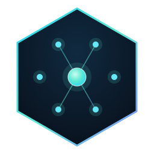

**Product:** [sassmaker.com](https://sassmaker.com)
<p align="center">
  
</p>

<h1 align="center">Fleet</h1>

<p align="center"><em>One shared-infrastructure project, several independent products.</em></p>

This repository is the canonical Fleet shared-infrastructure project and also
serves as the local workspace root for independent product repositories.

All Fleet-owned source is nested under `foundry/` and organized by the
operator-facing product model: helpers, skills, public apps, Marketing,
packages, and Fleet Console. `foundry/ops/` is the shared operational
substrate beneath those buckets. This workspace root remains the agent and
independent-project entrypoint; independent products remain separately
versioned and deployed unless explicitly imported as Fleet infrastructure.

The single internal project catalog is
[`foundry/ops/config/projects.json`](foundry/ops/config/projects.json). It owns
project identity, attention, lifecycle, repository location, deployment, and
public-listing posture. Automation and marketing registries are policy overlays;
generated internal and public views come from the catalog with
`npm run generate:projects`.

## Canonical Fleet components

- **Helpers:** `foundry/helpers/ai-visibility/`,
  `foundry/helpers/drank/`, and `foundry/helpers/psi-swarm/`.
- **Skills:** `foundry/ops/skills/` and `foundry/ops/teammates/skills/`.
- **Public apps:** `foundry/apps/public/public-directory/`.
- **Marketing:** `foundry/marketing/reel-pipeline/` and
  `foundry/marketing/content-factory/`.
- **Packages:** `foundry/packages/feedback/`.
- **Fleet Console:** `foundry/apps/dashboard/fleet-console/`, with the
  experimental local-only mobile client at
  `foundry/apps/dashboard/mobile-cockpit/`.
- **Operational substrate:** `foundry/ops/`, including its pinned public,
  credential-free `workflows/` module.

The detailed ownership and connection map is in
[`foundry/README.md`](foundry/README.md). Feedback is a Fleet-owned product,
but only its client package is shipped today; shared ingestion and the final
dashboard inbox remain missing.

The orchestration boundary is one-way: Fleet may catalog, inspect, monitor, and
invoke a standalone product's repo-local commands, but standalone products must
not require private Fleet files or instructions to build, test, migrate, or
deploy. Run `npm run check:independence` after fetching child repositories to
audit their canonical `origin/main` revisions; unavailable checkouts are
reported as skipped.

## Merged historical repositories

The following standalone repositories were merged into Fleet and moved to
Sarthak's personal GitHub account for attribution and history only. They are not
setup dependencies and must not be cloned as Fleet projects:

| Historical repository | Maintained source |
| --- | --- |
| [`sarthakagrawal927/saas-maker`](https://github.com/sarthakagrawal927/saas-maker) | `foundry/apps/public/public-directory/` and `foundry/packages/feedback/` |
| [`sarthakagrawal927/reel-pipeline`](https://github.com/sarthakagrawal927/reel-pipeline) | `foundry/marketing/reel-pipeline/` |
| [`sarthakagrawal927/drank`](https://github.com/sarthakagrawal927/drank) | `foundry/helpers/drank/` |
| [`sarthakagrawal927/mobile-dev-cockpit`](https://github.com/sarthakagrawal927/mobile-dev-cockpit) | `foundry/apps/dashboard/mobile-cockpit/` |
| [`sarthakagrawal927/psi-swarm`](https://github.com/sarthakagrawal927/psi-swarm) | `foundry/helpers/psi-swarm/` |
| [`sarthakagrawal927/mashup`](https://github.com/sarthakagrawal927/mashup) | `foundry/marketing/reel-pipeline/editorial/` |

Clone `sass-maker/fleet-workspace` once and initialize its public automation
module:

```bash
git submodule update --init --depth 1 foundry/ops/workflows
```

The module runs only from public inputs. Private Fleet CI and provider inventory
remain in this repository.

<!-- project-catalog:start -->
## Portfolio classification

This is a generated summary of the private Fleet project catalog. The complete
machine-readable source is `foundry/ops/config/projects.json`; the generated
human view is [`foundry/ops/docs/project-catalog.md`](foundry/ops/docs/project-catalog.md).
Maintenance rules live in [`foundry/ops/config/README.md`](foundry/ops/config/README.md).

### P1 — 4

- product: CodeVetter, HeyPace, PostTrainLLM, Office OS

### P2 — 19

- product: Memory Map, High Signal, Research Papers, Significant Hobbies, Reader, SWE Interview Prep, Calorie, Setline, RolePatch, Karte, Starboard, App Health, Motion, Indulge, Field Track
- platform: Fleet Workspace, Knowledge Base
- experiment: Mashup, Local AI Video Studio

### P4 — 24

- product: Drank, Email Manager, India Standards, Anime List, LoopTV, SaaS Ideas, What It Takes to Win, Sarthak Agrawal
- platform: Free AI, PSI Swarm
- experiment: EverythingRated, Materia, Chess, AliveVille, Protein Index, TrueHire, Today Little Log, Open Historia, Companion Robot, Elves HQ, Forecast Lab, Web Playables, Reddit Insights, Verified Bases

Priority, kind, status, deployment, and sharing readiness are independent.
Past projects remain preserved without becoming maintenance obligations.
<!-- project-catalog:end -->

## Work Tracking

Use repository-native GitHub issues or OpenSpec changes to capture durable work.
A work item can be an investigation, bug fix, deploy check, cleanup, code
change, or deferred follow-up. Fleet is the operational source of truth.

Create a task for:

- failing CI, broken deploys, and production bugs
- small or medium features
- cleanup and migration work
- TODOs and follow-ups
- research that should lead to a decision or implementation

Use a docs plan only when the document should remain useful after the work is
done. Good examples are architecture decisions, product specs, migration
strategies, runbooks, and research/reference notes.

## Docs Boundary

- Project `README.md`: current human entrypoint.
- Project `docs/`: durable reference, architecture, runbooks, research, and
  product docs.
- Project `docs/plans/`: rare design artifacts, not the task queue.
- GitHub issues: repository-native operational follow-up.
- OpenSpec changes: non-trivial product or cross-repository feature lifecycle.
- `PROJECT_STATUS.md`: durable current product state.

When a plan creates execution work, keep it in the owning repository or
cross-repository OpenSpec store.

The generated cross-project OpenSpec catalog is
[`foundry/ops/docs/openspec-inventory.md`](foundry/ops/docs/openspec-inventory.md).
Refresh it with `npm run generate:openspec-inventory`.

Single-project changes remain authoritative in the owning repository's
`openspec/`. Fleet and cross-project changes live only in the tracked
[`foundry/openspec/`](foundry/openspec/) store; do not create separate Desktop
OpenSpec stores.

Agent-facing instructions live in the fleet-level `AGENTS.md`, which applies to
projects below this directory unless a project has a more specific `AGENTS.md`.

## Repository Boundary

The Fleet root repo tracks workspace-level control files and all shared
infrastructure under `foundry/ops/`. Its `.gitignore` ignores independent child
product checkouts (`/*`) and allowlists:

- `README.md`, `PROJECT_STATUS.md`, `package.json`, agent/policy files, and `.gitignore`
- `foundry/` — all Fleet-owned apps, services, packages, tools, operations,
  specifications, and assets

Child project directories are intentionally ignored here because they are
independent repositories with their own histories, branches, and deploy flows.

Run `npm run test:fleet` for shared infrastructure checks and
`npm run check:components:native` for each imported component's own validation.
The latter preserves each component's package manager and toolchain rather than
imposing a shared deploy cadence.

## Fresh machine

Clone this repository as the workspace root, then follow
[`foundry/ops/docs/fleet-runbook.md`](foundry/ops/docs/fleet-runbook.md#fresh-machine-setup).
The runbook contains the canonical project clone list, agent-skill linking,
authentication checks, and the two read-only fleet health commands. Cloudflare
Pages projects normally show no Git provider because production deploys are
guarded GitHub Actions or Wrangler uploads; the GitHub repository and commit in
the deployment workflow are the source link.
