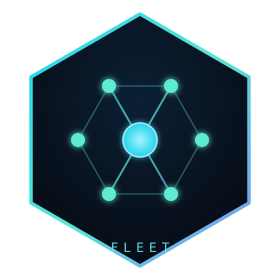

  

<h1 align="center">Fleet</h1>

<em>One shared-infrastructure project, several independent products.</em>

This repository is the canonical Fleet shared-infrastructure project and also
serves as the local workspace root for independent product repositories.

Shared operations live under `fleet-ops/`: registries, skills, automation,
marketing production, domain intelligence, performance tooling, and the private
mobile control client. Product repositories remain independently versioned and
deployed unless explicitly imported as Fleet infrastructure.

The canonical live project/domain inventory is [`fleet-ops/config/projects.json`](fleet-ops/config/projects.json);
this README is the human taxonomy, while [SaaS Maker](https://sassmaker.com) is
the public directory, package catalogue, and feedback product.

## Canonical Fleet components

- `fleet-ops/services/reel-pipeline/` — approved media production and Postiz handoff
- `fleet-ops/services/drank/` — domain intelligence
- `fleet-ops/psi-swarm/` — performance and site-health tooling
- `fleet-ops/apps/mobile-cockpit/` — private mobile Fleet client
- `fleet-ops/apps/ops-console/` — local operations view
- `fleet-ops/skills/`, `scripts/`, `automation/`, `config/` — common infrastructure

CodeVetter and App Health remain fully independent products. SaaS Maker is not
the Fleet control plane.

## Products

Projects are classified by purpose (a project can appear in more than one):
**support** · **personal** · **learning** · **saas** · **data** · **research**.
Some products have an **umbrella** relationship with a sub-product (separate repo,
worked on together as one effort).

**Support** — infrastructure serving other fleet projects

- [saas-maker](https://github.com/sass-maker/saas-maker) — public product directory, maintained package catalogue, and shared feedback ([sassmaker.com](https://sassmaker.com))
- [free-ai](https://github.com/sass-maker/free-ai) — OpenAI-compatible LLM gateway fronting 30+ free-tier models across 8 providers
- Reel Pipeline — AI short-form media production and Postiz handoff, canonical under Fleet Workspace; the standalone repository is a migration rollback source
- Drank — domain-rating intelligence, canonical under Fleet Workspace; the standalone repository is a migration rollback source

**Support + SaaS** — support infra that is also a public product

- [codevetter](https://github.com/Codevetter/codevetter) — desktop AI code review ([codevetter.com](https://codevetter.com)) — **umbrella for code quality and repo intelligence**
  - [starboard](https://github.com/Codevetter/starboard) — GitHub stars organizer + semantic search (sub-product of codevetter, separate repo)
- [knowledge-base](https://github.com/sass-maker/knowledge-base) — Private Agent Search: cited search over project-scoped private corpora
- [saas-ideas](https://github.com/sass-maker/saas-ideas) — scored catalog of SaaS ideas ([ideas.sassmaker.com](https://ideas.sassmaker.com))
- [high-signal](https://github.com/High-Signal-App/high-signal) — daily synthesized intelligence brief ([highsignal.app](https://highsignal.app))
- [app-health](https://github.com/sarthakagrawal927/app-health) — Owner-first application health and fix handoff for live apps

**Research** — experimental, the bet is a research question

- [aliveville](https://github.com/sarthakagrawal927/aliveville) — 3D AI world simulator with NPC agents ([aliveville.com](https://aliveville.com))
- [pace](https://github.com/HeyPace/pace) — on-device Mac voice agent that reads your screen
- [posttrainllm](https://github.com/PostTrainLLM/posttrainllm) — local LLM factory + runtime (Mac/MLX) + WebGPU playground

**Personal + free-tool** — built for personal use, free public tool

- [significanthobbies](https://github.com/Significant-Hobbies/significanthobbies) — life planner: private daily rituals + public living (hobbies, bucket lists, side quests) ([significanthobbies.com](https://significanthobbies.com))
- [reader](https://github.com/Significant-Hobbies/reader) — research library: capture, annotate, AI-chat
- [anime-list](https://github.com/Significant-Hobbies/anime-list) — anime/manga discovery with multi-axis filtering + watchlists
- [chess](https://github.com/Significant-Hobbies/chess) — AI-coached chess game
- [materia](https://github.com/Significant-Hobbies/materia) — evidence-graded body, supplement, herb, and drug reference
- [swe-interview-prep](https://github.com/Significant-Hobbies/swe-interview-prep) — SWE learning OS with FSRS spaced repetition
- [email-manager](https://github.com/sarthakagrawal927/email-manager) — Gmail workspace with local semantic search
- [looptv](https://github.com/Significant-Hobbies/looptv) — TV-style random video player
- [mobile-dev-cockpit](https://github.com/sass-maker/mobile-dev-cockpit) — native iPhone cockpit for supervising coding agents, mobile previews, Git review, and guarded deploys over Tailscale

**Personal + SaaS** — personal-use thesis, public SaaS surface

- [rolepatch](https://github.com/sarthakagrawal927/rolepatch) — AI resume tailoring + job-application assistant (cover letters, company research, role-fit scoring, STAR prep) ([rolepatch.com](https://rolepatch.com))
- [karte](https://github.com/sarthakagrawal927/karte) — AI link-in-bio: chat, encyclopedia, roast modes ([karte.cc](https://karte.cc))

**Data** — the data is the asset, public surface is the product

- [research-papers](https://github.com/High-Signal-App/research-papers) — academic paper platform (488k papers, semantic search)
- [everythingrated](https://github.com/High-Signal-App/everythingrated) — multi-axis rating tool for structured directories and catalogs
- [protein-index](https://github.com/Significant-Hobbies/protein-index) — normalized Indian protein-product intelligence with source-aware nutrition, offers, and ratings
- [success-by-26](https://github.com/sarthakagrawal927/success-by-26) — Visualization site for the Success by 26 early-advantage dataset

> Personal/parked out-of-fleet repos live on [github.com/sarthakagrawal927](https://github.com/sarthakagrawal927) or locally: pinpoint, portfolio, local-ai, today-little-log (archived), forecast-lab (delayed), and [web-playables](https://github.com/sarthakagrawal927/web-playables). Companion Robot now lives under `HeyPace`; Elves HQ and the standalone psi-swarm repository live under `sass-maker`.

## Work Tracking

Use repository-native GitHub issues or OpenSpec changes to capture durable work.
A work item can be an investigation, bug fix, deploy check, cleanup, code
change, or deferred follow-up. SaaS Maker is not the task system of record.

Create a task for:

- failing CI, broken deploys, and production bugs
- small or medium features
- cleanup and migration work
- TODOs and follow-ups
- research that should lead to a decision or implementation

Use a docs plan only when the document should remain useful after the work is
done. Good examples are architecture decisions, product specs, migration
strategies, runbooks, and research/reference notes.

## Docs Boundary

- Project `README.md`: current human entrypoint.
- Project `docs/`: durable reference, architecture, runbooks, research, and
  product docs.
- Project `docs/plans/`: rare design artifacts, not the task queue.
- GitHub issues: repository-native operational follow-up.
- OpenSpec changes: non-trivial product or cross-repository feature lifecycle.
- `PROJECT_STATUS.md`: durable current product state.

When a plan creates execution work, keep it in the owning repository or
cross-repository OpenSpec store. Do not mirror it into SaaS Maker.

Agent-facing instructions live in the fleet-level `AGENTS.md`, which applies to
projects below this directory unless a project has a more specific `AGENTS.md`.

## Repository Boundary

The Fleet root repo tracks workspace-level control files and all shared
infrastructure under `fleet-ops/`. Its `.gitignore` ignores independent child
product checkouts (`/*`) and allowlists:

- `README.md`, `PROJECT_STATUS.md`, `package.json`, agent/policy files, and `.gitignore`
- `assets/` — workspace logo and shared art
- `fleet-ops/` — all shared infrastructure, including imported services and apps

Child project directories are intentionally ignored here because they are
independent repositories with their own histories, branches, and deploy flows.

Run `npm run test:fleet` for shared infrastructure checks and
`npm run check:components:native` for each imported component's own validation.
The latter preserves each component's package manager and toolchain rather than
imposing a shared deploy cadence.

## Fresh machine

Clone this repository as the workspace root, then follow
[`fleet-ops/docs/fleet-runbook.md`](fleet-ops/docs/fleet-runbook.md#fresh-machine-setup).
The runbook contains the canonical project clone list, agent-skill linking,
authentication checks, and the two read-only fleet health commands. Cloudflare
Pages projects normally show no Git provider because production deploys are
guarded GitHub Actions or Wrangler uploads; the GitHub repository and commit in
the deployment workflow are the source link.
