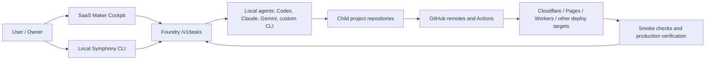

# Fleet Project Map

This document explains how the local Fleet workspace, Foundry/SaaS Maker,
Symphony, GitHub, and deployment targets connect.

## System Overview



## Boundaries

| Layer | Source of truth | What lives there |
| --- | --- | --- |
| Fleet root | Git repo at `/Users/sarthakagrawal/Desktop/Fleet` | Shared docs, shared agent policy, shared skills, workspace runbooks |
| Child projects | Each child `.git` repo | Product code, project docs, project tests, deploy config |
| Foundry/SaaS Maker | `saas-maker` repo and production API | Cockpit, CLI, task API, fleet metadata, Symphony task sync |
| Symphony | Foundry task API plus local `.symphony` cache | Task status, project assignment, agent dispatch prompts |
| GitHub | Per-project remotes | Code history, Actions, PRs, deploy workflows |
| Cloudflare | Workers, Pages, D1, KV, R2, custom domains | Runtime hosting and production data |

## Repository Layout

```text
/Users/sarthakagrawal/Desktop/Fleet/
  README.md                    # Fleet entrypoint
  AGENTS.md                    # Fleet-wide agent policy
  docs/
    fleet-runbook.md           # Run/verify/deploy guide
    project-map.md             # System connectivity map
    agent-layering.md          # Shared agent config layering
  saas-maker/                  # Foundry/SaaS Maker, Symphony source
    foundry.projects.json      # Active production fleet manifest
    docs/symphony.md           # Symphony command details
  <project>/                   # Independent child repository
```

The Fleet root intentionally ignores child project directories. This prevents
one parent commit from accidentally swallowing many unrelated project histories.

## Active Production Fleet

`saas-maker/foundry.projects.json` is the active production manifest.

| Project | GitHub | Runtime/deploy shape |
| --- | --- | --- |
| `anime_list` | `sarthakagrawal927/anime_list` | Next/OpenNext Cloudflare Pages |
| `CodeVetter` | `sarthakagrawal927/CodeVetter` | Desktop app plus landing/docs surfaces |
| `email-manager` | `sarthakagrawal927/email-manager` | Next/OpenNext Cloudflare Worker |
| `everythingrated` | `sarthakagrawal927/everythingrated` | Cloudflare Worker/web app |
| `free-ai` | `sarthakagrawal927/free-ai` | Cloudflare Worker gateway plus site/playground |
| `high-signal` | `sarthakagrawal927/high-signal` | Web/API Cloudflare Workers |
| `linkchat` | `sarthakagrawal927/linkchat` | Next/OpenNext Cloudflare Worker |
| `looptv` | `sarthakagrawal927/looptv` | Cloudflare Pages static app |
| `open-historia` | `sarthakagrawal927/open-historia` | Next/OpenNext Cloudflare Worker |
| `reader` | `sarthakagrawal927/reader` | Next/OpenNext Cloudflare Worker plus extension |
| `resume-tailor` | `sarthakagrawal927/resume-tailor` | Next/OpenNext Cloudflare Worker |
| `saas-maker` | `sarthakagrawal927/saas-maker` | Workers API, Cockpit, docs, CLI, widgets |
| `significanthobbies` | `sarthakagrawal927/significanthobbies` | Next/OpenNext Cloudflare Worker |
| `starboard` | `sarthakagrawal927/starboard` | Next/OpenNext Cloudflare Worker |
| `swe-interview-prep` | `sarthakagrawal927/swe-interview-prep` | Vite/Pages app with local helper server |
| `today-little-log` | `sarthakagrawal927/today-little-log` | Vite Cloudflare Pages app |
| `truehire` | `sarthakagrawal927/truehire` | Web app/workflow-deployed service |

## How Work Moves

1. A task is created in Cockpit or with `pnpm symphony create`.
2. Local Symphony pulls production tasks through the Foundry CLI.
3. A task is picked or dispatched to a local agent profile.
4. The agent works inside the matching child project repository.
5. The agent verifies locally, commits, and pushes that child repository.
6. GitHub Actions and deploy workflows run.
7. The agent records completion evidence and marks the Symphony task done.

Tasks should include links to commits, PRs, GitHub runs, deploy URLs, or smoke
checks when those are relevant.

## Agent Routing

Symphony supports multiple local agent commands. The default built-ins are:

- `codex`: Codex CLI with local permissions.
- `claude`: Claude CLI with local permissions.
- `gemini`: Gemini CLI with local permissions.

Custom profiles belong in `~/.foundry/config.json`, not in project code:

```json
{
  "symphonyAgentCommands": {
    "gemini-pro": "gemini --yolo -m gemini-2.5-pro -p {prompt}",
    "claude-max": "claude --dangerously-skip-permissions -p {prompt}",
    "codex-work": "codex exec --dangerously-bypass-approvals-and-sandbox {prompt}"
  }
}
```

Prefer cheaper/free/local routes for routine work. Escalate to expensive agents
when complexity, correctness risk, or missing capability justifies it.

## Shared Agent Guidance

The Fleet root `AGENTS.md` is the shared policy. Child projects should reference
it instead of copying the full text.

Use project-local `AGENTS.md` or `agents.md` for:

- project purpose and stack
- project-specific commands
- known deploy target
- local exceptions to Fleet policy

Use Fleet docs for:

- cross-project task policy
- agent layering
- how to verify/push/clean all repos
- how Foundry/Symphony connects the work

## Deployment Ownership

Use the project repo as the first source for exact deploy commands. In general:

- GitHub Actions owns CI and most repeatable deploy checks.
- Cloudflare Workers/Pages host most production runtime surfaces.
- Some Cloudflare native Git integrations may still exist for preview or legacy
  reasons, but GitHub Actions should be treated as the explicit deploy owner
  when a project has a deploy workflow.
- Stale virtual deployments should not be treated as active fleet health.

When a deployment is broken, create or update a Symphony task instead of leaving
the failure as an undocumented local note.

## Adding A New Fleet Project

1. Create or clone the project under `/Users/sarthakagrawal/Desktop/Fleet`.
2. Ensure it has its own Git remote and `README.md`.
3. Add project-specific `AGENTS.md` or `agents.md`.
4. Add the project to `saas-maker/foundry.projects.json` when it becomes part of
   the active production fleet.
5. Add deploy/CI ownership notes in the project README.
6. Create a Symphony task for any remaining setup work.

Do not add local-only experiments to the production fleet manifest until they
have an intended deploy/runtime owner.
