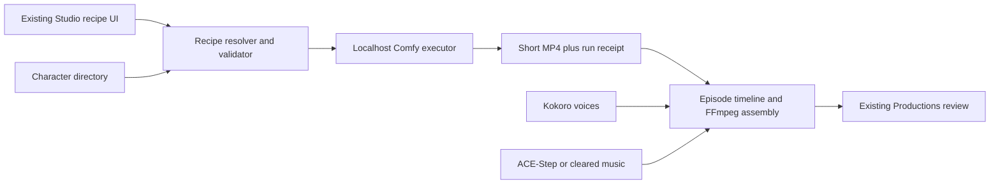
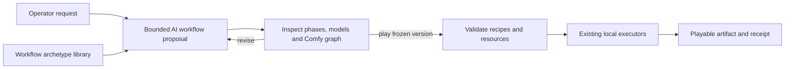
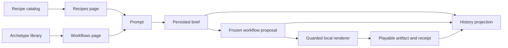

## Context

The existing product already has a production recipe catalog, model profiles,
an execution registry, a normal video artifact envelope, a character directory,
Kokoro voice generation, ACE-Step music assets, FFmpeg composition, and Local
Video Forge manifests. ComfyUI is useful here as a graph execution engine and
workflow interchange format, not as a second product architecture.

The host proof used official ComfyUI `v0.30.2` on a 48 GiB Apple Silicon Mac.
Pinned Lightricks LTX 2B distilled produced a 768x448, 97-frame I2V result in
42.02 seconds with 79.42 percent peak system RAM, but the operator classified
its quality as preview-only. The existing MLX LTX 2.3 Q4 profile remains the
final-quality target because its reference production quality is the accepted
bar and the runtime has previously completed on this host. MiniMax H3 reached
88.85 percent during load, required CPU fallback for an unsupported MPS integer
matrix operation, and did not complete one of 25 sampling steps in about three
minutes. Disk is 80 percent after both model sets.

## Goals / Non-Goals

**Goals:**

- Treat recipes as small, reviewable manifests over pinned Comfy API graphs.
- Reuse the existing Studio catalog, executor, character, voice, soundtrack,
  artifact, and review boundaries.
- Make fast I2V generation and multi-shot assembly resumable and measurable.
- Let AI select and populate a generous catalog of proven production
  archetypes while keeping executable graph structure deterministic and
  reviewable.
- Keep all runtime/model payloads ignored and local to `.reel-pipeline/`.

**Non-Goals:**

- Recreating ComfyUI, exposing its full node editor in Studio, or supporting
  arbitrary user graphs.
- Auto-installing Comfy Manager, custom nodes, or model files at render time.
- Generating a two- to three-minute episode as one diffusion pass.
- Celebrity likeness or voice cloning, automatic publication, or cloud deploys.

## Decisions

### Recipes wrap API graphs instead of becoming a new framework

Each recipe stores a normalized Comfy API prompt plus a small declaration of
which values may be changed. The existing video executor receives the selected
recipe and inputs, calls one `comfy-local` adapter, then wraps the result in the
current artifact envelope. Alternative: a generic workflow DAG in Reel
Pipeline. Rejected because Comfy already owns node scheduling and a second DAG
would duplicate it.

### Only declared knobs are mutable

The recipe schema separates `graph` from `inputs`. The resolver replaces only
declared node fields and validates values against bounds. Node type, edges,
model filenames, sampler family, and save destination policy remain locked.
Alternative: accept arbitrary Comfy JSON. Rejected because it makes custom
code execution and reproducibility impossible to reason about.

### AI proposes a plan; the library compiles it

Prompt intake first produces a persisted workflow proposal rather than
executing a renderer. The planner selects one versioned production archetype
from a compact library and binds its intent, phases, recipes, models, required
inputs, estimates, and explanation. A deterministic compiler resolves that
proposal to the existing recipe registry and Comfy API graph. The operator can
inspect the plan, expand the exact graph where Comfy owns a phase, revise
declared plan fields through natural language, and explicitly play a frozen
proposal version.

The library stores reusable production archetypes, not hundreds of copied
graphs. Multiple archetypes may intentionally compile to the same pinned graph
with different shot grammar or exposed presets. The UI must identify this
truthfully. Raw generated JSON is inspectable or exportable but never executed
unless it reduces to an allowlisted, installed, version-pinned recipe.

### Built-in-node allowlist and pinned provenance

Initial recipes use only Comfy core nodes observed in the official H3 and LTX
examples. Ingestion may read embedded `prompt` metadata from Comfy MP4s, but a
graph remains a candidate until its nodes, source URL, runtime revision, model
revision, hashes, and license metadata validate. Unknown nodes fail closed.

### LTX 2.3 is the final lane; LTX 2B is preview-only; H3 is blocked on Mac

The existing pinned MLX `ltx-2.3-mlx-q4` profile owns final and hero renders.
`ltxv-2b-0.9.6-distilled-04-25` is eligible only for preview and planning
because the real MPS canary is fast but did not meet the operator's quality
bar. H3 stays visible for portability and higher-ceiling hardware but carries
a Mac blocker and is never chosen automatically. Alternative: force H3 through
CPU fallback. Rejected because technical execution without practical
throughput is not a factory capability.

### Episodes are manifests of short shots

An episode manifest references character records and expands into 20-30 short
shots. Accepted shot artifacts are content-addressed by recipe id/version,
normalized inputs, reference hashes, model hashes, and seed. Dialogue and music
are separate timeline assets; FFmpeg owns deterministic assembly. This lets one
shot be regenerated without invalidating the episode.

### Resource enforcement surrounds every external process

Preflight calculates projected disk percentage before setup or generation.
The executor runs one queued job, polls system memory and Comfy history, sends
an interrupt at 90 percent RAM, and records peak usage and terminal status.
The same guard wraps ACE-Step and final assembly where relevant.

### History is a projection, not another ledger

History reads the existing Marketing Brief store and decorates each entry with
its original request, persisted workflow proposal, execution receipt, and
playable artifact URL. It does not copy prompts, workflows, or videos into a
new database or privilege a fixed experiment set in the information
architecture. The most recent entries form a bounded, scrollable filmstrip and
the complete archive remains available in the ledger. Recipes and Workflows are
read-only projections of the existing production catalog and
workflow-archetype library; choosing one returns to Create with a bounded
starting instruction.

The five-sample canary uses a checked-in manifest of creative prompts and
approved local reference paths. A runner submits them serially through the
same proposal and execution boundary as the UI, resumes already completed
sample ids, and relies on the 85 percent disk and 90 percent RAM guards. Its
entries carry no special History-page layout or status once persisted.

A separate 30-second story canary proves multi-shot pacing before committing to
the much more expensive 2- to 3-minute episode render. It resumes completed
shots, prefers WAI-generated keyframes when that optional checkpoint is already
installed, otherwise uses the installed LTX 2.3 text-to-video path without a
download, then assembles original Kokoro voice, ACE-Step music, and the five
shots with FFmpeg. The retained executed-workflow record overrides an earlier
single-shot proposal in History so the visible route describes what actually
produced the final artifact.

Workflow proposals and library entries expose a bounded estimate derived from
the retained local measurements: 205 to 216 seconds per six-second LTX 2.3
final shot and 16 to 42 seconds per short LTX 2B preview. The estimate is
display metadata only; it never changes the graph, queue order, resource guard,
or execution decision.

## Risks / Trade-offs

- [LTX 2.3 needs a larger local payload and slower final pass] -> use LTX 2B
  for planning previews, then render only accepted shots through LTX 2.3.
- [Reference I2V can become too static] -> expose a bounded motion-strength
  input and make reference framing/shot variety part of episode planning.
- [Comfy updates can change node schemas] -> pin the runtime revision and
  validate every recipe against live `object_info` before enabling it.
- [AI can propose syntactically valid but semantically invalid graphs] -> AI
  selects a constrained archetype and mutable inputs; deterministic code owns
  graph compilation, validation, and execution.
- [Long episodes can drift visually] -> reuse directory references, fixed
  appearance notes and seeds, shot-level review, and resumable replacement.
- [Model payloads consume substantial disk] -> keep the 85 percent setup gate,
  show installed footprint, and make cleanup an explicit operator action.

## Migration Plan

1. Add schemas and validation with fixture graphs; no existing recipe changes.
2. Add the localhost Comfy executor for LTX 2B previews and reuse the existing
   pinned MLX Local Video Forge executor for LTX 2.3 finals.
3. Register both LTX lanes and blocked H3 behind Coherent local film.
4. Add episode manifest/assembly using existing voice, music, and character
   modules.
5. Expose the flow in Studio and add browser/API tests.

Rollback removes the new recipe registrations and executor wiring. Existing
Studio recipes, Local Video Forge, ignored models, and generated artifacts
remain untouched; local payload deletion requires separate operator approval.
