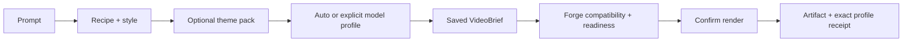

## Context

The current capability-aware maker already owns stable recipes, 48 finite style
variants, Auto selection, runtime readiness, spend posture, and continuation to
Forge. `coherent-local-film` is intentionally one recipe, but its engine is
hard-coded as `ltx` and the Forge queue advertises only `mlx-ltx-2.3`.

Model choice and creative theme are orthogonal to the existing visual-style
variants. Adding either as another finite recipe option would multiply the
catalog, make the native selector noisy, and couple creative intent to a
volatile backend inventory.

## Goals / Non-Goals

**Goals**

- Make local model choice truthful, inspectable, persistent, and replaceable.
- Preserve one compact maker and the existing recipe/variant identities.
- Let one motion format reuse many cast/world themes.
- Keep fast local generation as the default while exposing higher-ceiling and
  specialized candidates.
- Prevent model selection from silently causing a large download or setup.
- Preserve rights and content-scope evidence through rendering and distribution.

**Non-Goals**

- Installing Wan or H3 weights as part of this change.
- Claiming MiniMax H3 is open-source or universally the best model.
- A generic ComfyUI graph editor, arbitrary runtime command input, LoRA manager,
  or model marketplace.
- Multiplying all recipe variants by every model and theme.
- Circumventing the existing review, evidence, or Postiz publication gates.

## Decisions

### Keep three independent selection axes

The maker keeps the existing `recipeVariantId` for visible production method.
Eligible recipes may additionally store `themePackId` and `modelProfileId`.
Theme packs define creative prompt constraints; model profiles define execution.
Changing a model never silently changes the theme or edit template.

### Use dedicated registries, joined by the arsenal

`config/studio-theme-packs.json` owns stable creative packs. A Forge-owned
`config/forge-model-profiles.json` owns runtime profiles. `GET /studio/arsenal`
joins both into its existing secret-free read-only snapshot and reports which
recipes support them. This keeps volatile local installation state out of the
catalog while retaining one agent-readable discovery surface.

Each model profile declares a stable id, family/version, supported generation
modes, expected local resource class, native-audio posture, speed/quality tier,
license/territory notes, pinned source revision, required worker capabilities,
and setup command. Readiness is probed separately and reports ready, blocked, or
not-probed with one exact reason.

Initial profiles:

- `auto`: choose a ready compatible profile and reveal it before execution;
- `wai-illustrious-v17-sdcpp`: verified direct-checkpoint image-to-reel profile
  for anime and character concepts;
- `ltx-2.3-mlx-q4`: fast local default, currently installed and proven;
- `wan2.2-remix-gguf`: specialized image-first candidate, unavailable until a
  pinned Mac-compatible runtime and real canary pass;
- `minimax-h3-mlx-q4`: high-ceiling experimental candidate. Official H3 Base
  weights are available under the MiniMax H3 Community License, but the profile
  stays unavailable until its pinned MLX build, quantization, and real Mac
  canary pass. The hosted Context-IR and 2K regeneration modules are not part of
  the open-weight release, and its current local speed makes it a deliberate
  quality choice rather than Auto's default.

### Score Auto from brief constraints, never a global ranking

Auto filters to profiles that are ready, compatible with the requested mode,
allowed in the current territory, and within available memory. It then ranks
the remaining profiles using explicit brief priorities such as speed, quality,
reference-image use, native audio, and content scope. The chosen profile id and
reason are returned before the operator confirms the render and are persisted
in the receipt.

This avoids the misleading claim that one model is simply "best." MiniMax H3
is treated as an open-weight high-quality candidate; LTX remains the practical
fast default on this Mac.

### Make installation an explicit side effect

Readiness may disclose setup size and pinned source metadata, but no catalog
read, selection, save, Auto decision, or render request downloads a model.
Any future setup requires its own confirmation and re-runs readiness after
completion.
The existing 48 GB memory guard and one-generation-at-a-time worker rule remain.

### Theme packs carry source and rights posture

Theme packs contain structured prompt fragments for cast, world, wardrobe,
props, palette, and avoid rules. They also declare `sourcePosture` such as
`original`, `operator-owned`, or `named-ip`, plus required rights evidence.
Named-IP packs can produce local/private concepts, but commercial preparation
and Postiz handoff remain blocked without evidence covering the selected use.

A separate content-scope field distinguishes general and mature-enabled packs.
Mature-enabled production remains limited to fictional adults or rights-cleared
consenting adult references and must fail closed for minors, uncertain age, or
non-consensual likeness use.

### Keep the UI compact and progressive

The existing recipe selector remains primary. Theme appears when the selected
recipe supports a theme pack; Model appears under Advanced for generated-video
recipes. Auto is the default for both. A compact summary shows the selected
profile's speed, quality, local-resource, audio, license, and readiness posture.
Unavailable entries remain selectable for inspection but cannot start.

This is a preserve-mode Fleet Console change: existing routes, navigation,
labels, form order, analytics ids, and visual language remain intact.

### Use Night Out as the first reusable proof

The proof separates:

- `night-out` story/edit template: hook, escalating carousel, end prompt;
- `bouncy-card-carousel` motion treatment;
- swappable theme pack;
- original procedural funk audio bed;
- optional generation model for future moving-shot upgrades.

The first local MP4 uses original generated anime, fantasy, retro-space, and
monster-karaoke imagery. Exact named-franchise assets are not required for the
template contract to pass.

## Risks / Trade-offs

- **Too many controls** -> reveal Theme and Model only for eligible recipes and
  keep Auto as the zero-configuration path.
- **Variant explosion** -> never include model or theme in finite recipe ids.
- **Stale model claims** -> pin revisions and require real per-host canaries;
  display not-probed instead of optimistic readiness.
- **A model is mistaken for a content policy** -> persist content scope and
  rights posture independently from model profile.
- **Named IP is mistaken for publishable media** -> carry the selected pack's
  rights requirement into distribution evidence and fail closed.
- **Auto hides a surprising slow choice** -> reveal the exact selection and
  expected speed/resource class before confirmation.
- **A setup consumes tens of gigabytes unexpectedly** -> separate setup
  confirmation from render confirmation and disclose disk requirements first.

## Verification

- Contract tests for both registries, stable ids, references, and secret-free
  arsenal output.
- Brief normalization tests proving model/theme persist without changing the
  recipe variant id.
- Auto-routing tests for compatibility, readiness, memory, territory, speed,
  quality, native audio, and explicit-choice precedence.
- Worker tests proving only matching capabilities claim a job and that receipts
  record the exact profile and revisions.
- UI tests for progressive disclosure, unavailable-profile inspection,
  no-implicit-install behavior, and keyboard-native selection.
- A real LTX canary plus contract-only blocked receipts for any uninstalled Wan
  or H3 candidate.
- Browser evidence at 390, 768, and 1440 pixels under the preserve-mode design
  workflow before completion.
- Local Night Out MP4 probe plus representative-frame visual review; no publish.
