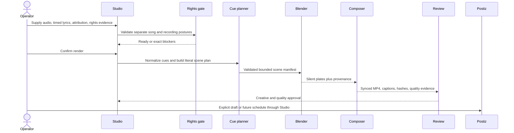

## Context

Marketing Studio already normalizes conversational requests into saved briefs,
routes work to local or specialized runtimes, records production evidence, and
hands eligible artifacts to Postiz. Its renderer boundary is adapter-based, its
faceless compositor already creates captioned vertical video, and its UI has an
established preserve-lane visual language.

Lyric videos add two contracts that ordinary marketing videos do not have:
time-aligned verbatim text and separate rights for the musical
composition/lyrics and the sound recording. Blender adds a large external
runtime with script-execution and artifact-provenance concerns. The design must
therefore add both capabilities without turning Marketing Studio into a lyric
acquisition service, a licensing authority, or a second publication system.

The primary operator is a local Fleet creator. Reviewers need enough provenance
to understand why an artifact rendered, which inputs were asserted as cleared,
which Blender version produced any visual assets, and why distribution was
allowed or blocked.

## Goals / Non-Goals

**Goals:**

- Add a sixth `lyric-video` workflow to the existing conversational Studio.
- Accept operator-supplied LRC, SRT, or structured timed lyrics without
  changing their text.
- Fail closed unless composition/lyrics rights, master-recording rights,
  attribution, and evidence are recorded separately.
- Map every lyric cue to a literal, reviewable visual instruction.
- Render a readable vertical lyric video locally with synchronized audio,
  captions, hashes, and quality evidence.
- Use Blender as an optional deterministic scene and asset renderer behind the
  existing renderer and Content Factory contracts.
- Produce one real, reproducible canary from a public-domain composition and a
  new Fleet-generated recording.
- Preserve the current Studio navigation, design tokens, interaction patterns,
  specialized-owner boundaries, and Postiz handoff.

**Non-Goals:**

- Finding, scraping, transcribing, paraphrasing, or generating the lyrics of a
  current commercial song.
- Determining copyright status on the operator's behalf or treating attribution
  as permission.
- Acquiring sync, mechanical, composition, lyric, or master-use licences.
- Executing arbitrary Python, Geometry Nodes, add-ons, or untrusted `.blend`
  files.
- Replacing the existing compositor with Blender for typography and audio.
- Immediate social publication, provider analytics, or bypassing Postiz.

## Decisions

### 1. Add a lyric-specific contract beside the general VideoBrief

The saved Marketing Studio brief will gain a `lyric` object only when
`videoKind` is `lyric-video`. It contains timed lyrics, an audio source,
attribution, evidence notes or URLs, a separate composition/lyrics posture, a
separate master-recording posture, visual style, and reduced-motion preference.
The normalized production manifest will reference hashed local inputs and
derived cue data rather than duplicate audio bytes.

This keeps ordinary briefs backward compatible and makes lyric-only validation
explicit. Extending every VideoBrief field directly was rejected because it
would make unrelated renderers understand music-rights state.

### 2. Rights are operator assertions recorded as evidence and enforced fail closed

Composition/lyrics posture accepts `owned`, `licensed`, or `public-domain`.
Master-recording posture accepts `owned`, `licensed`, or
`original-recording`. `unknown`, omitted, or rejected values block rendering.
Attribution and a non-empty evidence record are mandatory. The system records
the assertion, source, and input hashes; it does not issue a legal conclusion.

The distribution gate rechecks the same evidence plus creative and quality
approval. A single generic "copyright cleared" checkbox was rejected because it
hides the independent rights in the song and recording.

### 3. Timed lyrics are supplied, normalized, and preserved verbatim

LRC, SRT, and structured JSON cues normalize to ordered
`{startMs, endMs, text}` records. Validation rejects overlaps, non-increasing
times, empty text, cues outside the audio duration, excessive cue counts, and
unsupported markup. The renderer and planner retain the exact cue text.

The workflow will not query a song title, lyric provider, search engine, or LLM
for missing words. Automatic lyric acquisition was rejected because it would
create an unreliable rights and provenance path.

### 4. Literal visuals are a separate, reviewable plan

Every cue maps one-to-one to a scene record containing the unchanged lyric,
plain-language literal interpretation, bounded objects, actions, environment,
camera direction, palette, and asset provenance. A deterministic planner
provides a useful offline result. An optional language model may enrich the
scene record, but schema validation ensures it cannot alter, omit, or reorder
the lyric cues.

"Literal" means that visible subjects and actions concretely correspond to the
words; it does not promise a universal semantic interpretation. A free-form
single prompt was rejected because it would be difficult to audit and could
drop lines.

### 5. Blender renders visual plates; the existing compositor owns text and audio

Blender produces image sequences or silent visual plates from selected literal
scene records. The existing local compositor places synchronized lyric text,
captions, transitions, safe-area treatment, attribution, and the approved audio
over those plates. If a cue does not need 3D, the compositor can use a
deterministic native plate instead.

This division keeps text crisp and accessible, supports reduced motion, and
avoids relying on the host FFmpeg build for `drawtext`, `ass`, or `subtitles`.
Rendering the entire deliverable in Blender was rejected because typography,
cue timing, and audio muxing would be slower to iterate and harder to test.

### 6. Blender runs one repository-owned program against validated JSON

The Blender adapter invokes a pinned compatible Blender 5.2 runtime in
background, factory-startup mode with automatic script execution disabled. It
runs one repository-owned scene builder and passes a validated, bounded JSON
manifest after `--`. The manifest permits an allowlist of primitives,
materials, lights, cameras, motions, frame counts, output dimensions, and
output paths beneath the run directory.

The adapter records the exact Blender version, command posture, manifest hash,
render duration, and output hashes. It never accepts generated Python, add-on
installation, arbitrary file paths, or an uploaded `.blend`. A general-purpose
Blender execution API was rejected because it would enlarge the security
surface without helping this product workflow.

### 7. The real canary is recognizable and rights-safe

The checked fixture uses the public-domain words and melody commonly known as
“Twinkle, Twinkle, Little Star,” a newly generated instrumental recording, and
explicit attribution to the historical words and traditional melody. Its
manifest maps each cue to a concrete night-sky scene and exercises Blender,
composition, playback, hashes, and quality inspection.

No modern commercial recording is downloaded or committed. A popular current
song was rejected as the canary because attribution would not supply the
required lyric, composition, synchronization, and master-use permissions.

### 8. The Studio extension follows the existing preserve lane

`lyric-video` appears with the other workflow choices. Selecting it reveals a
Music and lyrics section inside the current brief editor: timed lyrics, audio
source, separate rights postures, evidence, attribution, literal style, Blender
usage, and reduced motion. Readiness and Production cards use existing status,
blocker, action, playback, and evidence patterns. Blender readiness is shown as
a runtime capability rather than a global redesign.

A standalone music product or new navigation model was rejected because it
would duplicate the established Create, Productions, Distribute, and Tools
workflow.

### 9. Execution remains explicit and Postiz remains the distribution owner

Creating or refining a lyric brief never renders. An explicit render action
revalidates inputs and rights before any audio or Blender work begins. Completed
videos still require creative and quality approval; only then can the existing
Postiz draft or future scheduling flow run. Immediate provider publication
remains rejected.

## Risks / Trade-offs

- [Rights assertions can be inaccurate] → Label them as operator assertions,
  require separate evidence fields, fail closed, and retain provenance for
  review.
- [Literal interpretation can still be subjective] → Preserve one-to-one cue
  mapping and expose the literal plan for operator editing before rendering.
- [Blender installation is large and slow] → Treat it as an optional external
  runtime, expose readiness, and keep deterministic non-Blender plates
  available.
- [3D rendering can exceed interactive latency] → Use Eevee, bound duration and
  resolution, cache plates by manifest hash, and show progress per cue.
- [Malicious input could escape the run directory] → Validate every enum,
  number, and path; construct commands without a shell; disable auto-exec; and
  use only the repository-owned builder.
- [Text can become unreadable over detailed scenes] → Keep text in the
  compositor with safe zones, contrast backing, cue-density limits, and a
  reduced-motion mode.
- [Host FFmpeg lacks common text filters] → Render text in browser/Canvas frames
  and use FFmpeg only for frame/audio assembly supported by the checked host.
- [A long song can produce many expensive Blender scenes] → Deduplicate assets,
  reuse plates, cap cue and scene complexity, and require an explicit estimate
  before real rendering.

## Migration Plan

1. Add the lyric contract, parsers, validators, literal planner, and unit tests
   without changing existing briefs.
2. Add Blender capability detection, safe manifest validation, the scene
   builder, and adapter smoke tests.
3. Add the compositor and end-to-end local fixture behind explicit
   `lyric-video` execution.
4. Extend Studio readiness, editing, Productions, and distribution checks using
   the existing UI components and routes.
5. Install and verify the compatible local Blender runtime, then render and
   inspect the rights-safe canary.
6. Run targeted tests first, then existing Studio, renderer, docs, design, and
   OpenSpec checks.

Rollback removes the new workflow and adapter registration while leaving
existing briefs and render modes untouched. Lyric briefs are additive saved
records and do not require a data migration.

## Open Questions

- Whether the first release should accept local audio paths only or add an
  authenticated upload boundary. The implementation will start with the
  repository's existing local-operator path model and keep upload work separate.
- Whether an LLM-enriched literal planner adds enough value beyond the
  deterministic planner to enable by default. The first release will remain
  deterministic and offline-capable.
- Whether longer songs need a background job protocol beyond current production
  progress. The canary and initial limits will provide evidence before adding
  another runtime abstraction.
