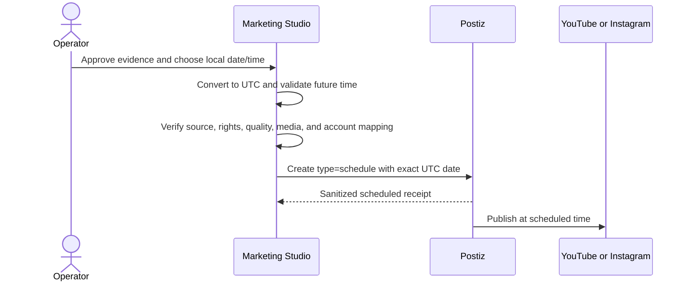

## Context

The generic distribution contract already carries an optional `scheduledFor`
timestamp and its fixture adapter already proves scheduled requests without
network access. Marketing Studio currently discards that capability, rejects
schedule inputs, and exposes only an unscheduled draft action.

Postiz's public create-post contract accepts `type: "draft"` or
`type: "schedule"` with an ISO 8601 UTC `date`. Reel Pipeline already owns the
evidence checks and exact brand/account/channel mapping needed before that call;
Postiz remains the owner of credentials, queueing, provider publication state,
calendar management, and analytics.

## Goals / Non-Goals

**Goals:**

- Let an operator choose a local future date/time in the Studio UI.
- Convert that choice to an absolute UTC ISO timestamp at the browser boundary.
- Revalidate the timestamp, evidence, and mapping on the server before any
  upload or Postiz create request.
- Support both unscheduled drafts and future scheduled requests.
- Persist the request and sanitized receipt so scheduled state is visible in
  Productions and Distribute.
- Prove Instagram and YouTube request shapes with fixtures and contract tests.

**Non-Goals:**

- Immediate `type: "now"` publication.
- Direct YouTube or Instagram credentials or APIs.
- Editing, cancelling, or rescheduling an existing Postiz post.
- Rebuilding Postiz's calendar, analytics, or provider retry UI.
- Executing a live scheduled post during automated verification.

## Decisions

### One optional schedule on the existing evidence-gated submission

The Studio distribution bundle will accept an optional `scheduledFor`. A new
scheduled-submission endpoint and UI action will pass a required future
timestamp, while the existing draft endpoint remains backward compatible and
always submits without one.

Alternative considered: create a separate schedule database and calendar in
Reel Pipeline. Rejected because Postiz already owns the durable calendar and
publication workflow.

### Validate before upload and normalize once

The browser converts `datetime-local` from the operator's device timezone to
UTC ISO. The Studio service rejects invalid or non-future values before
resolving or invoking Postiz. `PostizClient` repeats the future-date check
before media upload and maps the request to:

- no timestamp → `type: "draft"` and the current time;
- future timestamp → `type: "schedule"` and that exact timestamp.

There is no immediate-publish branch.

### Preserve exact routing and evidence

Scheduled submissions reuse the current content package, media receipt,
distribution approval, public-media check, and brand/channel account mapping.
The persisted distribution request carries the schedule. The sanitized receipt
adds the schedule but does not expose account integration ids, credentials, or
post copy.

### Express scheduling in the existing Distribute stage

The current Postiz stage gains a labelled `datetime-local` control, an explicit
device-timezone hint, and a `Schedule in Postiz` action. The draft action remains
available as the lower-commitment path. Both actions remain disabled until all
distribution evidence and Postiz readiness checks pass.

## Risks / Trade-offs

- **Device clock or timezone is wrong** → Show the resolved timezone beside the
  field and persist the UTC value returned by the browser.
- **Timestamp becomes stale between entry and submission** → Revalidate on both
  the Studio service and Postiz client immediately before network work.
- **Postiz accepts the request but the response is lost** → Preserve the
  existing ambiguous-create request id and reconciliation behavior.
- **A scheduled receipt is mistaken for verified publication** → Label it
  scheduled, never published, and keep live auto-post verification explicitly
  outside the automated test claim.
- **Existing draft users regress** → Keep the draft endpoint and button with
  their current unscheduled semantics.
- **Repeated clicks create duplicate posts** → Disable both submission actions
  after any Postiz receipt exists and reject duplicate API submissions before
  network access.

## Migration Plan

1. Add server and Postiz-client schedule support behind the existing mapping.
2. Add the UI control and scheduled action.
3. Validate fixtures, focused tests, full project tests, responsive UI, and
   OpenSpec.
4. Roll back by removing the scheduled action and endpoint; unscheduled drafts
   remain compatible and persisted requests tolerate `scheduledFor: null`.

## Open Questions

None for the first vertical slice. Editing or cancelling scheduled posts can be
a later Postiz-lifecycle feature if operators need it.
