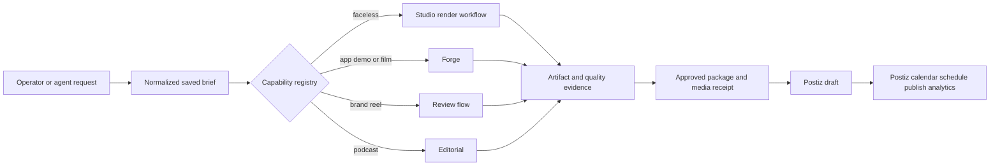

## Context

Reel Pipeline has four useful operator surfaces with different ownership:

- `/studio` provides individual ideation, metadata, script, faceless render,
  factory, and artifact-list tools.
- `/forge` owns authenticated film-style tasks, guided app capture, coherent
  film variants, and final-render decisions.
- `/review` owns anonymous brand-reel decisions.
- `editorial/` owns podcast transcription, clip decisions, and the strict
  podcast-edit handoff.

Distribution is correctly separate. Reel Pipeline can create a Postiz draft
from an approved content package and media receipt, while Postiz owns social
accounts, its calendar, schedules, publication, and analytics. The missing
piece is an operator workspace that makes these boundaries feel like one
product without merging their runtimes or claiming unavailable actions.

The UI change is `preserve` mode under the existing `PRODUCT.md` and
`DESIGN.md`. Marketing Studio remains a dense, dark production workspace; it
does not replace the selected cinematic film language or turn into a general
nonlinear editor.

## Goals / Non-Goals

**Goals:**

- Let the operator describe a video in natural language and receive a saved,
  editable, normalized production brief.
- Show every supported video workflow, its prerequisites, its authoritative
  execution surface, and its real current readiness in one place.
- Execute faceless/lesson videos directly and hand other kinds to their
  existing UI or editor with the normalized brief preserved.
- Make scripts, ideas, artifacts, quality, review, and distribution readiness
  discoverable from one workspace.
- Prepare and, when all approval and stable-media requirements are satisfied,
  create a Postiz draft from the UI.
- Preserve deterministic offline behavior and add no production dependency.

**Non-Goals:**

- Rebuilding the Postiz calendar, scheduler, provider OAuth, publication
  controls, or analytics UI.
- Automatic approval, scheduling, publication, credential management, or live
  auto-post verification.
- A timeline editor, draggable layers, or a new rendering engine.
- Moving Forge, Review, or Editorial state into the Studio store.
- Deploying the Worker or installing/configuring Postiz.

## Decisions

### Store a normalized brief, not an unstructured chat transcript

`src/studio/briefs.js` will own a versioned
`fleet.marketing-studio-brief.v1` record in the ignored Studio state directory.
The record contains the operator request, a short message history, video kind,
brand/project, channel, duration, creative fields, source and rights posture,
execution target, readiness, and lifecycle state.

The optional Studio LLM chain turns a request into structured JSON. A
deterministic classifier and template produce the same schema when no provider
is configured. Every result passes one normalizer before storage. The UI edits
the normalized fields; it never relies on prose as execution input.

Alternative considered: keep chat only in browser memory. Rejected because a
refresh would lose production intent and an agent-created brief could not be
continued by the operator.

### Route to existing workflow owners through a capability registry

`src/studio/capabilities.js` will declare five video kinds:

1. `faceless` — direct Studio execution through `runFacelessWorkflow`;
2. `brand-reel` — existing local brand-reel creation and `/review`;
3. `guided-app-demo` — Forge `guided-app-demo@1`;
4. `coherent-film` — Forge versioned film styles;
5. `podcast-short` — Editorial and `fleet.podcast-edit.v1`.

Each capability returns `ready`, `needs-input`, `external-step`, or `blocked`,
plus required inputs and an action descriptor. Only the faceless action runs in
the local Studio process. Other actions preserve the brief and open or explain
the owning surface. No generic endpoint pretends all renderers have the same
contract.

Alternative considered: import every renderer into the Studio API. Rejected
because Forge authentication/queueing and Editorial stage state have different
security and provenance contracts.

### Use confirmation as the boundary between conversation and execution

Creating or revising a brief never starts a render. The operator must choose
`Create video` or `Continue in …` after required fields and rights posture are
visible. Direct faceless execution passes the normalized brand, channel,
duration, and creative fields to the existing workflow and attaches its
artifact directory back to the brief.

This keeps conversational generation useful without allowing an LLM response
to become an implicit approval.

### Derive distribution inputs from explicit source and render evidence

For a Studio-owned faceless result, a small package builder will create a
proposed `fleet.content-package.v1` and matching `fleet.media-receipt.v1` from
the normalized brief and render files. It requires a configured Fleet brand,
canonical source URL, at least one source-backed claim, destination URL,
approved source/rights posture, an approved creative variant, a passing or
explicitly accepted quality result, and a stable public HTTPS media URL.

The UI separates:

- `Prepare handoff` — writes/reviews the package and proposed distribution
  request without a network call;
- `Create Postiz draft` — requires explicit distribution approval and invokes
  the injected Postiz client;
- `Open Postiz` — continues to Postiz for calendar and schedule work.

No schedule timestamp is accepted by the Studio endpoints. This is stricter
than reusing the CLI's optional `scheduledFor` field and preserves the current
Postiz-only scheduler contract.

Alternative considered: add a schedule picker beside the draft action.
Rejected because it would create a second schedule owner and conflict with the
active Postiz migration design.

### Keep one route and progressively disclose advanced tools

`/studio` becomes Marketing Studio with four primary views: **Create**,
**Productions**, **Distribute**, and **Tools**. Existing tool forms and stable
`/studio/:tool` endpoints remain under Tools. Forge, Review, Editorial, and
Postiz appear as named destinations with boundary copy, not hidden technical
links.

The UI remains server-rendered HTML with local JavaScript and CSS so it needs no
build step or new frontend dependency. It follows the existing Reel Pipeline
tokens and the operator-console density rules.

### Component and state flow

## Risks / Trade-offs

- **Natural-language classification can choose the wrong workflow** →
  classification is always visible/editable and no render starts until the
  operator confirms.
- **A unified shell can obscure runtime boundaries** → every action names its
  owner, readiness, and whether it executes locally or continues elsewhere.
- **Faceless artifacts lack complete distribution evidence today** → the
  package builder fails closed until explicit brand, source, claim, approval,
  quality, and stable HTTPS media evidence exist.
- **Postiz API or mapping is unavailable** → preparation remains usable, draft
  submission reports the exact blocker, and generation is unaffected.
- **The single-file UI can become difficult to maintain** → separate normalized
  data and endpoint logic from the HTML renderer, and use small view renderers
  rather than one interpolation block.
- **Preserve-mode changes may still be visually substantial** → capture the
  current `/studio`, follow `PRODUCT.md`/`DESIGN.md`, test 390/768/1440 widths,
  and complete the Fleet design receipt before claiming UI completion.

## Migration Plan

1. Add brief/capability/package modules and focused tests without changing the
   existing page.
2. Add the new Studio endpoints while preserving every current tool route.
3. Replace the page with the Marketing Studio shell and move current tools
   under the Tools view.
4. Add direct faceless execution, artifact association, handoff preparation,
   and injected Postiz draft submission.
5. Run focused tests, full Node/Rust checks, docs validation, browser checks,
   and the design-review gate.
6. Roll back by restoring the old `studioPageHtml`; the new state file is
   ignored and does not alter Idea Store, Forge, Review, Editorial, or Postiz
   records.

## Open Questions

None. The product boundary is fixed: Reel Pipeline owns creation and evidence;
Postiz owns the social calendar, schedule, publication, and provider metrics.
