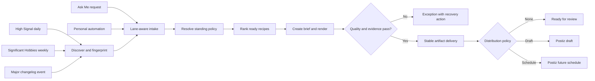

## Context

See `proposal.md` for motivation. Reel Pipeline already has a JSON Idea Store, a conversational Marketing Brief Store, content extractors for High Signal and Significant Hobbies, a Significant Content idempotent handoff, a factory conveyor, capability-aware recipes, quality reports, artifact manifests, and evidence-gated Postiz draft or future-schedule submission. The missing layer is a durable origin model plus unattended orchestration that reuses those boundaries.

Fleet identity remains owned by `foundry/ops/config/projects.json`; public changelog evidence follows the canonical same-origin `/changelog` contract. Reel Pipeline must not introduce project identities, credentials, a second task tracker, or direct provider publication.

## Goals / Non-Goals

**Goals:**

- Preserve the user's three visible content lanes while using a composable internal model.
- Make High Signal daily, Significant Hobbies weekly, and major project changelogs event-driven initial policies.
- Reuse current source, brief, renderer, quality, artifact, and Postiz contracts.
- Make every run idempotent, resumable, bounded by policy, and observable after the fact.
- Let the dashboard monitor and override instead of participating in normal execution.

**Non-Goals:**

- A general workflow builder, cron daemon, or replacement for host scheduling.
- LLM-authored claims, inferred rights, automatic credential setup, or direct social publication.
- Automatic engagement, comments, analytics optimization, or indefinite self-modifying campaigns.
- Enabling every Fleet project in the initial policy set.

## Decisions

### Model lanes as scope plus trigger

Persist `scope` (`project` or `personal`) and `trigger` (`scheduled`, `event`, or `operator-request`) with immutable source provenance; derive the three user-facing lanes. This preserves project attribution for direct requests and avoids a growing enum for every future combination.

Alternative: store only `project-automation`, `operator-request`, or `personal-automation`. Rejected because a direct request about a project would lose either its project scope or its conversational origin.

### Keep policy in versioned configuration and execution state in existing stores

Add one repository-owned policy registry without secrets. Use Idea Store idempotency keys, brief lifecycle, artifact manifests, and distribution receipts as the run ledger instead of adding another job database. The host scheduler invokes a bounded `factory autopilot` command; Reel Pipeline does not implement its own daemon.

Alternative: add SQLite workflow state. Rejected because current JSON stores already own the relevant lifecycle and a second queue would drift.

### Reuse configured source adapters

High Signal and Significant Hobbies use the current content extractors and configured content-base paths. Major changelogs resolve maintained public projects through the Fleet catalog, inspect new shipped Timeline entries from their durable status files as internal triggers, exclude minor/internal categories, and use the canonical public `/changelog` URL as distribution evidence. Source text and its fingerprint are preserved; no claim is invented from commit messages.

Alternative: scrape Git history. Rejected because commits are noisy, not customer-facing evidence, and violate the public evidence contract.

### Select recipes deterministically within policy

Each policy carries an ordered recipe allowlist and spend ceiling. Autopilot decorates recipes with the existing capability probes, rejects missing-input and over-budget candidates, and selects the first ready recipe. The initial policies are local-first; external or paid recipes require an explicit later policy revision. The selection receipt preserves the readiness snapshot and rejected blockers.

Alternative: ask an LLM to choose any engine. Rejected because identical runs could spend differently and bypass readiness constraints.

### Treat standing policy as bounded authority

Operator requests retain the existing explicit Build action. Automation-owned items may render and create a Postiz draft or future schedule when the exact policy revision authorizes those actions and all existing evidence gates pass. Immediate publication remains rejected, and Postiz continues to own calendar execution and provider state.

Alternative: auto-approve every generated artifact. Rejected because quality, source, rights, and stable-media failures must remain observable exceptions.

## Risks / Trade-offs

- **Changelog significance rules misclassify an entry** → Preserve the exact source text and rule result, default ambiguous entries to an exception, and allow a policy-safe override.
- **External or local runtime readiness changes between selection and render** → Re-check immediately before execution and record the changed blocker without silently changing spend posture.
- **Interrupted runs duplicate side effects** → Key every stage by policy, source fingerprint, and channel; refuse a second Postiz action when a receipt already exists.
- **Automatic schedules amplify weak content** → Require the same source, rights, quality, stable-media, and account-mapping gates as manual submission; start policies local-first and with bounded batch sizes.
- **Legacy records lack origin fields** → Normalize them as legacy operator requests while leaving source and approval fields unchanged.

## Migration Plan

1. Add optional origin fields and normalization without changing legacy behavior.
2. Add the policy registry, dry-run discovery, idempotency receipts, and lane-aware status.
3. Enable rendering for the three initial source policies with distribution mode `none` in fixtures and local verification.
4. Enable Postiz draft or schedule only when the existing machine configuration and policy authority pass preflight; otherwise retain an actionable exception.
5. Roll back by disabling the policies. Existing ideas, briefs, artifacts, and Postiz receipts remain valid and manual Studio execution continues unchanged.
