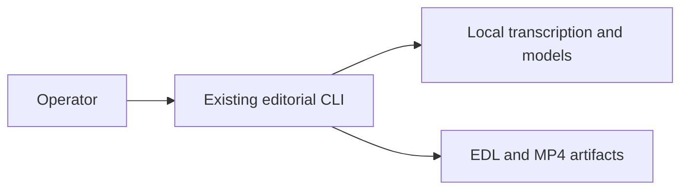

## Context

See [proposal.md](./proposal.md) for motivation. The local Node control server already owns `/studio`, while the incorporated Mashup runtime under `editorial/` owns archive ingestion, local model stages, sequencing, rendering, and a separate EDL editor. Mashup is intentionally an experimental CLI capability rather than a product surface.

## Goals / Non-Goals

**Goals:**

- Give Video Maker one immediately understandable browser workflow.
- Keep its first screen to one primary action and progressively disclose optional choices.
- Preserve the existing Mashup CLI and its resumable local work directory without exposing it in a web UI.

**Non-Goals:**

- Reimplement Mashup planning in JavaScript, add a Mashup web adapter, or merge its editor into Studio.
- Add uploads, remote storage, publishing, cloud jobs, or provider credentials.
- Remove legacy Studio APIs or automation/tool modules used by agents.

## Decisions

### One browser product

Fleet Console's existing `/marketing` page owns the visible Video Maker form. Reel Pipeline retains `/studio` as a diagnostic surface. Mashup has no navigation item, page, panel, or browser API; operators invoke the incorporated editorial CLI directly.

### Recipe-first settings

The prompt owns subject and intent. Settings separately choose the concrete production recipe rather than conflating intent with rendering: Auto, image slideshow, web motion, ASCII animation, local narration, Blender scenes, Three.js, and the other recipes already published by `/studio/arsenal`. The selected recipe exposes its output style, runtime, spend class, and readiness. Blocked recipes explain the missing setup before submission; external recipes produce their real continuation; local recipes execute through their configured engine.

Auto ranks only recipes whose current arsenal state is `ready` and whose action is local execution. Prompt hints may prefer an exact ready recipe, but the UI always names the chosen recipe instead of silently falling back to a different renderer.

### CLI-only Mashup

Mashup inputs, model selection, progress, and artifacts remain owned by `uv run --project editorial reel-editorial`. No source folders or output artifacts cross a browser boundary.

## Risks / Trade-offs

- **CLI use is less discoverable** -> This is intentional while Mashup remains an experimental capability rather than a supported Fleet product.
- **A source archive lacks subtitles or model readiness** -> The existing runtime exits with its real actionable error.

## Migration Plan

1. Add the focused Video Maker section to Fleet Console's existing Marketing page.
2. Remove Mashup from browser navigation and retain only the existing editorial CLI.
3. Distill the standalone Video Maker while preserving its existing API contracts.
4. Validate the integrated dashboard and retain rollback as removal of the creation component plus restoration of the previous Studio markup.
