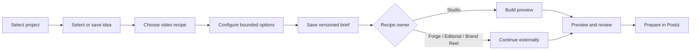

## Context

See `proposal.md` for motivation. Marketing Studio is a buildless server-rendered page with local JSON brief and idea stores, six workflow-level capabilities, a broader render-mode registry, direct local execution for faceless and lyric videos, specialized continuations for other workflows, and Postiz-owned distribution. The new planner must unify these truths without adding a second execution system or importing credentials.

## Goals / Non-Goals

**Goals:**

- Make project, idea, recipe, and options explicit saved production state.
- Compare heterogeneous recipes using one normalized readiness and spend vocabulary.
- Give an AI operator one deterministic, machine-readable inventory of workflows, recipes, tools, runtime readiness, automation policies, guardrails, and next actions.
- Keep execution behind the existing brief and capability boundaries.
- Make Edit, Build or Preview, and Prepare in Postiz truthful consequences of saved state.
- Preserve existing briefs and ideas through optional, backward-compatible fields.

**Non-Goals:**

- A node-graph editor, nonlinear automation builder, or generic workflow engine.
- Exact dollar estimates for third-party models or services without a versioned price source.
- New direct YouTube, Instagram, Grok, or other provider credentials.
- Pretending that unimplemented Three.js, local-model, or external paths are locally ready.
- Replacing Forge, Editorial, Brand Reel, Productions review, or Postiz.

## Decisions

### Use a repository-owned recipe catalog

A versioned `config/studio-arsenal.json` manifest maps user-facing workflows, recipes, and Studio tools to existing brief kinds, engines, owners, defaults, requirements, spend posture, side-effect posture, and actions. The existing planner and capability evaluator load from that manifest. A read-only assembler joins its references to `config/render-modes.json` and `config/studio-automation.json` at request time, so the UI, CLI, and future AI operator receive one normalized snapshot without turning volatile readiness or policy cadence into duplicated catalog data.

Alternative: derive cards directly from `config/render-modes.json`. Rejected because render modes do not describe workflow owners, rights requirements, user-facing defaults, or external continuations. Alternative: copy engines and automation policies into the arsenal manifest. Rejected because that would replace visible scattering with hidden drift.

### Treat the arsenal as a read-only planning contract

`GET /studio/arsenal` and `npm run factory -- arsenal` return the same schema. The snapshot names its source revisions, safe operating rules, known projects, tools, workflows, recipes, engines, and automation policies. Optional filters may narrow by channel, spend ceiling, owner, readiness, or recipe id, but inspection never creates a brief, renders media, uploads an artifact, or contacts Postiz.

Alternative: let the agent call every existing endpoint and infer the graph. Rejected because discovery would remain scattered and could accidentally mix read-only inspection with mutating actions.

### Validate references instead of trusting labels

Manifest validation rejects duplicate ids, unknown engines, unsupported owners, invalid spend classes, malformed options, missing actions, and tool definitions without a matching stable handler. Automation policies continue validating recipe ids against this canonical recipe set. This makes drift a test failure instead of an agent prompt problem.

### Persist selection on the existing brief

Optional `ideaId`, `recipeId`, and normalized `recipeOptions` fields extend the versioned Marketing Studio brief. The idea store gains an optional `projectSlug`. Old records normalize with null selections and remain readable.

Alternative: add a separate production-plan store. Rejected because it would duplicate lifecycle, revision, project, channel, and execution state already owned by the brief.

### Derive stable variants from finite options

The server expands each recipe's select choices and booleans with a bounded Cartesian product. Variant identifiers derive from the recipe id plus sorted normalized values; labels use the human option labels and values. Duration stays separate, and text or local-path fields remain required follow-up inputs. The current manifest yields 40 variants, and validation caps expansion so future catalog edits cannot create an unusable selector.

Alternative: hand-author every variant in the manifest. Rejected because defaults, UI labels, and normalization would drift. Alternative: multiply variants by every duration. Rejected because duration is orthogonal and would inflate the current selector from 40 to 160 entries without adding a distinct visual method.

### Separate selectability, readiness, and delivery

Every variant is selectable for inspection. Runtime and input readiness controls whether its action can run. A separate delivery contract identifies `final-video`, `preview`, or `continuation`; Auto considers only ready `final-video` variants. This prevents a successful PNG or HTML preview from being advertised as a completed video.

### Finish local HTML and Blender paths with existing tools

HTML composition uses the repository's dependency-free Chrome DevTools capture utility to render deterministic timeline frames, then the existing FFmpeg boundary encodes a vertical H.264/AAC MP4 while retaining the HTML preview. Blender continues generating bounded scene plates and composes those plates into a timed H.264/AAC MP4 through FFmpeg, preserving the manifest and plate hashes. No new production dependency or arbitrary Blender script input is introduced.

Alternative: mark both paths Preview only forever. Rejected because the operator's target is a final playable video. Alternative: add Remotion as another dependency. Rejected because the repository already owns Chrome capture and FFmpeg boundaries.

### Keep the Console control native and compact

The existing format `<select>` remains the primary control. Options are rebuilt from the server variant catalog into recipe-labelled groups, and each option suffix states Final video, Preview, Continue, Needs input, or Needs setup. The summary carries the richer explanation, so the dropdown remains scannable and keyboard-native.

### Add a style-first gallery without creating a second editor

Fleet Console owns `/marketing/explore-gallery` as a child of the existing Marketing route. The gallery leads with real media grouped by visual family, then discloses engine, spend posture, delivery type, and source posture. It does not duplicate prompt entry, production settings, or review controls. A sample with a stable runnable variant links back to `/marketing?variant=<id>`; imported assets and external continuations remain inspect-only when no local preset can reproduce them.

The Reel Pipeline owns a secret-free gallery registry and read-only gallery API. Registry entries point only to allow-listed local artifacts, report missing assets honestly, and stream playable media by stable sample id rather than exposing arbitrary filesystem paths. Media responses support byte ranges because browsers depend on them for reliable MP4 seeking and playback.

### Make visual options materially change output

Finite visual choices are a rendering contract, not catalog copy. HTML composition presets alter composition, typography, spatial rhythm, and motion; ASCII palettes alter the authored color system; Blender art directions alter geometry, lighting, materials, and camera staging. An imported Grok asset is labelled as an import and may expose local post-production treatments, but the Studio never claims that those treatments are new Grok generations.

### Keep the planner deterministic and dependency-free

The page uses a small explicit selection state and native controls. The server remains authoritative for validation and readiness. No XState or React Flow dependency is added: this flow is linear, and a graph editor would misrepresent specialized external ownership.

### Separate spend posture from volatile prices

Recipes use `none`, `local-compute`, `external-service`, or `paid-api` spend classes plus plain-language notes. The Studio does not display invented dollar estimates. A future priced cost service can add versioned estimates without changing recipe identity.

### Derive terminal actions from state

The catalog and decorated brief return bounded actions: edit is always local; build is either the existing execute endpoint or a specialized continuation; preview requires a real media artifact; Postiz preparation uses the existing distribution evidence gate.

## Risks / Trade-offs

- **Recipe catalog drifts from adapters** → Unit-test every recipe mapping and keep engine identifiers validated against known contracts.
- **The combined snapshot becomes another source of truth** → Assemble it from canonical manifest, render-mode, brand, and automation registries and include their schema/version provenance.
- **An agent treats discovery as permission** → Mark every operation with its side-effect and confirmation posture; keep the arsenal endpoint and CLI strictly read-only.
- **Readiness checks become slow or invasive** → Use lightweight configuration and local probes only; defer expensive canaries to explicit execution.
- **Idea records lack project ownership** → Preserve them as unassigned legacy ideas and require project association before using them in a new plan.
- **Too many recipes overwhelm operators** → Group by outcome, show spend and runtime at scan level, and put detailed requirements behind the selected recipe.
- **Variant expansion overwhelms the selector** → Group by recipe, retain one separate duration selector, use deterministic ordering, and reject catalogs above the bounded expansion cap.
- **A gallery becomes another settings screen** → Keep it artifact-first with lightweight filters and one "Use this style" handoff to the existing maker.
- **A sample plays in one server but not Fleet Console** → Serve registered MP4s with byte-range responses and test 206 delivery.
- **A backend label is mistaken for visual quality** → Rank and group by visible treatment, disclose the engine second, and mark imported or baseline fixtures explicitly.
- **Frame capture is slower than preview generation** → Show an explicit rendering state, use deterministic lower capture FPS with H.264 delivery, and retain resumable source artifacts on failure.
- **A local encoder silently returns a non-video artifact** → Require a non-empty MP4 output and propagate its path through quality probing before the brief reaches review.
- **External continuation returns no artifact automatically** → Preserve the brief id in continuation URLs and show the external owner as the authoritative next step.

## Migration Plan

1. Add optional catalog and plan fields with backward-compatible normalizers.
2. Expose the catalog, project-scoped ideas, and plan actions through current Studio APIs.
3. Replace the Create first viewport with the ordered planner while retaining the detailed brief editor below it.
4. Move the existing workflow, recipe, and tool metadata into the arsenal manifest and expose the joined read-only snapshot.
5. Roll back by restoring the in-module definitions; existing briefs, recipe ids, artifacts, and external continuations remain valid.
