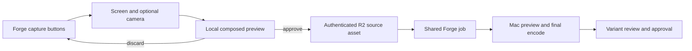

## Context

Reel Pipeline has multiple local render modes and a large set of proof
primitives, but no shared contract for deciding when to use them. The most
recent proof exposed slideshow, SVG, ASCII, presenter, and generated motion in
parallel; it demonstrated breadth but failed as a film because the viewer had
no dominant subject or narrative through-line.

The first reference implementation is a 25–30 second CodeVetter launch short.
Its selected visual direction is `evidence-beam`: uncertain code is isolated,
evidence is assembled along one continuous path, and a clear shipping verdict
emerges. The delegated direction probes are stored under
`artifacts/design/probes/codevetter-film/`.

## Goals / Non-Goals

**Goals:**

- Make narrative intent the input to composition rather than selecting render
  engines directly.
- Keep one dominant visual idea across a short while allowing different media
  to support successive story beats.
- Reuse real product evidence, local LTX motion, voice, captions, SVG/Canvas,
  Chrome capture, and FFmpeg finishing behind one typed timeline.
- Make every render deterministic, reviewable, and reproducible.
- Distinguish production-safe tools and assets from experimental or
  license-restricted proof lanes.
- Make real app and presenter capture a consent-driven UI workflow while a
  versioned film skill preserves the resulting composition quality.

**Non-Goals:**

- A nonlinear editor, generic animation framework, public template marketplace,
  automatic shot planning, or automatic publishing.
- Displaying every available render primitive in one film.
- Shipping Wav2Lip output or another research-only model in commercial media.
- Adding D3, Three.js, Lottie, or a music-generation model before an existing
  primitive proves insufficient.

## Decisions

### Narrative roles form the scene grammar

Each film declares a spine and scenes with one of six roles: `setup`,
`tension`, `analysis`, `verdict`, `proof`, or `close`. A scene also declares
its narrative purpose, dominant subject, supporting layer, transition intent,
spoken line, and asset references.

This is preferred to engine-named scenes such as `ascii` or `slideshow`.
Techniques are implementation choices; the role explains why the scene exists.

### A visual budget is validated before rendering

Every scene permits one dominant subject, at most one supporting visual layer,
one principal action, one camera move, and one principal transition. A film
uses one palette and typographic system unless the manifest explicitly records
a justified act break.

The validator rejects scenes with missing narrative purpose, simultaneous
competing media, unreadable text timing, or unlicensed assets. It does not try
to algorithmically score taste; review still requires human evidence.

### Media adapters remain behind the scene contract

The compositor resolves approved inputs through existing capabilities:

- product capture through Chrome screenshots or recordings;
- generated motion through Local Video Forge shot manifests;
- deterministic typography and evidence paths through SVG/Canvas;
- narration, captions, music, and effects through the existing audio/FFmpeg
  stages.

The normalized timeline records what was chosen. A different engine can
implement the same scene without changing the story contract.

### Real UI is content; generated UI is not evidence

CodeVetter product scenes use current local screenshots or recordings from the
actual application. Generated imagery may supply atmospheric or transitional
material but SHALL NOT invent product claims, findings, metrics, or UI proof.

### The reference film uses one continuous evidence path

The CodeVetter cut follows this sequence:

1. AI-generated code arrives as undifferentiated volume.
2. One risky change is isolated.
3. A single evidence beam connects change, history, and executable tests.
4. The beam resolves into one qualified shipping verdict.
5. The film closes on CodeVetter and the line `Ship with evidence.`

ASCII, charts, and slides are omitted unless they advance this path. The human
presenter is omitted; narration carries the voice while the product and
evidence remain the subject.

### Film skills preserve production judgment

A film skill is a versioned recipe, not executable agent prose. It records:

- the story spine and permitted narrative-role sequence;
- required and optional asset types plus publication constraints;
- visual-budget, motion, caption, voice, and audio defaults;
- approved scene primitives and quality gates;
- a reference manifest and representative output frames;
- known failure modes and when the skill should not be selected.

AI may propose a skill and fill its variables from a prompt, script, or product
brief. The normalized manifest records the selected skill ID and version.
Changing a skill creates a new version so completed renders stay reproducible.
The first skill is `evidence-beam@1`, derived from the CodeVetter reference
film.

### The operator console is a control surface, not an editor

The existing local studio/server surface gains one dense workflow:

1. prompt or paste a brief;
2. select an explicit film skill or accept the AI suggestion;
3. inspect required assets, source revisions, and rights;
4. submit and monitor local or remote tasks;
5. review representative frames or variants and choose `accept`, `retry`,
   `change-motion`, `change-keyframe`, or `cloud-candidate`;
6. launch the approved final render.

The console does not expose a freeform timeline, arbitrary layer dragging, or
frame-by-frame editing. Advanced edits remain in Final Cut, DaVinci, CapCut, or
another editor after export.

### Capture is a workflow; composition is a film skill

`Record guided app demo` is a stateful browser workflow, not an agent tool. The
operator clicks through source selection, optional camera permission,
countdown, recording, local preview, discard or approval, and upload. Browser
capture uses `getDisplayMedia()` and `getUserMedia()` only after an explicit
gesture. Nothing records in the background and nothing uploads before the
operator approves the take.

`guided-app-demo@1` is the film skill applied to that source. It pins the real
app as the dominant subject, a same-session presenter at bottom right, safe
size and margins, authentic audio synchronization, caption and audio defaults,
and publishability gates. The UI labels this choice `Film style`; the exact
skill ID and version remain visible in job metadata and advanced details.

The browser records one composed WebM source at a fixed portrait resolution.
The Mac worker produces a smaller preview encode and a higher-quality final
MP4 from the same approved source, so the accepted content and synchronization
cannot drift between review and final.

### Existing deterministic tooling is the production default

The first implementation uses the existing Node, Playwright/Chrome, Canvas/SVG,
FFmpeg, Kokoro, and optional LTX runtime. Remotion may be used as a local proof
renderer but does not enter the Node production dependency graph.

Alternatives considered:

- **D3 transitions:** rejected initially because frame-driven SVG math already
  covers the required evidence path and avoids another dependency.
- **Three.js:** deferred because headless WebGL remains a reliability risk.
- **Talking-head-led film:** rejected because it weakens product hierarchy and
  local lip-sync remains an experimental/licensing boundary.
- **OpenVid:** evaluated as interaction-pattern research only. Its
  PolyForm Noncommercial 1.0.0 license does not fit anticipated commercial
  marketing use, and its browser editor is substantially larger than this
  pipeline's headless scene contract. Do not import its code, models, or
  bundled assets. Independently implement only the useful ideas: focus-travel
  zoom fragments, original 2D device frames, layered screen stages, and
  explicit-time rendering.

## Risks / Trade-offs

- **A strict visual budget can feel limiting** → allow manifest-level
  exceptions with a written purpose, then surface them in review metadata.
- **Real product captures can drift as CodeVetter changes** → record source
  revision and recapture rather than preserving stale screenshots as truth.
- **LTX hero motion can distort interface details** → never use generated
  frames as product evidence; cut back to deterministic capture before showing
  a claim or verdict.
- **Narrative validation cannot guarantee taste** → require representative
  frame review, critique, and owner `keep` or delegated approval.
- **Experimental tools may leak into publishable output** → classify every
  adapter and asset as production-safe or proof-only and fail closed when the
  requested publication tier conflicts.
- **Capture permission can be denied or revoked** → keep permission states
  explicit, recover without losing the rest of the form, and never imply that
  recording started before the browser confirms it.
- **Long browser captures can exhaust memory or Worker limits** → cap takes at
  90 seconds, stream the approved Blob directly to R2, and record bytes,
  duration, media type, and hash without embedding video in JSON.
- **Separate face and app tracks can drift** → compose them into one
  same-session canvas recording before upload; imported presenter tracks must
  provide an explicit synchronization receipt.

## Migration Plan

1. Add the scene schema, validation, and focused tests without changing current
   render modes.
2. Add the deterministic compositor and CodeVetter reference manifest as a new
   opt-in command.
3. Render and review the reference film locally.
4. Keep current `forge:demo` behavior available until a later change explicitly
   migrates it.

Rollback is deletion of the new opt-in command and scene-pack files; no data
migration or deployment is involved.

## Open Questions

- LTX LipDub remains gated and is not required for this change.
- Music selection remains an approved local-asset decision; the first proof may
  use a deterministic sound bed and effects instead of generated music.
