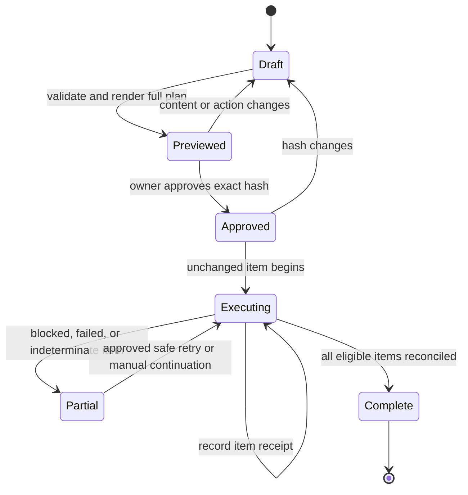

## Context

Fleet already has a canonical product registry, live site-health probes,
source-backed content packages, immutable media receipts, a Postiz adapter, and
browser-based directory experiments. These pieces do not currently form an
operator-facing workflow for competitive SEO coverage or one-off launches.
The existing site-health router checks technical and on-page quality, while the
marketing control plane is optimized for bounded recurring drafts and currently
forbids automatic posting.

The new skills must work across heterogeneous product repositories and
publishing stacks. They must also distinguish three different authorities:
product repositories own product truth and first-party pages, Postiz owns
connected social accounts and social scheduling, and each external destination
owns its form, moderation, and publication state.

## Goals / Non-Goals

**Goals:**

- Give the owner a single complete preview before either skill makes public or
  repository changes.
- Let one approval authorize every unchanged action in that preview.
- Audit SEO content by customer/search intent and competitive page archetype,
  not by a universal article-count target.
- Produce complete source-backed first-party pages and publish them through the
  owning repository's established workflow.
- Produce excellent flagship launch content and broad, lower-effort but
  destination-relevant secondary distribution.
- Reuse Postiz, purpose-built connectors, and the connected browser rather than
  adding another social scheduler or a hidden browser runtime.
- Preserve idempotency, per-item evidence, and truthful partial outcomes.

**Non-Goals:**

- Daily social-media management or an always-on autonomous content calendar.
- Creating fake accounts or reviews, bypassing CAPTCHA or anti-bot systems,
  hiding browser automation, manufacturing community engagement, or posting
  irrelevant duplicate content.
- Automatically purchasing placements, sending press pitches, or making legal,
  medical, financial, or comparative claims without source evidence and the
  required approval.
- Rebuilding Postiz, the Fleet content renderer, or project-specific content
  infrastructure inside these skills.
- Treating raw article volume, domain rating, or dofollow status as proof of
  marketing value.

## Decisions

### Keep two public skills over one shared private contract

`content-coverage` and `launch-campaign` remain independently triggerable
because their inputs, cadence, and primary outputs differ. Both use one
dependency-free campaign-manifest library and CLI for preview validation,
fingerprinting, approval, item state, and receipts. This avoids divergent
approval semantics without forcing agents to load both skill protocols.

### Make the immutable manifest the approval boundary

The manifest contains campaign identity, kind, product revision, source
evidence, complete content bodies, destinations, account mappings, timing,
costs, execution mode, repository writes, checks, publish/deploy commands,
blockers, and expected receipts. Canonical JSON is hashed with SHA-256.
Approval records the hash, owner decision reference, and time. The execution
gate recomputes the hash before every item; a mismatch invalidates the approval.

The shared library never evaluates arbitrary shell stored in a manifest.
Agents execute the approved commands through the normal repo workflow and
record the result. This keeps the manifest reviewable without turning it into a
general remote-code-execution format.

### Store private campaign state outside the checkout

Unpublished bodies, approvals, screenshots, account/destination identifiers,
and receipts live below a machine-local Fleet runtime directory with private
permissions. Repository fixtures contain fictional content only. Public
snapshots receive counts, stages, and sanitized result URLs after publication,
never unpublished copy or authentication material.

### Discover content standards at run time

The content-coverage workflow combines:

1. product truth from the target repository and live site;
2. sitemap and local route/content inventory;
3. live search-result and competitor-page research;
4. a reusable archetype vocabulary covering category, problem, how-to, use
   case, integration, comparison, alternatives, proof, benchmark, glossary,
   template, and product explanation pages; and
5. optional first-party performance evidence when deliberately connected.

An archetype is required only when current search evidence, customer intent, or
the product's differentiation supports it. The verdict therefore measures
coverage quality and gaps rather than enforcing a fixed number of posts.

### Publish first-party pages through the owning repository

The skill reads the target repository's nearest agent instructions and status,
uses its existing content model and package manager, edits the smallest coherent
surface, and runs the smallest required checks. If no suitable article surface
exists, the skill includes creation of that surface in preview and invokes the
project's spec-driven workflow after approval. Commit, push, or production
deploy occurs only when each exact action is present in the approved manifest.

### Use a tiered launch plan

The launch skill separates:

- `flagship`: a small number of high-effort canonical, social, email, launch,
  or press assets written in full;
- `secondary`: broad eligible directories and content platforms with
  destination-specific fields and lighter adaptation; and
- `manual_or_blocked`: moderation-sensitive communities, press, paid,
  authentication-blocked, CAPTCHA, anti-bot, or policy-incompatible actions.

The existing directory registry is a seed inventory, not authority. Each
destination is rechecked for audience fit, current submission flow, cost,
policy, and automation mode before appearing as executable.

### Prefer semantic integrations, then normal browser interaction

At execution time the agent queries for a purpose-built connector, API, or CLI
for each action. Social work uses Postiz when mapped. UI-only actions use the
connected in-app browser or Chrome through the Browser skill, preserving the
user's signed-in session when available. Browser execution uses visible normal
interactions, never the legacy force-submit or automation-evasion scripts.

CAPTCHA, anti-bot challenges, missing authentication, unexpected payment, or
materially changed forms produce a blocked or indeterminate receipt. They do
not trigger a bypass or blind retry.

### Treat confirmed receipts as the only success signal

Every item has a deterministic identity derived from the campaign hash,
destination, content variant, and action. Confirmed provider IDs, live URLs,
repository revisions, or browser success evidence produce successful receipts.
Ambiguous navigation or submission text remains indeterminate and requires
reconciliation before retry. Re-running an approved campaign skips items with
confirmed matching receipts.

## Risks / Trade-offs

- **Competitor pages can be numerous but low quality** -> score audience fit,
  intent, evidence, and differentiation instead of copying volume.
- **Search results and platform rules change** -> timestamp all live evidence
  and require destination revalidation before execution.
- **Cross-repository publication can become a broad rewrite** -> use existing
  content surfaces and trigger a separate project OpenSpec when infrastructure
  is missing.
- **One approval can authorize many public actions** -> show every action and
  full body, hash the manifest, reject changes, and expose costs and account
  mappings before approval.
- **Browser submissions can be ambiguous or duplicated** -> use deterministic
  item IDs, capture evidence, reconcile before retry, and report partial state.
- **Low-effort distribution can degrade the brand** -> require relevance,
  destination-specific copy, claim accuracy, and exclusion of deceptive,
  duplicate, or moderation-sensitive spam.
- **Postiz is not fully cut over on the designated host** -> keep social items
  blocked or draft-only until the existing Postiz readiness gates pass.

## Migration Plan

1. Land and validate the shared manifest library, CLI, fixtures, and tests.
2. Add `content-coverage`, its inventory helper, references, metadata, router
   entry, scorecard field, and fixture-based dry run.
3. Add `launch-campaign`, its channel/quality/execution references, metadata,
   and fixture-based preview/receipt run.
4. Register both skills in the capability catalog and existing parent routing
   without changing the runtime skill loader.
5. Run both skills in preview-only mode against CodeVetter fixtures.
6. After owner review, run one content write to a non-production fixture repo
   and one browser dry run that stops before submit.
7. Keep all live publication disabled until an exact real campaign manifest is
   separately approved.

Rollback removes the new skills and router entries while preserving
machine-local manifests and receipts for audit. Existing Postiz and site-health
behavior remains independently usable.

## Open Questions

None. The owner selected two separate skills, full-plan preview, one
manifest-level approval, automatic unchanged execution, and browser completion
for destinations without a better integration.
