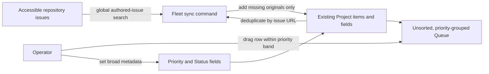

## Context

See `proposal.md` for motivation. Fleet currently delegates cross-repository issue aggregation to GitHub's global Issues dashboard, which can filter authored issues across organizations but cannot preserve a custom priority order. The current authenticated search returns more than one hundred open authored issues across dozens of repositories. GitHub Projects can hold original issue items and project-local fields, but its built-in auto-add workflow targets one repository per workflow and is plan-limited. Organization-level issue fields also do not populate for issues owned by another organization, so the queue must use Project fields rather than organization issue fields.

The primary worktree contains unrelated changes. Implementation must avoid those paths and keep the new tooling under Fleet-owned Foundry operations paths.

## Goals / Non-Goals

**Goals:**

- Preserve exact human-controlled row order, including insertion between existing tasks.
- Cover all issues visible to the operator's authenticated GitHub account across organization boundaries.
- Keep synchronization idempotent and unable to overwrite manual rank or Project metadata.
- Make the prototype useful directly in GitHub without a separate database or deployed service.

**Non-Goals:**

- Replace GitHub Issues, move issues between repositories, or copy issue content into Fleet.
- Infer product strategy without explicit operator direction, or treat issue age and title wording as sufficient evidence.
- Add workflows to every repository or install a GitHub App across every organization.
- Build a Fleet Console or mobile UI in this change.
- Assign initial priority values to the operator's backlog without explicit operator judgment.

## Decisions

### Use one GitHub Project as a projection over original issues

Create a private Project named `Sarthak Priority Queue`, initially under the operator's personal GitHub account. Run a cross-organization canary before bulk import; if GitHub rejects other-organization items under a user-owned Project, create the Project under `sass-maker` instead. In either case, items remain original issues and permissions continue to follow their owning repositories.

This is preferred over a homegrown database or dashboard because it preserves GitHub as the sole operational tracker and supplies editing, linking, filtering, and audit behavior without a deployed service.

### Make priority bands and unsorted position the authoritative rank

The primary `Queue` view uses a table layout filtered to open issues, grouped by Priority, and with no configured sort. Grouping visibly enforces `P0` → `P1` → `P2` → `P3` while GitHub's native row position inside each band represents exact rank and supports drag insertion in the middle. Grouping does not disable manual ordering; a configured sort would, so the Queue remains unsorted.

Newly synchronized items are added without editing existing Project items and begin at GitHub's default insertion position. They remain unprioritized and therefore visibly unreviewed until the operator or an explicitly directed agent reads the issue body and relevant state. The synchronization command does not attempt fractional ranking, renumbering, or metadata inference.

The queue uses this outcome order when reviewing work:

1. **Finish** — close already-started work and narrowly bounded release or verification gates.
2. **Market** — distribute products that have a credible, ready source asset or unblock their public journey.
3. **Measure** — collect decision-changing product, growth, quality, or reliability evidence.

Priority is assigned from evidence, not keywords:

- `P0 — Now`: actively in progress or one bounded step from a meaningful finish; deliberately capped to a small working set.
- `P1 — Next`: the next unblocked finish, ready marketing action, or decision-changing measurement.
- `P2 — Soon`: aligned work that is dependency-gated, owner-gated, waiting for a measurement window, or follows a P1 prerequisite.
- `P3 — Later`: speculative expansion, broad debt reduction, low-urgency maintenance, or explicitly deferred work.

`blocked` and `deferred` items cannot be P0 unless the queued action is specifically to remove that blocker and the operator has chosen to do it now. Editing Priority moves the issue to the matching group; the operator then places it intentionally within that band.

### Use project-local fields across organizations

Create these Project fields:

- `Priority`: single select with `P0 — Now`, `P1 — Next`, `P2 — Soon`, and `P3 — Later`.
- `Reasoning complexity`: single select with `R0 — Mechanical`, `R1 — Routine`, `R2 — Judgment`, `R3 — Systems`, and `R4 — Novel`.
- `Status`: use the Project's standard single-select status for workflow context.

Project-local fields are selected because organization issue fields show empty values for issues owned by another organization. Priority values are deliberately coarse; manual queue position answers the finer question of what comes before what. Reasoning complexity measures ambiguity and depth of reasoning only: repetitive volume, elapsed time, and implementation size do not raise it.

### Synchronize through the installed GitHub CLI and user authentication

Add a small Fleet-owned script that:

1. verifies `gh` authentication and required Project scopes without revealing token values;
2. searches `is:issue is:open author:<login>` across every accessible repository;
3. reads existing Project items;
4. adds only missing issue URLs; and
5. prints numeric discovered, added, unchanged, and failed counts.

The script accepts explicit project owner/number and author arguments, supports a dry run, and uses existing CLI/API capabilities rather than a new dependency. User authentication is required because one GitHub App installation token is scoped to one owner and is a poor fit for cross-organization reads.

### Filter active work instead of deleting completed history

The Queue view filters to open issues. Project auto-archive will be enabled only if a live cross-organization close/reopen canary proves that it behaves consistently. Otherwise closed items remain linked but filtered out, and synchronization reports closed linked items without destructively deleting them.

## Risks / Trade-offs

- [Cross-organization Project behavior is incompletely documented and some Project linkage is not visible on the foreign issue sidebar] → Run a one-item canary before bulk import, keep the Project as the primary navigation surface, and record the observed limitation.
- [The built-in Project auto-add workflow cannot cover dozens of repositories] → Use one explicit user-authenticated sync command with no repository changes.
- [Manual order can be hidden or disabled by a saved sort] → Keep the canonical Queue view unsorted and place any grouped/sorted exploration in separate named views.
- [Bulk import could encounter rate limits or permission failures] → Deduplicate first, process items independently, report failures, and make reruns idempotent.
- [Project-only Priority is not visible from every repository issue page] → Treat it as personal queue metadata and keep repository labels/status authoritative only for repository-local concerns.
- [A private issue may be invisible to another Project viewer] → Rely on GitHub's repository permissions and do not copy private issue content elsewhere.

## Migration Plan

1. Create the Project and one cross-organization canary item.
2. Configure project-local fields and an unsorted Queue view.
3. Add and test the synchronization command in dry-run mode.
4. Bulk import missing open authored issues and verify counts against global search.
5. Move a canary item into the middle of the queue, refresh, and confirm relative order persists.
6. Close and reopen a disposable canary issue to verify active filtering and decide whether auto-archive is safe.
7. If the prototype fails, remove only the Project items or Project created by this change; original repository issues remain untouched.
