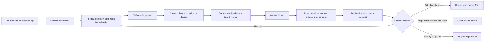

## Context

The Day 0 playbook is not a request for a more elaborate renderer. It is an
experiment-control problem: hold positioning stable, run enough executions of
each structural format, review quickly, preserve lineage, and react to measured
breakouts without scaling prematurely.

Reel Pipeline already has creative variants, capture, technical review,
provenance, draft handoff, and metrics adapters. Foundry already owns
mission-linked marketing state and owner decisions. Postiz owns provider
accounts, publication, and analytics. The design connects these pieces with
one narrow UGC experiment contract.

## Goals / Non-Goals

**Goals:**

- Make every creator execution attributable to one product positioning,
  format skeleton, hook hypothesis, creator reference, and source-rights
  record.
- Support native TikTok editing and creator-device posting as first-class
  manual boundaries instead of forcing every execution through a Fleet
  renderer.
- Turn post metrics into explicit repeat, revise, graduate, or stop actions.
- Reuse Reel Pipeline review, product proof, captions, receipts, and Postiz
  boundaries.
- Keep the experiment intentionally small and founder-led.

**Non-Goals:**

- Creator discovery, scraping, cold-DM automation, or personal-account scoring.
- Contract generation, e-signature, payment calculation, payouts, tax forms,
  or affiliate accounting.
- TikTok account credential storage, browser login, or automatic posting.
- Replacing Postiz metrics or building multi-touch install attribution.
- Applying the Day 0 cadence to podcast, faceless, or other non-UGC programs.
- Treating generated presenters as substitutes for contracted real creators.

## Decisions

### 1. Add a separate Day 0 experiment profile

The existing 35-post, 5–7-posts-per-day growth profile remains valid for its
faceless/app-marketing experiment. UGC gets a separate profile: 90 days,
3–5 creators, approximately 9–12 approved posts per week across the roster,
5–8 executions before judging a format, and an explicit product-positioning
freeze.

This avoids silently changing other Reel Pipeline workflows to match a
creator-led operating model.

### 2. Store opaque creator references, never credentials

An execution records `creatorRef`, creator geography/persona test dimensions,
and the brand-channel mapping needed for attribution. It does not store
personal profile scraping, passwords, phone numbers, payment details, contract
files, or tax data. Those remain in the operator's approved external systems.

### 3. Native edit packets are the default output

The playbook's Day 0 workflow values speed, native platform editing, and
creator authenticity over production polish. Reel Pipeline therefore emits a
packet containing:

- full hook/body/CTA script;
- timed beat and performance directions;
- product-proof asset and desired visible-brand moment;
- caption/disclosure suggestions;
- format and hypothesis IDs;
- rights and approval requirements.

The creator films and edits on their device, then submits the exported cut for
review. Reel Pipeline composition is optional for product-proof inserts,
captions, archival material, or approved enhanced variants.

### 4. Copy structural skeletons, not creative skin

Scouted references record a URL, observed date, broad performance band,
structural hook, beat sequence, product-placement mechanic, and CTA mechanic.
They must not import source media, transcript lines, watermarks, likeness, or
creator-specific props. A format becomes testable only after it has original
product-specific skin.

### 5. Revision and performance lineage are immutable

Each submitted creator cut has a hash and revision. Time-coded notes produce a
new revision; they do not mutate an approved cut. Publication and metrics
receipts retain experiment, format, execution, hook, creator, and revision
attribution.

### 6. Decisions are deterministic and stage-specific

- Below 5K views: no positive signal; revise the hook before blaming the
  format.
- 5K–10K: emerging signal; inspect hook and retention.
- 10K–50K: strong signal; schedule another controlled execution.
- 50K+: breakout; generate a hook clone action due within 24 hours.
- At least one 100K result during 90 days: minimum continuation proof.
- Two or three outsized results from the same format across at least two
  creators: graduate the format to a later scaling change.
- Ninety days at full cadence with no 100K result, no improving format, and no
  product-lift evidence: stop or reposition.

Thresholds are defaults in the experiment record, not hard-coded global
marketing policy.

## Flow

## Data Boundaries

### `fleet.ugc-day-zero-experiment.v1`

- experiment/project identity and stage;
- qualification evidence and fixed positioning;
- start/end dates and cadence;
- creator references and test dimensions;
- budget acknowledgement without payment ledger;
- format and execution IDs;
- thresholds and stop/graduate rules.

### `fleet.ugc-native-edit-packet.v1`

- experiment, format, execution, creator reference;
- full script and timed performance beats;
- hook, angle, character, product reveal, CTA;
- approved product-proof assets and brand-visibility instruction;
- disclosures, captions, hashtags, and rights requirements.

### `fleet.ugc-creator-cut.v1`

- immutable media hash, duration, source rights, creator release evidence;
- format/hook/execution/revision attribution;
- visible-brand and disclosure review;
- time-coded notes and approval state.

### `fleet.ugc-performance-receipt.v1`

- publication identity and timestamp;
- views, watch/retention where available, likes, comments, shares, saves;
- experiment/format/hook/creator/execution/revision attribution;
- normalized signal band and recommended next action.

## Risks / Trade-offs

- **The system grows into a creator CRM** → Store only opaque creator refs and
  execution state; keep sourcing and relationship data external.
- **Native editing breaks artifact lineage** → Require hashed creator-cut
  intake and immutable revisions before approval.
- **A single viral post causes premature scaling** → Require repeated results
  across creators for graduation.
- **Generic semantic similarity blocks useful format repetition** → Track
  structural format reuse intentionally while preserving original scripts and
  assets for every execution.
- **Metrics availability differs by provider** → Allow manual receipts and
  missing fields; never fabricate retention or install lift.
- **Production polish slows the learning loop** → Default to native packets
  and technical review; use Reel Pipeline rendering only where it adds
  product proof or legibility.

## Rollout

1. Implement contracts and fixtures only.
2. Run one manual experiment with one Fleet consumer/prosumer product, three
   creator references, and no account credentials in Fleet.
3. Emit native-edit packets for two format hypotheses and review submitted
   cuts through immutable revisions.
4. Import publication/metrics receipts manually or from Postiz.
5. Verify the decision engine recommends hook clones, repetition, and stop/
   graduate actions correctly.
6. Only after the manual pilot proves useful, add a compact operator view to
   Foundry's marketing page.

Rollback deletes no media or external state: stop issuing new packets and keep
existing receipts as read-only experiment evidence.

## Open Questions

- Which Fleet consumer/prosumer product is the first eligible Day 0 pilot?
- Whether TikTok posts remain manual creator-device actions while Instagram
  cross-posts enter Postiz as drafts.
- Which external system holds creator contracts and payment records during the
  pilot.
- Whether visible-brand review can be partly automated or remains a human
  checkbox for the first experiment.
