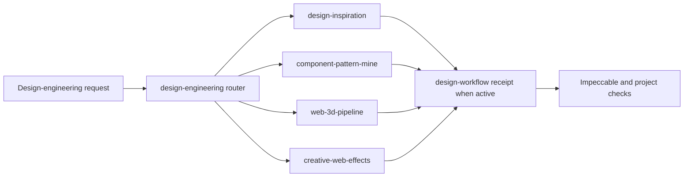

## Context

Fleet already exposes `design-workflow` for preserve/overhaul governance and
Impeccable for design craft. The current workflow names component research and
reference requirements, but it does not provide reusable execution contracts
for inspiration, component mining, web 3D, or creative effects. Fleet skills
are canonical under `foundry/ops/skills/`, use parent routing for related
subskills, and are linked into agent runtimes by the existing installer.

## Goals / Non-Goals

**Goals:**

- Make four specialized jobs discoverable through one concise parent router.
- Keep each child skill small and progressively load detailed decision guides.
- Provide deterministic, dependency-free local capability diagnostics for the
  rendering workflows.
- Preserve existing design direction, dependency approval, browser evidence,
  accessibility, and performance boundaries.

**Non-Goals:**

- Mirror every link from Design Engineer Tools or maintain a general software
  recommendation directory.
- Replace Impeccable, `design-workflow`, browser tooling, or project-specific
  frontend instructions.
- Bundle paid assets, copy proprietary implementations, install applications,
  add production dependencies, or execute a deploy.

## Decisions

### Use one parent router and four sibling subskills

Add `design-engineering` as the exposed parent. Keep `design-inspiration`,
`component-pattern-mine`, `web-3d-pipeline`, and `creative-web-effects` as
sibling child skills loaded on demand. This matches Fleet parent-skill
discovery, keeps trigger metadata compact, and avoids injecting all four
protocols into every design turn. Making all four standalone would improve
explicit invocation but would expand the always-visible skill catalog and
create overlapping triggers with `design-workflow` and Impeccable.

### Encode outcomes rather than vendor lists

Each child skill defines inputs, decisions, evidence, stop conditions, and
handoff output. Tool directories remain discovery sources. Detailed references
contain selection heuristics and output contracts; they do not vendor a large,
fast-staling catalog. This retains current verification and lets the agent use
the best available browser, CLI, or project-native tool.

Design Engineer Tools and DesEngs remain named broad-discovery seeds. Neither
feed is copied into a Fleet registry or treated as evidence that a listed tool
is current, suitable, free, or licensed for reuse.

### Give creative effects four explicit modes

Keep one child skill but route inside it to `shape`, `audit`, `opportunities`,
or `vocabulary`. `shape` owns new-effect planning and implementation when
requested. `audit` inspects existing code and produces prioritized source-linked
findings. `opportunities` identifies where motion adds meaning and where the UI
should remain still. `vocabulary` translates imprecise intent into an
implementation-neutral motion contract. Separate modes avoid adding several
overlapping animation skills and let read-only requests stop before mutation.

### Make code probes temporary comparison infrastructure

Allow `design-inspiration` to create two or three project-native code probes
when screenshots cannot demonstrate interaction or responsive behavior. Keep
them behind a temporary comparison surface that is absent from production
navigation and analytics. Record the selected probe in the existing receipt,
then remove the comparison surface before completion unless the owner
explicitly makes it part of the product. This provides higher-fidelity
direction evidence without leaving a hidden prototype route behind.

### Share one dependency-free diagnostics command

Add a small Node script under the parent skill that reports availability of
common local commands and relevant package declarations without installing or
executing them. The 3D and effects skills call it only when implementation or
asset processing needs local tooling. A shared diagnostic avoids duplicated
shell snippets while keeping all mutation decisions with the agent and owner.

### Keep artifacts inside existing authorities

Research results are returned inline by default. When an active Fleet design
receipt exists, inspiration references and direction probes feed its existing
fields; specialized skills do not create a second status or approval ledger.
Implementation evidence remains in project-native tests, browser captures, and
the existing receipt.

### Treat creative effects and 3D as related but distinct

`web-3d-pipeline` owns scenes, cameras, models, materials, glTF, optimization,
loading, and 3D interaction. `creative-web-effects` owns purposeful animation,
SVG, Canvas, shader, scroll, and pointer effects. Shader work that materially
depends on a 3D scene routes through 3D first, then hands a defined rendering
surface to the effects skill.

## Risks / Trade-offs

- **Router overlap with existing design skills** -> State that specialized
  children supply evidence or implementation mechanics while
  `design-workflow` remains the Fleet completion authority.
- **External references drift** -> Require live verification for current tool,
  price, license, and compatibility claims; keep the bundled source maps
  illustrative rather than exhaustive.
- **Temporary code probes leak into the product** -> Isolate comparison
  infrastructure, keep it out of navigation and analytics, and make removal or
  explicit owner retention part of the completion contract.
- **Effects encourage spectacle over utility** -> Require a named purpose,
  fallback, reduced-motion behavior, input safety, and a measurable budget
  before implementation.
- **3D dependencies can inflate bundles** -> Choose the cheapest sufficient
  rendering tier and require explicit approval for production dependency
  additions.
- **Skill prose becomes too large** -> Keep routing and core workflows in
  `SKILL.md`; load one-level references only for the active job.

## Migration Plan

1. Initialize the parent and four child skills with generated UI metadata.
2. Add focused references and the shared read-only diagnostics command.
3. Add routing from the parent and integration guidance in `design-workflow`.
4. Run skill validation, focused tests, diagnostics fixtures, strict OpenSpec
   validation, and whitespace checks.
5. Install links only through the existing `agent-stack.sh install-skills`
   boundary after the change lands; no runtime or production migration is
   required.

Rollback removes the new skill directories and the two routing references;
existing design workflows continue unchanged.
