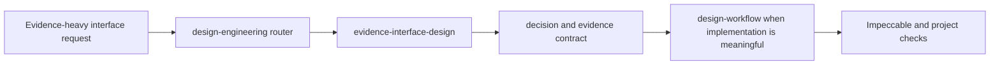

## Context

The existing `design-engineering` parent exposes four sibling workflows through
one concise router. `design-workflow` owns Fleet direction and completion gates,
while Impeccable owns general design craft and review. The new capability needs
to add evidence-specific reasoning without duplicating either authority or
turning Vercel's brand-specific report skill into a Fleet house style.

## Goals / Non-Goals

**Goals:**

- Add one progressively loaded child workflow for reports, benchmarks,
  comparisons, dashboards, calculators, and decision pages.
- Make factual integrity, claim provenance, reader decisions, and honest visual
  encoding explicit and testable.
- Keep the parent as the only exposed Fleet skill while extending its routing
  and metadata coherently.

**Non-Goals:**

- Add a charting library, report template, design system, CSS foundation, or
  runtime tool.
- Adopt Vercel typography, assets, tokens, monochrome styling, grid rules, or
  universal restrictions on expressive design.
- Replace project-specific `PRODUCT.md`, `DESIGN.md`, `design-workflow`, or
  Impeccable.

## Decisions

### Add a sibling child rather than expand the parent or component miner

Create `evidence-interface-design` beside the four existing children and add a
single routing row to the parent. Evidence architecture spans multiple
components and content types, so placing it in `component-pattern-mine` would
blur that skill's bounded component-analysis job. Expanding the parent with the
full contract would penalize every unrelated design-engineering invocation.

### Keep the executable workflow concise and load one detailed contract

Put routing, framing, composition, implementation boundary, and completion in
`SKILL.md`. Put the claim ledger, reading-path contract, encoding rules,
calculator model, and validation matrix in
`references/evidence-contract.md`. No script or asset is needed because the
work is judgment-heavy and no deterministic operation repeats across projects.

### Adapt principles, not Vercel implementation

Retain the useful operational concepts: reader-first framing, supported-answer
discipline, fast and audit reading paths, one evidence home per claim, geometry
chosen from the data relationship, explicit calculator state, and first-read
review. Rewrite them for Fleet and record Vercel's published `design.md` only as
a non-authoritative source in the existing discovery map. Reject copying the
brand shell, CSS API, typography, assets, fixed grid, and house-style bans.

### Preserve the existing governance boundary

Research-only use stops with an evidence-interface contract. Requested
implementation invokes `design-workflow`, reuses the existing project stack,
and completes through browser evidence, Impeccable review, and the project
check. The new child does not introduce a second receipt, score, or approval
ledger.

### Extend focused tests instead of adding a separate suite

Add the child to the existing design-engineering test matrix. Assert routing,
metadata, execution-profile validity, relative reference integrity, evidence
contract requirements, parent-only exposure, and workflow integration. Reuse
the existing skill validator and capability-catalog checks.

## Risks / Trade-offs

- **The child overlaps generic design craft** -> Keep its trigger and body
  specific to evidence-heavy artifacts and defer general hierarchy, polish, and
  aesthetics to Impeccable.
- **Detailed rules become a hidden house style** -> Make factual and semantic
  constraints normative while leaving visual expression project-specific.
- **The source is copied too literally** -> Use Fleet-authored language and
  include no Vercel assets, CSS, tokens, class names, or long source passages.
- **The contract becomes too large** -> Keep one directly linked reference and
  test progressive loading and relative-path integrity.

## Migration Plan

1. Initialize the child with skill-creator and generated UI metadata.
2. Author the concise workflow, evidence contract, and execution profile.
3. Extend the parent router, design-workflow integration, source map, inventory,
   and focused tests.
4. Validate the skill, OpenSpec change, focused tests, capability catalog, and
   whitespace; then publish a follow-up PR linked to issue #209.

Rollback removes the child folder and its routing, documentation, test, and
OpenSpec additions. The four existing design-engineering workflows continue
unchanged.
