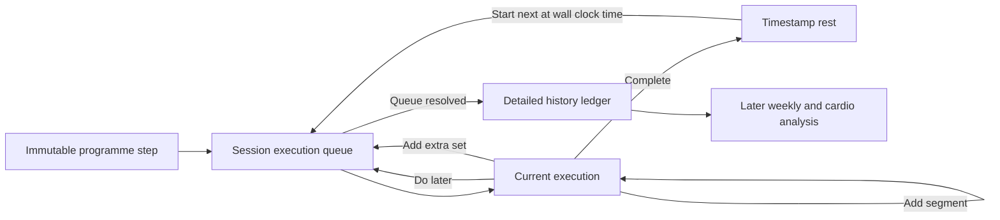

## Context

Setline's current version 3 state stores one scalar result per planned step.
The active session retains those records, but saving reduces the workout to
aggregate history fields. The rest timer has an authored target and a
timestamp-derived deadline, yet the next step has no start timestamp, so actual
rest cannot be separated from preparation or set duration.

This change must preserve fast one-tap completion, exact authored programme
order, offline-first writes, whole-state Google/D1 synchronization, and honest
measurement. No new dependency or D1 table is required because the private
state is already stored as validated JSON.

## Goals / Non-Goals

**Goals:**

- Preserve immutable planned targets alongside session-specific actual results.
- Support multiple weight/repetition segments within one set.
- Support session-only extra sets and explicit deferral.
- Record authored, adjusted, and actual rest separately.
- Save a complete per-execution ledger locally and in the private cloud copy.
- Migrate active version 3 sessions without losing their known actual values.
- Keep the interaction mobile-first and one-tap completion dominant.

**Non-Goals:**

- Weekly dashboards, exercise/cardio graphs, progression recommendations, or
  estimated performance trends.
- Exercise substitution, arbitrary drag-and-drop reordering, programme editing,
  or applying session changes to future workouts.
- Distance, speed, incline, resistance, calories, heart rate, or sensor capture.
- A mandatory precise Start Set / Finish Set mode for every step.

## Decisions

### 1. Keep the programme immutable and add a session execution queue

Each session will snapshot authored steps into execution records and store a
separate ordered queue of execution ids. Every record retains
`plannedStepId`, `plannedPosition`, and the relevant target snapshot. Extra sets
have no planned step id and explicitly identify the planned record they clone.
Deferral changes only the queue; it never moves or mutates programme data.

This is preferable to rewriting the template because history can compare intent
with reality and the next scheduled workout remains deterministic. A single
mutable step array was rejected because it loses whether a position was planned
or improvised.

### 2. Store actual work as ordered segments

A version 4 execution record will contain ordered segments:

```text
ExecutionRecord
  id, plannedStepId, source, status
  plannedPosition, executionPosition
  exercise and target snapshot
  segments[]
  actualRpe
  startedAt, completedAt
  authoredRestSeconds, adjustedRestSeconds, actualRestSeconds
```

Weight-and-repetition segments contain weight and repetitions. Other current
tracking kinds use one segment containing their applicable repetitions,
duration, or weight-duration values. A standard set is therefore simply a
one-segment execution, avoiding separate code paths for ordinary and drop sets.

Volume is the sum of `weight × repetitions` across segments. Warm-up and working
volume are still calculated separately from the record's snapshotted type.

### 3. Record cadence when the next execution starts

Completing an execution at `t0` creates a rest phase with:

- immutable authored rest;
- a mutable session timer target used by add/pause/skip controls;
- an end deadline derived from timestamps.

Selecting Start next step at `t1` records `t1` as the next execution's
`startedAt` and stores `t1 - t0` as the previous execution's actual rest.
Waiting after zero or starting early is therefore retained honestly. Pausing
changes countdown presentation but does not remove wall-clock time from actual
rest.

The first execution starts with the workout. Zero-rest transitions may start
automatically and are labeled as such. The resulting `startedAt` to
`completedAt` window is not described as exact set duration because simple mode
can include setup time.

### 4. Persist detailed completed sessions, not only aggregates

Version 4 `HistoryEntry` will contain the execution snapshots plus derived
summary metrics. History rendering and future analytics consume the retained
records; derived totals remain cached for fast display but are recalculable.

Version 3 active records migrate to one segment using their known actual
weight, repetitions, or duration. Version 3 summary-only history remains
summary-only with `detailsAvailable: false`. No records or rest values are
fabricated.

### 5. Preserve the existing visual language

This is a preserve-lane interaction change. The current target and lime
completion slab remain primary. Segment controls sit within the existing
actuals fieldset; Add segment, Add another set, Do later, and Skip are quieter
secondary actions. The rail shows `PLANNED`, `MODIFIED`, `EXTRA`, `DEFERRED`,
and `SKIPPED` as text labels. The summary adds a dense ledger below the existing
metrics rather than creating a new dashboard.



## Risks / Trade-offs

- **State growth from detailed history** → Keep records compact, retain no media,
  and monitor serialized whole-state size before adding broad analytics.
- **More controls could weaken one-tap completion** → Keep advanced actions
  secondary and collapsed behind explicit labels; completion remains the only
  lime action.
- **Deferral may confuse planned order** → Show planned position and actual
  queue position simultaneously and label every deferred record.
- **Rest accuracy still depends on Start next step** → Describe actual rest as
  unavailable when no valid next-start timestamp exists; never infer it from
  countdown ticks or set completion intervals.
- **Older history lacks detail** → Preserve aggregate history with an explicit
  unavailable marker rather than backfilling synthetic records.

## Migration Plan

1. Add version 4 validators and pure version 3 migration tests.
2. Migrate active records to one-segment executions and preserve their original
   order.
3. Mark legacy completed history `detailsAvailable: false`.
4. Read/write version 4 through the existing local and cloud state paths.
5. Retain the version 3 parser for rollback compatibility; a rollback can still
   load pre-upgrade data but will not understand sessions created only in
   version 4.

## Open Questions

- None blocking. Weekly aggregation thresholds and additional cardio fields
  will be specified when those analysis surfaces are built.
