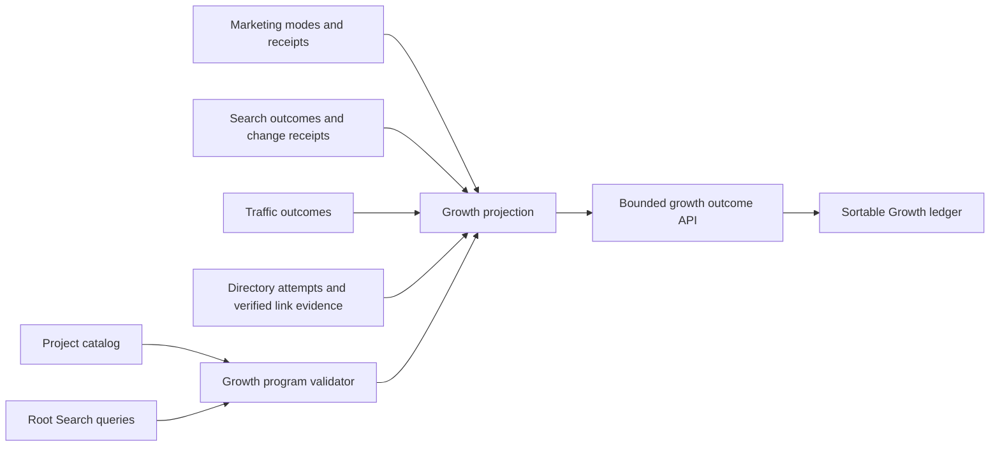

## Context

See `proposal.md` for motivation. Fleet already owns the relevant facts in
separate contracts: catalog identity and attention, Marketing program modes,
root Search queries, Search change receipts, Search Console outcomes,
Cloudflare outcomes, Marketing publication receipts, and legacy directory
submission status. The feature must join those sources without becoming a new
task tracker or an attribution database.

## Goals / Non-Goals

**Goals:**

- Reuse the existing four-product focus set and canonical query registry.
- Produce one bounded, deterministic growth projection for all maintained public projects.
- Make evidence gaps actionable without changing the evidence owner.
- Preserve Fleet Console's current Operate-mode visual language and progressive disclosure.

**Non-Goals:**

- Automatic content, link, indexing, deployment, or marketing execution.
- Revenue-share accounting, multi-touch attribution, or a CRM.
- Claiming directory submissions are backlinks or traffic is conversion.
- Adding a new provider, dependency, database, or production schedule.

## Decisions

### Use a small overlay, not another project registry

Add a versioned growth program that references existing project and query ids.
It stores only focus destinations, mode mapping policy, and attribution
boundaries. Names, domains, lifecycle, Search query text, evidence, and actions
remain authoritative elsewhere. This avoids parallel identity and task state.

### Derive modes from existing Marketing program modes

Map `focus` to Growth `focus`, `evergreen` and `infrastructure` to `maintain`,
and `private` to `observe`. The overlay validates the mapping and exact focus
membership. An alternative manual 27-row mode list would be easier to render
but would duplicate current portfolio policy and drift.

### Join existing outcomes at projection time

Extend the owner-outcome projection with `growth` rows assembled from Search,
Marketing, Cloudflare, Search change receipts, and directory status. The API
returns bounded fields and public URLs only. No raw provider body, local path,
credential, or free-form retained output enters the response.

### Treat link acquisition as an evidence type

Legacy directory status can establish that a form was attempted or queued, not
that a backlink exists. The projection counts only project membership in
explicit submission collections as attempts. Verified links require an exact
public source URL and canonical destination; the initial verified set may be
empty without making the UI empty.

Free external tools can strengthen the evidence without becoming new outcome
providers. Google Trends may inform which category query enters the canonical
query registry, but does not produce a project score. A local Screaming Frog
crawl may inform release/site-health work, but does not enter this projection.
Ahrefs Webmaster Tools may support a verified-link entry only when the exact
external source URL and owned destination were inspected. Rich Results Test and
Schema Markup Validator remain release checks rather than growth measurements.

### Add a Growth page without absorbing Marketing

`/growth` answers one question: which products are actively being grown, what
changed, and what is measured next? `/marketing` continues to show the actual
post inventory and maker. Navigation groups both under Growth, while Metrics
retains its four evidence views. This avoids bloating Google Search and keeps
Marketing's broader production responsibility intact.

## Risks / Trade-offs

- **Focus policy can drift from Marketing modes** -> fail validation on exact focus membership and unknown modes.
- **Sparse commercial outcomes could make the view feel incomplete** -> show Search and traffic natively while naming conversion ownership and the precise missing receipt.
- **Directory history contains retired products and weak evidence** -> filter through the current catalog and label all non-URL records as attempts only.
- **A joined row can imply causality through proximity** -> use source labels and explicit “not attributed” language; never calculate a blended score or uplift.
- **Another primary page can increase navigation weight** -> group it with Marketing and keep compact rows with details collapsed.

## Migration Plan

1. Land configuration, validation, projection, API, and UI together behind the existing local Console deployment boundary.
2. Verify the generated row set exactly matches maintained public projects.
3. Merge without production deployment; the existing manual deploy gate remains authoritative.
4. Roll back by reverting the change; no stored data or schema migration is involved.
