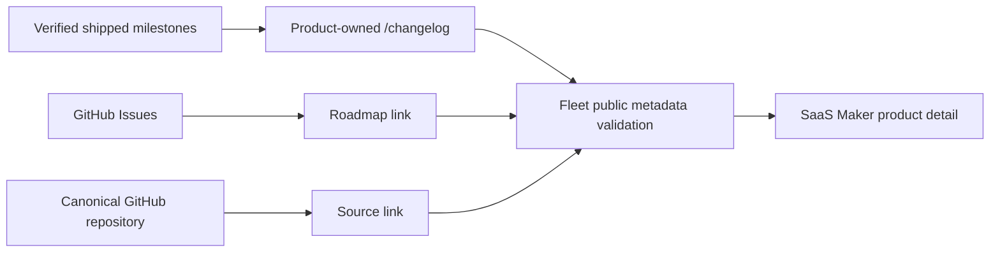

## Context

The SaaS Maker public directory currently projects 25 maintained product detail
pages (excluding the personal website). Most Changelog links point to raw
GitHub commit history, and most Roadmap links point to `PROJECT_STATUS.md`.
Products use several independent stacks and repositories, including Astro,
Vite/React, Next.js, static HTML, and Cloudflare Workers. Fleet owns the
catalog contract but must not become a content runtime or copy private project
history into public output.

## Goals / Non-Goals

**Goals:**

- Give every maintained public product an owned, readable `/changelog`.
- Seed honest public entries from verified shipped milestones.
- Preserve each product's visual identity and existing navigation.
- Make GitHub Issues the roadmap and the canonical repository the source.
- Detect catalog drift centrally while keeping changelog bodies decentralized.

**Non-Goals:**

- Building a changelog CMS, API, database, or shared runtime package.
- Publishing raw commits, private status text, unreleased work, or open issues
  as shipped changes.
- Changing product navigation labels, redesigning product websites, deploying
  production sites, or covering archived/local/private/headless products.

## Decisions

### Use one conventional route with framework-native content

Every included product uses `/changelog`, implemented with its existing router,
layout, components, and data conventions. This is easier to discover and
validate than product-specific slugs. A shared UI dependency was rejected
because it would force unrelated stacks to share presentation code and create a
cross-repository release dependency.

### Keep bodies in product repositories and links in Fleet

Each owning repository stores and renders its own editorial entries. Fleet
stores only the canonical URLs and validates their shape. Centralizing
changelog bodies in Fleet was rejected because it would recreate the retired
SaaS Maker content/control boundary and risk leaking private project history.

### Seed from durable, verified shipped evidence

Agents use `PROJECT_STATUS.md`, existing release notes, and merged history to
write newest-first entries. They do not translate every commit. This produces a
useful product narrative and avoids exposing implementation noise.

### Preserve visual direction per product

Each new route follows the Fleet design workflow in preserve mode, reusing the
existing shell. Validation includes the product's smallest relevant check and
responsive browser evidence. A single cross-product template was rejected
because the websites intentionally have different identities and stacks.

### Derive public evidence links deterministically

Fleet catalog generation derives:

- changelog: `<canonical product origin>/changelog`
- roadmap: `<canonical public GitHub repository>/issues`
- source: canonical public GitHub repository

Private repository links remain omitted from the public projection. This keeps
the existing privacy gate while satisfying the user-visible changelog contract.

## Risks / Trade-offs

- [Many independent repositories can drift later] → Add a deterministic Fleet
  validation rule and keep the route convention uniform.
- [Private repositories cannot provide useful public Roadmap or Source links] →
  Keep those links omitted while still requiring a public owned changelog.
- [Historical status text may contain internal details] → Require editorial
  summaries and publish only verified user-visible outcomes.
- [A broad rollout can collide with unrelated work] → Inspect every worktree,
  skip dirty overlaps, keep per-repository commits small, and report blockers.
- [Source changes are not immediately live] → Push verified source only;
  production deployment remains a separate manual action.

## Migration Plan

1. Inventory all maintained public product websites and classify exclusions.
2. Add and validate `/changelog` one repository batch at a time.
3. Add or update internal discoverability links without changing primary labels.
4. Update Fleet catalog generation and SaaS Maker projection.
5. Run per-project checks, Fleet catalog checks, and URL-shape tests.
6. Commit and push safe repositories independently; do not deploy.
7. Archive this change and update durable project status only after all
   included repositories are complete or explicitly tracked as blockers.

Rollback is repository-local: revert a product's changelog commit and restore
the prior generated Fleet metadata. No data migration or runtime state exists.

## Open Questions

- None. Products with private source repositories receive the public
  changelog but continue to omit inaccessible Roadmap and Source links from
  SaaS Maker.
