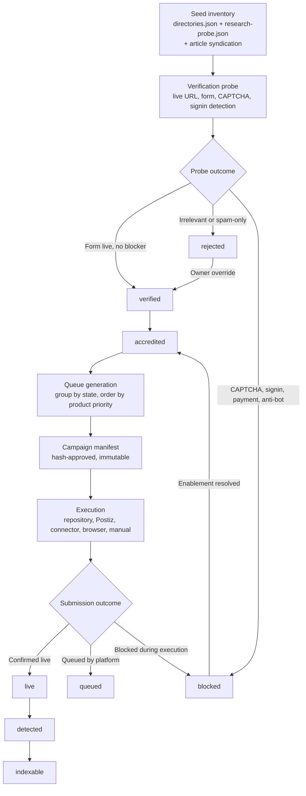

## Context

Fleet has over 150 external distribution destinations across three registries:
23 curated directories (`directories.json`), 113 unique long-tail seeds
(`research-probe.json`), and 15 article-syndication platforms (hardcoded in
`channel-inventory.mjs`). Three protected channels — Hacker News, LinkedIn, X
— are always individually planned and never enter broad distribution.

Today the `launch-campaign` skill treats all of these as "seed evidence only"
and reverifies every platform on every campaign. There is no persistent state
file, no accreditation queue, and no resumable record of which platforms are
verified, live, indexable, blocked, or rejected. The
`campaign-manifests/out/platform-accreditation-queue-2026-08-15.md` file
referenced in issue #371 does not exist yet.

The existing campaign-manifest library (`lib/campaign-manifest.mjs`) provides
hash-based approval, immutable manifests, receipt normalization, and lifecycle
state. The accreditation system reuses this boundary: every external write
requires an exact hash-approved manifest.

Fleet product priorities are defined in `config/projects.json`:
- **P1**: codevetter, pace, posttrainllm, agent-office
- **P2**: fleet-workspace, high-signal, karte, reader, starboard, and 15
  other active products
- **P4**: drank, email-manager, free-ai, and 21 archived/owner-finished
  products

## Goals / Non-Goals

**Goals:**
- Persist per-platform accreditation state across campaigns so verification
  work is never repeated without reason.
- Generate a dated, human-readable accreditation queue that groups platforms
  by state and orders work by product priority.
- Route articles to editorial/community destinations and products to
  listing/launch surfaces with deterministic, auditable rules.
- Integrate with the launch-campaign skill so it consumes accredited
  platforms and surfaces only unverified seeds as a bounded queue.
- Record honest evidence for every state transition: live URL, HTTP status,
  form probe result, screenshot path, and whether the outcome is confirmed or
  indeterminate.
- Preserve Hacker News, LinkedIn, and X as protected channels with owner
  exclusions — they never enter broad accreditation.
- Execute in Fleet product priority order: P1 first, then P2, then P4.

**Non-Goals:**
- Automatic submission without an approved manifest. The accreditation system
  records state and generates queues; execution remains gated by the existing
  manifest approval boundary.
- Bypassing CAPTCHA, anti-bot controls, authentication, or payment walls.
  Blocked platforms enter the enablement queue honestly.
- Manufacturing sites, fake identities, reviews, votes, or artificial
  engagement.
- Replacing the campaign-manifest library. The accreditation system extends
  the existing manifest boundary; it does not create a parallel approval path.
- Accrediting platforms Fleet does not own or control. The system records
  observed state on third-party platforms; it does not claim ownership.

## Decisions

### 1. Single JSON state file under existing config directory

Store accreditation state in
`foundry/ops/config/directory-submissions/accreditation-state.json`. This
co-locates state with the existing `directories.json`, `research-probe.json`,
and `products.json` inputs. The file is versioned, diffable, and machine-
readable.

**Alternative considered**: Per-platform YAML files in a directory tree.
Rejected — a single JSON file is simpler to read, diff, and generate from, and
matches the existing config convention.

### 2. State model with nine lifecycle states

```
seed → verified → accredited → queued → live → indexable → detected
                 ↘ rejected
                                ↘ blocked
```

| State | Meaning |
|---|---|
| `seed` | Entry exists in a registry but has not been probed |
| `verified` | Live form/URL probed successfully; audience fit confirmed |
| `accredited` | Verified and ready for campaign inclusion |
| `rejected` | Verified but excluded: irrelevant, spam-only, policy conflict |
| `queued` | Accredited and entered into an approved campaign manifest |
| `live` | Submission confirmed live on the platform |
| `indexable` | Live and confirmed crawlable/indexable by search engines |
| `detected` | Live but not yet confirmed indexable; pending follow-up |
| `blocked` | Cannot proceed: CAPTCHA, anti-bot, sign-in, payment, or moderation |

State transitions are monotonic forward except `blocked` (which can resolve to
`accredited` after enablement) and `live` → `detected` → `indexable` (which
represents the post-submission verification chain).

### 3. Owner exclusions are first-class

Hacker News, LinkedIn, and X are marked `qualityGate: protected` in the state
file and are excluded from broad accreditation queue generation. They appear
in a separate "Protected channels" section of the queue and are always
individually planned within each campaign manifest.

### 4. Product-to-platform matching is deterministic

| Artifact type | Route to |
|---|---|
| Article | Protected channels + article syndication (editorial, community, owned publication) |
| Product / major feature | Protected channels + curated directories + long-tail seeds (listing, launch, comparison surfaces) |

This mirrors the existing `channel-inventory.mjs` routing logic
(`curatedDirectories` and `longTailSeeds` are empty for articles) but makes it
explicit in the accreditation state so matching is auditable outside a
campaign context.

### 5. Queue generation orders by product priority

The queue generator reads `config/projects.json` and emits sections in
priority order: P1 products first, then P2, then P4. Within each product,
platforms are grouped by state (`accredited`, `seed`, `blocked`, `rejected`).
The output file is
`campaign-manifests/out/platform-accreditation-queue-<YYYY-MM-DD>.md`.

### 6. Launch-campaign skill consumes accredited state

The skill's step 3 ("Research current channel eligibility") changes from
"treat the directory registry as seed evidence only; recheck everything" to:

1. Load `accreditation-state.json`.
2. Include platforms with state `accredited` directly in the manifest (still
   subject to per-campaign audience-fit confirmation, but no full re-probe).
3. Surface platforms with state `seed` or `blocked` as a bounded verification
   queue.
4. Platforms with state `rejected` are excluded unless the owner overrides.

### 7. Evidence is recorded per transition, not per campaign

Each state transition in `accreditation-state.json` records:

```json
{
  "platformId": "insidr",
  "fromState": "seed",
  "toState": "verified",
  "observedAt": "2026-08-15T14:22:00Z",
  "evidence": {
    "liveUrl": "https://www.insidr.ai/submit-tools/",
    "httpStatus": 200,
    "formDetected": true,
    "captchaDetected": false,
    "screenshotPath": null
  },
  "outcome": "confirmed"
}
```

`outcome` is `confirmed` or `indeterminate`. Indeterminate outcomes do not
advance state; they remain in the current state with the evidence record.

## Risks / Trade-offs

- **State drift**: Third-party platforms change forms, add CAPTCHA, or go
  offline. Mitigation: `verifiedAt` timestamp with a configurable staleness
  window (default 30 days); stale `accredited` platforms re-enter the
  verification queue.
- **False confidence**: An `accredited` state does not guarantee a submission
  will succeed on a specific campaign. Mitigation: the launch-campaign skill
  still confirms per-campaign audience fit; accreditation reduces re-probe
  effort, not judgment.
- **Config file growth**: 150+ platform records with transition history could
  grow large. Mitigation: transition history is capped to the most recent 10
  transitions per platform; older transitions are archived.
- **Honesty boundary**: The system must never claim a platform is live or
  indexable without evidence. Mitigation: `live`, `indexable`, and `detected`
  states require a receipt with a verified live URL and HTTP status.

## Accreditation flow



## State file schema

```json
{
  "version": 1,
  "updated": "2026-08-15",
  "ownerExclusions": ["hacker-news", "linkedin", "x"],
  "stalenessDays": 30,
  "platforms": [
    {
      "id": "insidr",
      "name": "Insidr.ai",
      "source": "research-probe",
      "artifactFit": ["product", "major-feature"],
      "submitUrl": "https://www.insidr.ai/submit-tools/",
      "home": "https://www.insidr.ai",
      "currentState": "accredited",
      "verifiedAt": "2026-08-15T14:22:00Z",
      "qualityGate": "standard",
      "transitions": [
        {
          "fromState": "seed",
          "toState": "verified",
          "observedAt": "2026-08-15T14:22:00Z",
          "evidence": {
            "liveUrl": "https://www.insidr.ai/submit-tools/",
            "httpStatus": 200,
            "formDetected": true,
            "captchaDetected": false
          },
          "outcome": "confirmed"
        }
      ]
    }
  ]
}
```

## Queue file shape

The generated `platform-accreditation-queue-<date>.md` contains:

1. **Protected channels** — Hacker News, LinkedIn, X (always individually
   planned; never broad-accredited).
2. **P1 products** — for each product: accredited platforms ready for
   inclusion, seeds requiring verification, blocked platforms with blocker
   type, rejected platforms with reason.
3. **P2 products** — same structure.
4. **P4 products** — same structure (archived; lower priority).
5. **Summary counts** — total platforms by state across the full inventory.
