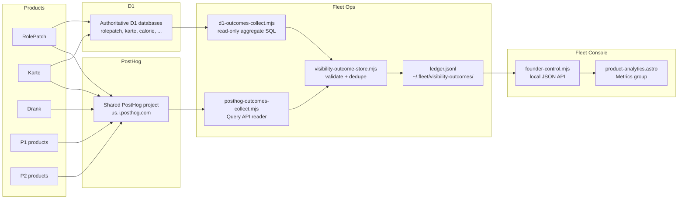

## Context

Three products already use the same shared PostHog project key
(`phc_qgiAarw4Co4pw9fz3Fxj4UJaHmqzFetqs4JrXhGc35Nd` at `us.i.posthog.com`):

- **Drank** — error monitoring only; page views and autocapture disabled.
- **RolePatch** — isomorphic 4-event taxonomy (`signup`, `activated`,
  `core_action`, `returned`) via `posthog-js` in the browser and raw `fetch` to
  the PostHog capture API in server actions. Every event carries
  `project_id: "resume-tailor"`.
- **Karte** — browser-only 4-event taxonomy via `posthog-js` with the same
  event names and a `project_id` property.

Twelve products have authoritative D1 databases (rolepatch, karte, calorie,
setline, starboard, significanthobbies, reader, swe-interview-prep,
knowledge-base, email-manager, free-ai, high-signal) that can answer signup,
activation, and retention questions with aggregate counts.

The provider-outcome pattern already normalizes Cloudflare and Search Console
evidence into a private JSONL ledger via
`visibility-outcome-store.mjs`. Families today: `search`, `ai-crawl`,
`ai-referral`, `web-traffic`, `web-vitals`. Each observation carries an id,
projectId, family, provider, metrics, period, and observedAt. The store
validates every observation against a family-specific contract and deduplicates
by id.

Fleet Console is an Astro 7.2 app served via Cloudflare Tunnel at
fleet.sassmaker.com. It reads outcome evidence through the local Founder Control
JSON API (`founder-control.mjs`). Existing Metrics views: Domains, Google
Search, AI Awareness, Performance.

## Goals / Non-Goals

**Goals:**

- One owner-visible Product Analytics page that answers "how many people used
  my products" across the portfolio.
- Grounded metrics only — no inferred, sampled, or fabricated numbers.
- Reuse the existing shared PostHog project, the existing outcome ledger, and
  the existing Fleet Console projection pipeline.
- A single 5-event taxonomy that works for every product type (authenticated
  SaaS, static site, local-first).
- Privacy-safe: no PII, opaque IDs, credential-free bundles in the ledger.

**Non-Goals:**

- Replacing PostHog as the event pipeline.
- Building a custom analytics dashboard inside PostHog.
- Collecting raw event streams or user-level traces in Fleet.
- Tracking products that are past or out-of-fleet.
- Auto-enabling a recurring collection schedule.
- Deploying or mutating product source automatically.

## Decisions

### Extend the existing outcome store with a `user-metrics` family

Rather than creating a separate store, add a `user-metrics` family to
`FAMILY_CONTRACTS` in `visibility-outcome-store.mjs`. This keeps one ledger,
one validation path, one projection pipeline, and one deduplication strategy.
The family supports two providers: `posthog-insights` (for PostHog-derived
aggregates) and `d1-aggregate` (for D1-derived counts). Both emit the same
metric labels so the Console can merge them per product.

### Metric contract

Every `user-metrics` observation carries a subset of these metrics:

| Metric label | Unit | Direction | Source |
|---|---|---|---|
| Visitors | visitors | higher-is-better | PostHog unique page views |
| Identified users | users | higher-is-better | PostHog identified distinct IDs |
| Accounts | accounts | higher-is-better | D1 or PostHog signup count |
| Activation rate | percent | higher-is-better | activated / signup (0-100) |
| D1 retention | percent | higher-is-better | returned / signup (0-100) |
| D7 retention | percent | higher-is-better | returned / signup (0-100) |
| Core actions | actions | higher-is-better | PostHog or D1 core_action count |

### 5-event taxonomy

Every product emits exactly five events so one cross-fleet funnel and retention
insight works without custom dashboards:

1. `page_view` — any page load (PostHog autocapture or explicit).
2. `signup` — first session after an account is created.
3. `activated` — user reaches first real value.
4. `core_action` — the thing the product exists to do (with an `action`
   property for the product-specific verb).
5. `returned` — a return session by a user with prior activity.

Every event carries `project_id` matching the canonical catalog ID. RolePatch
and Karte already emit four of five (missing `page_view`); Drank emits none of
the five (error monitoring only). The proposal standardizes all three and
extends to the remaining pilot products.

### PostHog aggregate collector

`posthog-outcomes-collect.mjs` reads the shared PostHog project via the
Query API (`/api/projects/:id/query/` with `TrendsQuery`) using a personal
API key with read-only access. The Insights trend endpoint is deprecated and
returns 403. It groups by `project_id`, including historical aliases
(`resume-tailor` for RolePatch, `linkchat` for Karte), queries the last 7-day
window, and emits one `user-metrics` observation per product with the
PostHog-derived metrics. The collector follows the same shape as
`cloudflare-outcomes-collect.mjs`: read canonical projects, collect, validate,
append to ledger.

### D1 aggregate collectors

For products with authoritative D1 databases, a `d1-outcomes-collect.mjs`
script runs read-only aggregate SQL (e.g. `SELECT COUNT(*) FROM users WHERE
created_at >= ?`) via `wrangler d1 execute --command` or the D1 REST API. It
emits `user-metrics` observations with provider `d1-aggregate`. Queries are
product-specific but follow a shared template: signup count, activated count,
core_action count, returned count (distinct users with activity in the last 7
days who also had activity in a prior 7-day window).

### Fleet Console page

`product-analytics.astro` lives under the Metrics group. It reads
`user-metrics` observations from the ledger via the Founder Control API and
projects a per-product directory: product name, visitors, identified users,
accounts, activation rate, D1/D7 retention, core actions, observation date, and
provider boundary (PostHog, D1, or both). Missing metrics stay explicit as "Not
measured" — never zero, never inferred.

### Privacy model

- No PII in the ledger. PostHog distinct IDs are opaque hashes; D1 queries
  return counts only, never rows.
- Bundles are credential-free: the ledger stores normalized aggregates, not
  API responses, tokens, or cookies.
- The PostHog project key is a public client-side key already shipped in
  product bundles; the collector uses it with the read-only Insights API.
- D1 collectors use existing Wrangler OAuth or read-only D1 REST access; no
  new credentials are introduced.

### Rollout sequencing

Pilot first (5 products), then attention order:

1. **Pilot** — RolePatch (authenticated, server-confirmed events), Karte
   (authenticated, D1-backed), Drank (existing PostHog, needs taxonomy
   upgrade), one static site (page_view only), one local-first product
   (D1-only or opt-in PostHog).
2. **P1 products** — codevetter, pace, posttrainllm.
3. **Active P2** — remaining maintained products with PostHog or D1 evidence.
4. **Remaining maintained** — products without current instrumentation get
   "Not measured" until instrumented.

### Data flow

## Risks / Trade-offs

- [PostHog Query API rate limits] -> Query one 7-day window per product per
  explicit update; serialize with a concurrency cap like the Cloudflare
  collector.
- [D1 query cost] -> Run aggregate queries only on explicit update; cache
  results in the ledger so repeated Console reads do not re-query.
- [PostHog project key is public] -> It is already shipped in client bundles;
  the collector uses it read-only. No new exposure.
- [Products without instrumentation] -> Show "Not measured" explicitly; do not
  infer zero or hide the row.
- [Event taxonomy drift] -> The shared contract and collector validation reject
  observations with unknown metric labels, matching the existing family
  contract enforcement.
- [Cross-product user identity] -> PostHog distinct IDs are opaque per product;
  do not attempt cross-product user merging in this proposal.
