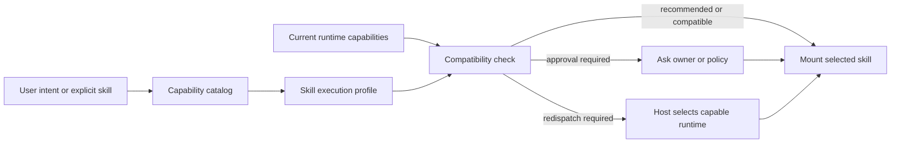

## Context

The Fleet capability catalog already acts as a compact metadata registry for
skills, scripts, templates, and docs. It discovers `SKILL.md` files without
preloading their full bodies. Agent-skill frontmatter is intentionally narrow
and host-specific model names would make a skill less portable.

The public directory at `sassmaker.com` is Fleet's maintained, indexable SaaS
Maker surface. It currently publishes products but has no durable learning
article surface.

## Goals / Non-Goals

**Goals:**

- Let every Fleet-owned skill declare provider-independent runtime quality.
- Let the metadata catalog expose the declaration before a skill is mounted.
- Give hosts a deterministic continue, ask, or re-dispatch decision.
- Preserve runtime, provider, owner, and administrator control over the actual
  model.
- Publish the idea as a clear first-party learning article using the existing
  SaaS Maker visual language.

**Non-Goals:**

- Hard-coding OpenAI, Anthropic, Google, local-model, or other provider names.
- Making a skill mutate the current model after it has started.
- Building a natural-language skill resolver or a universal model router.
- Deploying the article or posting campaign content during implementation.

## Decisions

### Keep the profile in the skill package as a JSON sidecar

Each Fleet-owned skill receives `execution-profile.json` beside `SKILL.md`.
The sidecar is portable with the skill, machine-readable without parsing prose,
and does not depend on unsupported frontmatter extensions. A central registry
was rejected because copying a skill would silently detach its execution
requirements.

### Describe capabilities, not models

Version one contains:

- `recommended.intelligence`: `economy`, `balanced`, or `frontier`;
- `recommended.reasoning`: `low`, `medium`, `high`, or `very_high`;
- matching `minimum` fields;
- `degradation`: `allow`, `ask`, or `deny`; and
- a concise human-readable `rationale`.

Providers and hosts map these tiers to their available models. The contract
states quality requirements but never owns price, availability, or routing.

### Make compatibility deterministic and advisory to the host

The catalog exposes profiles on skill records. A compatibility function and CLI
command compare an abstract runtime descriptor with the selected profile:

- at or above recommended: `recommended`;
- below recommended but at or above minimum: `compatible`;
- below minimum with `allow`: `degraded`;
- below minimum with `ask`: `approval_required`; and
- below minimum with `deny`: `redispatch_required`.

The command does not invoke a model. It gives an orchestrator a stable decision
before the selected skill is mounted and executed.

### Use one restrained Learnings surface

The article and index extend the existing dark folio identity in `Read` mode.
They reuse the established navigation, footer, type family, copper accent,
spacing, and rules. The article leads with the distinction between agents and
skills, documents the design, and clearly labels Fleet's implementation as an
experiment rather than an industry standard.

## Risks / Trade-offs

- **Capability labels remain subjective** -> keep the vocabulary small,
  validate every profile, and publish rationale with each declaration.
- **Providers expose different controls** -> let host adapters make the final
  mapping and treat unavailable reasoning controls as runtime limitations.
- **Profiles can become stale** -> require every Fleet-owned skill to have a
  valid sidecar and include profile integrity in catalog doctor checks.
- **A skill may contain mixed-complexity stages** -> version one chooses a safe
  whole-skill recommendation; stage-level routing can be added later if real
  usage justifies the complexity.
- **The article could overclaim novelty** -> distinguish the common
  agent-level model-routing pattern from the less-standardized portable
  skill-level contract.

## Migration Plan

1. Add schema validation, catalog projection, compatibility evaluation, CLI,
   and focused fixtures.
2. Add a reviewed profile to all Fleet-owned skills.
3. Update operator documentation and validate the entire capability catalog.
4. Add and locally review the Learnings article at all required widths.
5. Generate a separate immutable launch-campaign preview for owner approval.

Rollback removes the optional sidecars and catalog fields while leaving normal
skill loading unchanged.

## Open Questions

None for version one. Stage-specific profiles and provider mapping registries
remain deliberately deferred until usage evidence shows they are necessary.
