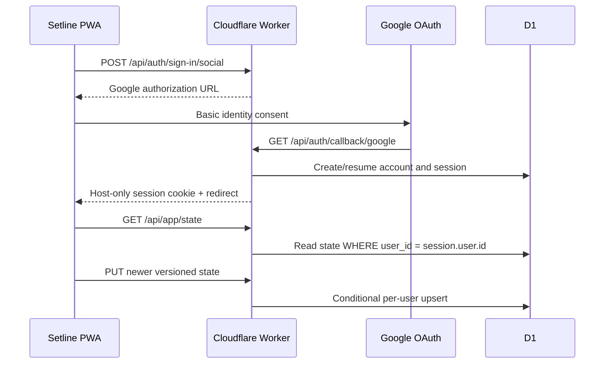

## Context

Setline is a Vinext/React PWA whose structured workout state currently lives in
`localStorage`. Its generated Worker delegates every request to Vinext and its
only production surface is a private ChatGPT Sites deployment. Calorie provides
the relevant Fleet precedent: Better Auth with a Google provider, auth tables
in D1, a Worker-first `/api/auth/*` route, local-first operation, and private
per-user cloud data.

The workout player must remain usable without connectivity. Authentication may
add cross-device continuity, but it must not add a network request to completing
a set, change authored exercise order, or imply that unsynced state is backed
up.

## Goals / Non-Goals

**Goals:**

- Offer optional Google sign-in with only `openid`, `email`, and `profile`.
- Keep explicit device-only mode and existing offline workout execution.
- Sync one versioned Setline state document per authenticated user through D1.
- Make local/cloud status and sign-out consequences visible and factual.
- Serve the application, auth API, and private state API from one tagged
  Cloudflare Worker and custom domain.
- Preserve the established Scoreboard Split visual language.

**Non-Goals:**

- Email/password, passkeys, roles, organizations, or social functionality.
- Sharing programme or workout data between users.
- Replacing local storage with a network-only data path.
- A field-level collaborative merge protocol.
- Deleting the existing owner-only Sites project during this change.

## Decisions

### Better Auth owns Google sessions in D1

Use the same exact Better Auth and Drizzle ORM pattern as Calorie. Better Auth
owns `user`, `session`, `account`, and `verification`; Setline owns only its
`workout_state` table. The Worker constructs auth per request from generated
bindings and never keeps request state in module globals.

Home-grown OAuth was rejected because provider callbacks, CSRF/state
validation, cookie attributes, session rotation, and account linking are
security-sensitive protocol work. Auth.js was considered, but Better Auth is
already deployed and understood in Fleet’s Cloudflare+D1 environment.

### Google sign-in is optional, not an availability dependency

New visitors choose Google sync or device-only mode. Existing device data opens
without an interstitial and offers sign-in from the header. Starting sign-in
removes the device-only preference, but not the local workout state. After the
callback, that state is eligible for deterministic migration to the signed-in
account.

### One versioned state document preserves the workout invariant

The existing state is small and already has a coherent aggregate boundary:
active session plus history. Store it as validated JSON in one D1 row keyed by
Better Auth user id. Add `updatedAt` to the client envelope and use
last-modified-wins reconciliation:

1. Restore local state immediately.
2. If authenticated and online, fetch the user’s D1 state.
3. Keep the newer envelope.
4. Upload the local envelope when it is newer or the cloud row is absent.
5. If the server rejects a stale write, restore the returned newer envelope.

This avoids merging individual sets in a way that could corrupt authored
exercise order. A future full programme model can normalize data only when its
editing semantics are implemented.

### Offline writes stay local and retry on connectivity

Every workout mutation writes local storage synchronously. Authenticated
changes mark a small pending-sync flag and attempt an awaited API write without
blocking the interaction. The client retries on `online` and visibility
changes. Auth and `/api/app/*` remain network-only in the service worker.

### Worker-first routing and bounded input

The custom Worker handles `/api/auth/*`, `/api/auth/config`,
`/api/app/state`, and `/api/health` before delegating all other requests to
Vinext. Private routes resolve the session first and scope every D1 statement to
that user id. JSON bodies are read through a 512 KiB streaming limit, validated,
and returned with `Cache-Control: no-store` plus defensive headers.

### Preserve the Setline visual system

This is a preserve-lane change. Add one account-choice board, compact header
identity/status controls, and legal pages using existing ink, chalk, lime, blue,
border, typography, and touch-target rules. The workout player remains the
visual and interaction priority.

## Risks / Trade-offs

- **Last-write-wins can replace older device changes** → Compare explicit
  timestamps, reject stale server writes, surface sync state, and never merge
  individual ordered sets.
- **OAuth callback mismatch blocks sign-in** → Use one dedicated web client,
  explicit base URL, and exact
  `https://setline.significanthobbies.com/api/auth/callback/google`.
- **Network loss during a workout** → Persist locally before any API request and
  retry later; set completion never awaits sync.
- **A compromised state payload could consume Worker memory** → Enforce a
  streaming size cap and schema/version checks before D1 writes.
- **Production migration is irreversible at the table level** → The migration
  is additive; rollback switches to a prior Worker version and leaves unused
  tables intact.
- **The existing Sites deployment remains reachable to the owner** → Mark the
  Cloudflare origin as primary and retain Sites only as a private rollback
  artifact until the owner explicitly asks to remove it.

## Migration Plan

1. Add and locally validate auth/state code, migration, legal surfaces, Worker
   config, and generated binding types.
2. Create the `setline` D1 database and insert its opaque id in tracked
   Wrangler configuration.
3. Apply the numbered migration to the remote database.
4. Create a dedicated Google web OAuth client for the production origin and
   callback; store its id/secret and a generated Better Auth secret as Worker
   secrets without writing them to source.
5. Merge the exact reviewed source to a clean, green `main`.
6. Pass Fleet’s deploy guard and deploy the Worker with the full Git SHA tag.
7. Verify health, auth configuration, Google redirect/callback/session,
   per-user state round-trip, offline local operation, and custom-domain
   routing.
8. Roll back the Worker version if auth or workout execution regresses; no D1
   destructive rollback is required.

## Open Questions

- None. The owner asked for the Calorie pattern and end-to-end production
  completion.
