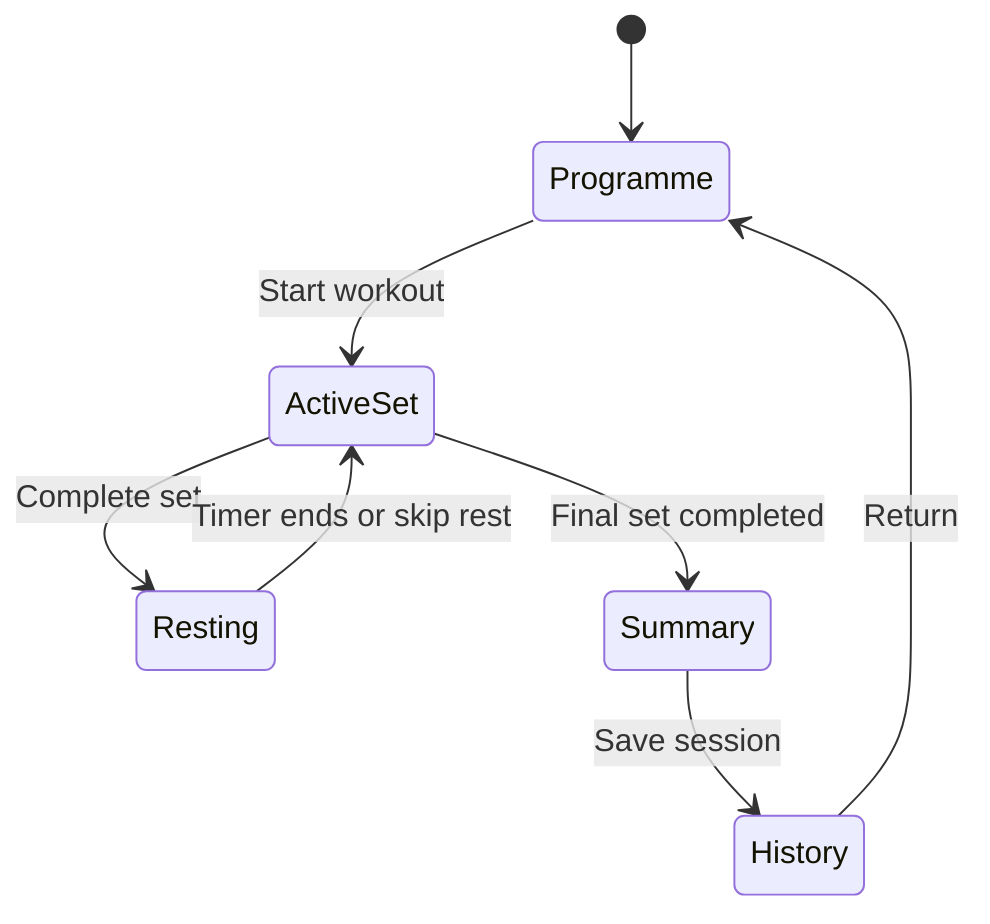

## Context

Setline is a greenfield Fleet app built from the approved Sites Vinext starter. The first release must make the workout-player loop credible on a phone without introducing server persistence, authentication, or programme-builder complexity. Gym connectivity is unreliable, timers must survive focus changes, and measurements must remain honest about which values the user entered versus which values the app derived.

## Goals / Non-Goals

**Goals:**

- Make today's workout understandable and startable from the first viewport.
- Keep the active set, target, previous performance, and primary completion action visible without scrolling on a typical phone.
- Record set results and workout history locally without a network request.
- Derive rest countdowns from timestamps so tab suspension does not silently extend a timer.
- Demonstrate warm-up/working-set separation and basic progress using realistic data.
- Produce an accessible, responsive, private Sites deployment.

**Non-Goals:**

- Accounts, multi-device sync, server databases, or conflict resolution.
- Full programme/workout authoring, drag-and-drop editing, JSON import/export, or reminders.
- Automatic progression changes, health advice, sensor-derived measurements, or native integrations.
- A complete implementation of every PRD phase.

## Decisions

### One client-owned workout state machine

The primary route renders programme, player, rest, history, and progress views from one typed client component. A small reducer-like transition layer owns session state so completing, skipping, and advancing sets stay coherent.

Alternative considered: separate routes and a global state library. This adds routing and dependency surface before the core loop has been validated.

### Device-local persistence

The app stores an explicitly versioned Setline snapshot in `localStorage`. Initial rendering uses a deterministic programme fixture; stored session progress replaces it after client hydration. Writes occur after meaningful transitions, not on every timer tick.

Alternative considered: D1 plus authentication. That is required for a later cloud-sync phase but would make offline execution dependent on more infrastructure and user identity decisions.

### Timestamp-derived rest timing

Rest state stores `restEndsAt` and planned seconds. The visible countdown is recalculated from `Date.now()` once per second. Adding time mutates the end timestamp; skipping clears it.

Alternative considered: decrementing an in-memory integer. It drifts when browsers throttle background tabs and violates the PRD's timing requirement.

### Honest derived analytics

Working volume is calculated only from completed working sets with recorded weight and repetitions. Warm-up volume is displayed separately. Estimated progress and previous-performance labels are explicitly presented as derived from the local sample/history.

Alternative considered: a single composite intensity score. The PRD rejects unexplained intensity numbers, and the first release lacks enough longitudinal evidence.

### Restricted visual system for an Operate surface

The delegated direction combines interval-timer legibility, strength-training log notation, and competition scorecard density. The app uses a light, high-contrast field, deep navy type, safety-lime action color, squared controls, tabular numerals, and a persistent mobile action zone. Expression is concentrated in timing, progress rails, and oversized set notation rather than decoration.

Alternative directions explored but not selected: a paper training ledger with stamped annotations, and a dark power-rack console with LED numerals. The selected scorecard direction is clearer under mixed gym lighting and supports longer sessions without a novelty tax.

## Risks / Trade-offs

- [Device-local records can be lost with browser data] → Label the local-only boundary and defer cloud sync rather than implying backup.
- [A single route can grow crowded] → Keep view transitions explicit and split code only when later capabilities justify it.
- [Background browser behavior varies] → Derive remaining time from timestamps; do not claim lock-screen delivery where the browser cannot provide it.
- [Fixture content can look like user history] → Mark the starter programme as a sample and distinguish sample previous performance from recorded results.
- [The full PRD exceeds this release] → Track deferred phases in `PROJECT_STATUS.md` and keep the OpenSpec capability scoped to the validated loop.

## Migration Plan

1. Build and validate locally against the generated sample programme.
2. Publish as an owner-only Sites version.
3. Roll back by redeploying the prior saved Sites version if needed.
4. Introduce versioned data migrations before changing the local snapshot schema in a later release.

## Open Questions

- Whether the first cloud-backed version should remain passwordless or support conventional email authentication.
- Whether programme editing should precede JSON import/export or ship in the same phase.
- Which notification channel should be the first reminder implementation.
