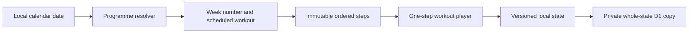

## Context

Setline currently keeps one hard-coded 12-set sample workout in `app/page.tsx`
and validates cloud state against that one exact identifier list. The supplied
PDF is a dated 12-week programme with seven scheduled day types, several
tracking modalities, exact intra-session order, and a few rules that change by
week. Workout execution must remain device-first and Google synchronization
must continue to treat the state as one ordered document.

The incumbent Scoreboard Split design is sound for gym use, but the combination
of oversized type, heavy structural rules, offset shadows, and large lime
surfaces makes too many elements compete. This is a preserve-lane refinement,
not a replacement visual world.

## Goals / Non-Goals

**Goals:**

- Encode the complete supplied plan as reviewable typed data.
- Resolve the current plan week and scheduled day from local calendar dates.
- Execute strength, cardio, mobility, preparation, and cooldown steps in the
  exact authored order.
- Apply deterministic week changes without inventing coaching or silently
  accepting conditional progressions.
- Preserve existing offline-first and authenticated whole-state behavior.
- Make the interface calmer while retaining Setline's daylight scorecard
  identity and unmistakable primary action.

**Non-Goals:**

- A general programme editor, PDF importer, arbitrary JSON schema, or automatic
  programme generation.
- Automatic weight progression, deload decisions, exercise substitutions, or
  readiness judgments.
- Retrospective completion of adherence checkboxes without recorded sessions.
- Replacing Better Auth, D1, local storage, or the existing Worker topology.

## Decisions

### Immutable programme data is separate from recorded state

Add a typed `programme.ts` module containing the programme identity, date
window, weekly schedule, authored workout templates, and a resolver that
materializes week-dependent steps. The persistent envelope stores only the
selected workout id, resolved week number, records, and history.

Keeping definitions out of local/cloud state prevents a stale client from
silently rewriting programme order and keeps D1 payloads small. Storing the
entire plan in each state envelope was rejected because definitions are shipped
application data, not user recordings in this release.

### Every executable item is an ordered planned step

Strength sets, mobility doses, cardio segments, preparation drills, and
cooldowns share a common ordered `PlannedStep` contract with an explicit
tracking kind. A record can capture weight, repetitions, duration, RPE, and
completion without pretending that every activity is kilograms × repetitions.

The player always advances by array position. It never sorts by exercise,
tracking kind, or completion timestamp.

### Conditional changes remain explicit

Rules with an objective date boundary are materialized automatically: RDL uses
two working sets in Weeks 1–2 and hard cardio uses four rounds in Weeks 1–2.
The possible third RDL set, optional lateral raises, pull-up substitution, and
deload all require human judgment, so the app displays their conditions but
does not add or replace work automatically.

### State v3 retains legacy active-workout compatibility

Version 3 adds workout identity, week number, activity-aware records, and
workout names in history. Version 2 state migrates history and binds an active
sample session to an internal legacy template, allowing it to finish in its
original order. New sessions always use the supplied programme.

Dropping or reshaping an active v2 session was rejected because either choice
would lose recorded work or insert new earlier steps ahead of already-completed
sets.

### Lime becomes a signal, not a field

Preserve chalk, ink, lime, blue, squared geometry, tabular numerals, and the
Scoreboard Split. Reduce heavy borders and offset shadows, moderate display
type, and remove full-cell lime fills from schedule/navigation. Lime remains on
the current action, compact active indicators, and focus treatment.

This retains recognition and one-handed clarity while letting the real
programme's denser content read like a calm training log.

## Risks / Trade-offs

- **Large authored templates can become hard to review** → Build repeated sets
  through small deterministic helpers and test the fully resolved id/order
  sequences.
- **An optional rule could be mistaken for scheduled work** → Label conditional
  items as plan notes and never include them in the executable record array.
- **Calendar boundaries can be timezone-sensitive** → Derive the day and week
  from local calendar dates rather than UTC timestamps.
- **Legacy state broadens validation paths** → Keep the legacy template private,
  accept it only when migrating a v2 active session, and never expose it as a
  startable workout.
- **A denser seven-day plan may overwhelm the Today screen** → Show today's
  session and its immediate facts first; keep the complete week and phase rules
  in Programme.

## Migration Plan

1. Add programme definitions, resolver tests, and v3 state migration.
2. Wire dynamic scheduled workouts and activity-aware inputs into the existing
   player.
3. Replace sample copy and views with the supplied plan, then apply the quiet
   preserve-lane CSS refinement.
4. Validate local restore, exact order, week rules, cloud envelope parsing, and
   responsive/browser behavior.
5. Ship through reviewed green main and the existing SHA-tagged Worker path if
   the owner asks for production publication.

Rollback uses the prior Worker version. D1 needs no migration or rollback
because the stored payload column remains opaque JSON.

## Open Questions

None. Where the PDF offers an equipment choice, Setline retains the written
choice label rather than choosing on the owner's behalf.
