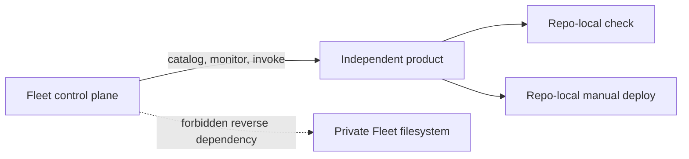

## Context

Fleet Workspace is both a private control-plane repository and the local
workspace root for independent child repositories. Fleet may discover those
repositories, run portfolio checks against them, and coordinate their manual
release commands. That relationship becomes inverted when a product command
calls `../foundry/ops` or directs agents to private Fleet documentation.

The runtime violations are bounded: App Health, Setline, and What It Takes to
Win call the private Fleet deploy guard from `package.json`. Eighteen tracked agent
bootloaders also require `../AGENTS.md` or the private Fleet repository. No
runtime import or shared data migration is involved.

## Goals / Non-Goals

**Goals:**

- Make affected product build, test, and manual deploy commands repo-local.
- Preserve the existing product checks and SHA-tagged/manual deployment
  behavior.
- Keep Fleet orchestration one-way: Fleet invokes product contracts and
  observes public/product-owned evidence.
- Detect future tracked reverse dependencies during local Fleet validation.

**Non-Goals:**

- Deploying any product or changing Cloudflare/GitHub settings.
- Duplicating the full Fleet deploy guard into every repository.
- Moving product source, changing package dependencies, or standardizing all
  products on one command name.
- Making private Fleet policy a runtime requirement of public products.

## Decisions

### 1. Product commands own product checks

App Health keeps its complete repo-local check command, build, dry-run, explicit
production-approval rules, and SHA-tagged Worker deployment. Setline keeps
`npm run check` followed by its existing SHA-tagged Wrangler command. What It
Takes to Win keeps `npm run ready` followed by its existing Pages command. The
private Fleet preflight is removed from those product commands rather than
copied.

Alternative considered: vendor `fleet-deploy-guard.sh` into each repository.
Rejected because copied policy would drift and recreate the duplication this
change removes.

### 2. Fleet orchestration points inward to product contracts

Fleet remains free to run a product's declared `check`, `ready`, or `deploy`
command from the product checkout. Product repositories SHALL NOT resolve
private Fleet scripts, files, or instructions to perform their native work.

### 3. A local boundary audit catches tracked reverse dependencies

Fleet gains a read-only scanner for available independent child repositories.
It examines tracked operational files for private Fleet filesystem references,
reports unavailable checkouts without failing, and fails when an available
independent product depends on `../foundry/ops` or the private Fleet repository
for required instructions.

The scanner is a workspace audit, not a product runtime dependency. Tests use
temporary fixture repositories so Fleet CI does not need to clone every
product.

### 4. Shared agent guidance is installed locally, not linked remotely

Each affected product keeps complete repo-local tracked instructions. Optional
machine-local Fleet skill and agent links may still be installed into child
checkouts, but they remain ignored conveniences and cannot be required to
understand or operate the repository.

## Risks / Trade-offs

- **Removing the shared deploy guard weakens a preflight** → Preserve every
  product-native check and manual-only deployment command; Fleet can still run
  its own guard before invoking the product command.
- **A checkout is absent during the workspace audit** → Report it as skipped;
  repository-native validation remains authoritative.
- **Forbidden-reference matching catches explanatory prose** → Limit scanning
  to tracked operational/instruction files and allow explicit test fixtures.
- **Product command names remain inconsistent** → Accept native boundaries now;
  a future catalog field can declare each product's command without coupling.

## Migration Plan

1. Remove the three sibling Fleet deploy-guard calls without changing the
   remaining product commands.
2. Replace required parent/private Fleet instruction links with self-contained
   product guidance.
3. Add and test the read-only Fleet workspace audit.
4. Run each product's smallest relevant native checks from its own checkout.
5. Commit and push each repository independently; perform no deployment.

Rollback is one repository-local revert per affected product plus a Fleet
revert of the audit and documentation. No production state changes.

## Open Questions

- Whether the project catalog should later declare normalized `checkCommand`
  and `deployCommand` fields for Fleet orchestration.
