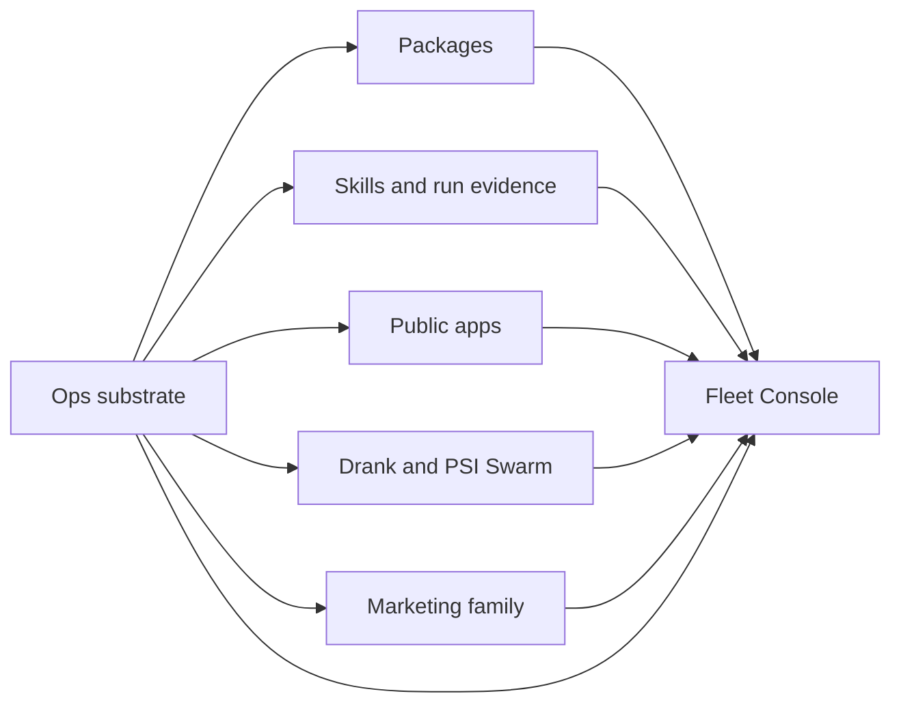

## Context

Foundry currently separates source by implementation type:
`apps/`, `services/`, `packages/`, `tools/`, and `ops/`. That model makes
runtime boundaries clear, but it does not match the operator's product model.
In particular, Reel Pipeline, Editorial, Content Factory, publishing handoff,
and marketing evidence are one large Marketing family rather than a peer of
focused internal applications such as Drank and PSI Swarm.

The move touches path-based contracts throughout CI, registries, scripts,
submodules, documentation, generated projections, tests, skill instructions,
and component-local commands. Existing unrelated dirty work under `foundry/ops`
must remain intact.

## Goals / Non-Goals

**Goals:**

- Make the six operator-facing buckets visible in the tracked layout.
- Preserve component histories and native runtime/deploy boundaries.
- Make Marketing a first-class product family.
- Keep Ops as substrate rather than presenting it as another product.
- Produce a durable, evidence-backed map of implemented and missing
  connections.
- Leave all existing production behavior and deployment identities unchanged.

**Non-Goals:**

- Implement Feedback ingestion or its dashboard.
- Add new Marketing automation, publishing, or outcome collection.
- Rename packages, public routes, Cloudflare targets, or GitHub repositories.
- Combine package managers or lockfiles.
- Deploy, migrate data, or mutate provider state.

## Decisions

### Use category paths without flattening runtime boundaries

The canonical layout will be:

```text
foundry/
├── packages/
│   ├── ai-visibility/
│   └── feedback/
├── apps/
│   ├── public/
│   │   ├── mobile-cockpit/
│   │   └── public-directory/
│   ├── internal/
│   │   ├── drank/
│   │   └── psi-swarm/
│   └── dashboard/
│       └── fleet-console/
├── marketing/
│   ├── reel-pipeline/
│   └── content-factory/
└── ops/
    ├── skills/
    ├── workflows/
    └── ...
```

Each moved component keeps its own manifest, lockfile, tests, and deploy
command. A single workspace-level package manager is explicitly rejected
because it would couple unrelated release and runtime surfaces.

### Keep skills physically under Ops

Skills are an operator-facing bucket, but their canonical implementation
remains `foundry/ops/skills/` because discovery, installation, execution
profiles, and machine-host hooks are all Ops responsibilities. Moving skills to
a new root would create churn without clarifying ownership.

### Treat Marketing as a family, not one application

Reel Pipeline remains the orchestration engine. Editorial stays nested within
it, while Content Factory becomes a sibling owned by the Marketing family
during this path-only change. A later bounded change may fold Content Factory
into Reel Pipeline after its public commands and imports are deliberately
redesigned.

### Keep the dashboard thin

Fleet Console moves under the explicit dashboard bucket. It SHALL aggregate
evidence and link to specialized internal or Marketing surfaces rather than
copy their domain logic.

### Track connection truth explicitly

The Foundry README will document each component's provider, consumer, transport,
and current status as `connected`, `partial`, or `missing`. The matrix is
curated from code and checked contracts; it is architectural documentation, not
a second task queue.



### Preserve submodule governance

The public workflows submodule remains under Ops. Render-engine gitlinks move
with Reel Pipeline, preserving exact revisions and URLs. This change does not
decide whether the first-party `reel-maker` engine should later be absorbed or
retired.

## Risks / Trade-offs

- **Path references are missed** → Inventory tracked references before moving,
  search for every old prefix afterwards, and run Fleet plus native checks.
- **Unrelated dirty Ops work is overwritten** → Avoid mechanical rewrites of
  dirty files unless required; preserve existing hunks and stage only this
  change.
- **Submodule metadata drifts** → Update `.gitmodules`, verify gitlink status,
  and validate workflows separately.
- **Generated projections encode old paths** → Update canonical generators
  first, regenerate views, then assert no old canonical path remains.
- **A conceptual bucket is mistaken for a shared runtime** → Retain native
  manifests, locks, deploy identities, and checks.
- **The connection overview becomes a task ledger** → Record only durable
  implemented/partial/missing truth and keep actionable work in GitHub Issues.

## Migration Plan

1. Capture the complete old-path reference inventory.
2. Move tracked component directories with Git-aware moves.
3. Repair component-local relative paths and submodule declarations.
4. Repair Fleet registries, CI, scripts, tests, skills, and documentation.
5. Regenerate derived project and public surfaces.
6. Run path residue checks, component-root validation, targeted native checks,
   Fleet tests, and strict OpenSpec validation.
7. Archive this change and update `PROJECT_STATUS.md`.

Rollback is a normal Git revert because there is no deployment or data
migration.

## Open Questions

None block the structural move. Feedback ingestion, Marketing outcome
collection, and the long-term `reel-maker` decision remain intentionally
visible as missing or partial connections.
