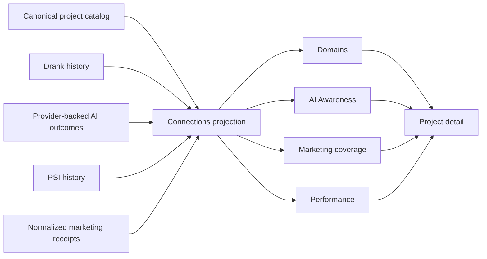

## Context

See `proposal.md` for motivation. Fleet Console already builds one fail-soft
`fleet.connections.v1` projection containing canonical maintained products,
registrable-domain semantics, provider-backed AI outcome signals, PSI history,
project-detail links, and normalized mission evidence. The current browser
client recombines those signals into one Metrics matrix, while Marketing renders
recommendations without full portfolio coverage.

The tracked `PRODUCT.md` and `DESIGN.md` remain authoritative. This is a
`preserve` design-workflow lane: retain the dark, dense operational language,
row-based hierarchy, responsive shell, and existing tokens while changing the
information architecture.

## Goals / Non-Goals

**Goals:**

- Derive all four portfolio decisions from existing canonical projections.
- Keep evidence meaning and missing states server-owned and testable.
- Preserve project detail as the diagnostic drill-down.
- Keep routes, URL scope, and old Metrics links safe during migration.

**Non-Goals:**

- Connecting Search Console, AI providers, Cloudflare, PSI, or Postiz.
- Adding schedules, mutations, credentials, provider SDKs, or storage.
- Replacing detailed SEO, GEO, Performance, Design, Feedback, or System Map
  evidence.
- Ranking products or creating an aggregate portfolio score.

## Decisions

### Add a bounded portfolio-strength projection

`buildFleetConnections` will add a `portfolio` object derived from the same
project outputs and normalized evidence already used by project detail:

The projection will group domains, filter core AI products, and classify
performance before JSON reaches the browser. This keeps semantics deterministic
and directly testable. The alternative—repeating filters and thresholds in the
browser—was rejected because it would make missing-state behavior easy to drift.

### Use explicit performance thresholds

The server will define PSI `>= 90` and LCP `<= 2500 ms` as the two required
guardrails. Both must exist to classify a product; incomplete evidence is Not
measured. The alternative of using PSI alone was rejected because the issue
explicitly requires both PSI and LCP and the current projection already retains
both.

### Keep AI readiness outside AI Awareness

Core AI products come from catalog priority P1, maintained lifecycle, and
product category. Awareness values come from the existing
`provider-observation` evidence mode only. Crawler, referral, fixture, and
readiness signals stay on project detail. The alternative of using agent
readiness as a fallback was rejected because it would answer a different
question.

### Derive Marketing coverage from normalized mission evidence

`buildMarketingProjection` will emit one coverage row for every maintained
product. Positioning availability comes from the catalog description, open
recommendation count comes from current projection state, and the newest
publication receipt comes only from normalized `Marketing publication receipt`
mission evidence. No receipt means Never marketed. Configuration and drafts do
not imply publication.

### Migrate navigation without breaking old links

Add `/domains`, `/ai-awareness`, and `/performance`; refocus `/marketing`; turn
`/metrics` into a redirect to `/domains`; and move Feedback plus System Map to
secondary navigation. Project filtering remains query-based and the client
continues to attach scope to navigable links.

## Risks / Trade-offs

- [The active connections OpenSpec still describes Metrics as primary] →
  archive this focused change into a new capability and update the older active
  change's completed navigation statements before claiming coherence.
- [Marketing receipts may be absent even when a product was marketed outside
  the normalized intake] → report Never marketed as a receipt-state claim and
  label the evidence boundary; do not infer historical activity.
- [Shared registrable-domain parsing is intentionally bounded] → reuse the
  existing parser and its current compound-suffix set; do not introduce a
  dependency in this change.
- [Five primary links add sidebar density] → keep the existing collapsible
  shell, short labels, and mobile drawer; verify at all required widths.

## Migration Plan

1. Extend and test server projections without changing provider inputs.
2. Add routes and client renderers, then update navigation and styles.
3. Preserve `/metrics` as a compatibility redirect and keep project detail
   unchanged.
4. Validate focused tests, build, strict OpenSpec, and the Fleet design receipt.
5. Roll back by reverting the commit; no data or provider migration is required.
