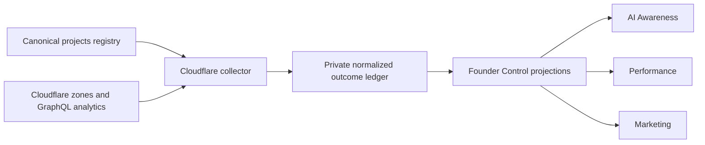

# Design

## Data flow

## Collection

The collector uses `CLOUDFLARE_API_TOKEN` when present and otherwise follows
the existing read-only Wrangler OAuth lookup used by Fleet's Workers CPU
report. It lists live account zones at runtime and assigns each project host to
the longest matching zone suffix, so zone ids and project targets are not
duplicated in a second registry.

One account-level query collects the last 28 completed days of RUM page loads,
visits, paths, referrers, and p75 Web Vitals. One zone-level adaptive query per
root zone collects the latest completed day of verified AI crawler, assistant,
and named AI-search traffic. This narrow daily range respects the current
free-zone adaptive-query boundary; Fleet retains comparable daily snapshots
locally instead of requesting unavailable history.

## Normalization

Extend the existing visibility outcome contract with:

- `web-traffic`: visits, page views, and search referral visits;
- `web-vitals`: field LCP, INP, CLS, TTFB, and sample count;
- optional HTTPS provider URL;
- bounded named breakdowns for top pages, referrers, crawlers, and statuses.

Existing `ai-crawl` and `ai-referral` families remain authoritative for
discovery evidence. Each observation is project-scoped, idempotent, and stores
only normalized counts, paths, provider host labels, dates, and zone links.

## Presentation

This is preserve-mode work. Existing sortable ledgers, disclosure rows,
secondary actions, status regions, and evidence links are reused.

- AI Awareness adds crawler requests and AI referral visits to core-project
  rows; detail shows provider links and bounded crawler/path/status evidence.
- Performance keeps PSI as the synthetic guardrail and adds field p75 LCP,
  INP, and CLS; detail names the two different sources.
- Marketing adds visits and page views; detail shows top pages and referrers.
- Google Search detail links to the exact Search Console property.

Missing Cloudflare evidence remains `Not measured`. The pages do not create a
combined grade and do not interpret a crawl or referral as a model citation.

## Update behavior

AI Awareness, Performance, and Marketing expose the same Cloudflare Update
control. All controls start the one allowlisted portfolio collector, share
active-run deduplication, report progress through a polite status region, and
redraw only the current page after completion.

## Failure and privacy

Authentication, GraphQL, and zone-coverage failures return bounded project or
provider reasons without replacing existing evidence. Existing ledger data
stays readable. The collector does not print tokens or raw provider errors.
