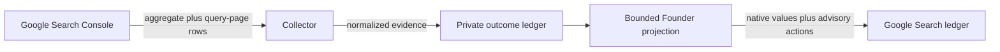

## Context

See `proposal.md` for motivation. The current collector records one aggregate
row and up to 25 query rows per canonical public project. Query rows do not name
the page that ranked, so the Console can describe demand but cannot identify the
surface to improve. The machine-local ledger is provider evidence and must not
become a recommendation store.

## Goals / Non-Goals

**Goals:**

- Preserve Google Search Console as the authority for native search values.
- Attach a validated landing page to each newly collected bounded query row.
- Produce one deterministic, explainable action per project and per retained
  query-page row.
- Keep old observations readable and the `/v1/outcomes/search` response bounded.

**Non-Goals:**

- Competitor research, keyword-volume estimates, blended SEO scores, or revenue
  attribution.
- Automatic metadata/content edits, indexing requests, issue creation, or
  deployment.
- Bing, Yandex, paid analytics providers, or changes outside Fleet Workspace.

## Decisions

### Collect query and page in one provider request

The existing bounded term request will use Search Console dimensions
`["query", "page"]`. Each returned row becomes one query-page record; duplicate
queries on different landing pages remain separate because they describe
different work.

Alternative: issue separate query and page requests and join locally. Rejected
because aggregate joins can associate a query with the wrong page.

### Persist evidence and derive advice

The private store adds an optional normalized `landingPage` field but stores no
action. The Founder projection derives action objects from the latest native
values, so future threshold changes do not rewrite provider evidence.

### Use explicit sample floors and ordered rules

Project actions require 20 impressions; query-page actions require 10. Rules
run in this order so a weak sample cannot produce a strong prescription:

1. Missing observation → Not measured.
2. Zero project impressions → Check indexing.
3. Below sample floor → Collect more data.
4. Position 1–10 with clicks → Protect and expand.
5. Position 1–10 without clicks → Improve snippet.
6. Position 11–30 → Strengthen ranking page.
7. Position beyond 30 → Build search relevance.

Each action is a stable object with `id`, `label`, `reason`, and numeric
`priority`. The UI sorts the action column by priority and does not repeat the
classification logic.

Alternative: use an SEO opportunity score. Rejected because combining position,
CTR, and impressions would imply precision the low-volume portfolio does not
have.

### Preserve the existing page hierarchy

The main ledger gains only one Next action column. Query-page details remain in
the existing disclosure, where Landing page and Action join the native term
metrics. No new summary cards, filters, routes, or navigation are introduced.

## Risks / Trade-offs

- **Search Console privacy filtering omits query-page rows** → Keep the project
  aggregate and state that query actions are unavailable.
- **Average project position blends many queries** → Project actions remain
  broad triage; only query-page actions name a specific page change.
- **Old observations have no landing page** → Normalize the field as absent and
  populate it on the next read-only collection.
- **Long URLs or queries overwhelm the disclosure** → Retain current bounded
  rows, wrap text, show a readable path label, and keep the full URL in the
  native link.
- **Thresholds overfit the first snapshot** → Keep them explicit constants and
  cover every boundary with tests.

## Migration Plan

1. Land backward-compatible store, collector, projection, and UI changes.
2. Run the read-only Search Console collector once to add landing pages to the
   newest observations.
3. Verify all 27 public projects remain represented and old rows still parse.
4. Roll back by reverting code; the optional landing-page field remains valid
   normalized evidence and requires no ledger migration.
