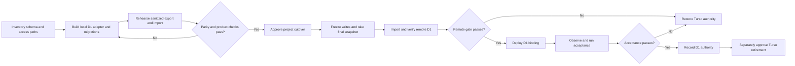

## Context

See `proposal.md` for motivation and scope. The eight projects all use SQLite-compatible Turso/libSQL, but their access patterns differ: some run directly in Workers or Pages Functions, some use Drizzle or authentication adapters, and Anime List and Starboard also run database-heavy GitHub Actions or operator scripts outside a Cloudflare request. The migration must therefore standardize safety and evidence while allowing a small project-specific adapter.

The Fleet root currently contains unrelated work. Planning lives in the existing Fleet OpenSpec store; implementation must occur on clean, issue-linked branches in each child repository and must preserve unrelated root changes.

## Goals / Non-Goals

**Goals:**

- Make D1 authoritative for all eight scoped products without changing customer-visible product behavior.
- Use one shared cutover contract and project-specific implementation slices.
- Keep local tests isolated and make schema/data parity independently auditable.
- Make every production mutation explicit, reversible, and scoped to one project.

**Non-Goals:**

- A shared multi-tenant Fleet database.
- A fleet-wide ORM or database abstraction package.
- Simultaneous dual writes to Turso and D1.
- Schema redesign, product feature work, or historical data cleanup during transfer.
- Deleting Turso databases, secrets, or provider accounts as part of the initial cutover.

## Decisions

### 1. Use one D1 database per product

Each project receives a separately named D1 database and binding. This preserves ownership and blast-radius boundaries and matches Fleet's one-resource-per-product posture. A shared Fleet D1 database was rejected because it couples deploys, schemas, access, and rollback across unrelated products.

Anime List starts with one D1 database matching its current production source of truth. Its optional manga connection becomes a second D1 binding only if the inventory phase proves that one database cannot satisfy current Cloudflare constraints; it is not created preemptively.

### 2. Replace the adapter at the runtime boundary, not throughout domain code

Projects using Drizzle move to its D1 driver and pass the platform binding into the existing database construction boundary. Direct-libSQL projects receive a narrow project-local adapter or targeted query conversion. A new cross-project package is rejected because the six query layers and runtimes are not uniform enough to justify shared production code.

Better Auth integrations use the existing ORM/D1-compatible adapter path already present in the owning project. Authentication tables and session behavior are parity-critical and cut over with the same database, never into a separate shared auth store.

### 3. Move remote database automation behind a Cloudflare-bound execution path

D1 is natively available through Worker/Pages bindings, not as a drop-in remote libSQL URL. Database-touching GitHub workflows and maintained scripts will therefore be classified individually:

- deterministic schema/import operations use Wrangler's D1 commands;
- scheduled product work moves to an existing Worker scheduled handler when it belongs at runtime;
- operator-triggered dynamic work uses an authenticated, non-public Worker operation or a Wrangler-driven local command, whichever is smaller and matches current ownership;
- obsolete scripts are removed only through the cleanup boundary.

Embedding Cloudflare API credentials into a new generic SQL client or exposing an unauthenticated maintenance route is rejected.

### 4. Use an offline copy plus bounded write freeze, not dual writes

Each canary rehearses against local D1 using a sanitized or approved source export. Production cutover uses a final source snapshot during a short, declared write freeze; D1 is imported and verified before the application binding is switched. This is simpler to reason about than dual writes, which would add cross-provider partial-failure and reconciliation behavior to every write path.

If a project cannot tolerate the measured freeze duration, its slice must design and test an incremental catch-up mechanism before approval; the rest of the fleet does not inherit that complexity.

### 5. Verify invariants, not only total rows

Every project receipt records schema objects, per-table row counts, foreign-key checks, selected critical aggregates, representative owner-scoped records, and read/write/auth journeys. Counts alone were rejected because identical counts can still hide broken ownership, missing indexes, altered nulls, or relationship damage. Receipts contain aggregates and pass/fail evidence only, never application rows, SQL literals, exports, or credentials.

### 6. Roll out by complexity, with a review gate per project

The completed and final rollout order is:

1. `karte` — first verify whether its production runtime is already D1-backed and only Turso scripts/registry remain; if so, treat it as reconciliation rather than a data cutover.
2. `significanthobbies` — compact Drizzle boundary and existing Cloudflare Worker surface.
3. `reader` — Drizzle/Better Auth plus R2, with auth and document ownership parity.
4. `swe-interview-prep` — Pages Functions with a broad direct-query handler surface.
5. `anime-list` — a 42 MB catalog/user database that fits one D1 binding, but has scheduled catalog refreshes and a broad batch surface.
6. `starboard` — a 2.13 GB source with two virtual tables, six triggers, a large query/script surface, and multiple database-touching workflows.
7. `open-historia` — a live Hono Worker with Better Auth and cloud saves; its Turso database reports no reads or writes, so the cutover is primarily schema/runtime verification.
8. `truehire` — a retained archived product with a live OpenNext Worker and light historical database reads; preserve every existing table and row before retiring the source.

The order can change after the inventory tasks measure schema size, access paths, and operational constraints. No implementation or cutover for project N+1 depends on project N being complete.

### 7. Treat dependency removal and retirement as trailing cleanup

`@libsql/client`, Turso env validation, workflow secrets, and registry entries remain until no maintained path uses them and D1 acceptance passes. Removing packages follows `code-cleanup`. Deleting secrets or Turso databases is a separate explicitly approved operation after the observation window.

## Risks / Trade-offs

- **[D1 SQL or transaction semantics differ from libSQL usage]** → inventory pragmas, batching, transaction callbacks, result-shape assumptions, and unsupported SQL per project; add targeted parity tests before adapter replacement.
- **[Large export/import exceeds a reliable single operation]** → measure schema/data first, produce ordered chunked SQL, and rehearse restart behavior locally before any remote import.
- **[External jobs lose direct database access]** → move only the database portion behind an authenticated Cloudflare-bound path and test manual/scheduled triggers separately.
- **[Write freeze drops acknowledged state]** → reject new writes with an explicit maintenance response or queue them through a proven handoff; record freeze start/end and reconcile before reopening.
- **[Rollback writes diverge after D1 becomes authoritative]** → keep the observation window short, define the rollback decision threshold, and if writes occurred on D1 export/reconcile them before restoring Turso authority.
- **[Auth sessions fail after cutover]** → include auth/session tables, cookie verification, ownership checks, and session create/revoke flows in the acceptance gate.
- **[Provider consolidation does not reduce cost]** → treat consolidation as an operational decision; retrieve current provider usage/pricing before claiming savings.

## Migration Plan

For each project, repeat the following gates independently:

1. Create or confirm the owning GitHub issue and clean implementation branch.
2. Inventory tables, indexes, triggers, views, pragmas, foreign keys, query patterns, auth integration, workflows, scripts, and estimated transfer shape without reading application rows into planning artifacts.
3. Add local D1 configuration, deterministic migrations, adapter changes, and targeted tests.
4. Rehearse export/import into local D1 and generate a sanitized verification receipt.
5. Run the project's smallest relevant typecheck/tests/build plus critical auth/read/write journeys.
6. Request explicit approval for that project's remote D1 creation, production export/import, binding/config mutation, and deployment.
7. Execute the bounded write handoff, remote import, parity gate, and release.
8. Observe critical journeys and scheduled work; roll back on a defined P0/P1 integrity, auth, or persistence failure.
9. After acceptance, update project/Fleet status and spend attribution. Handle dependency removal through `code-cleanup`.
10. Request separate approval before removing Turso secrets or databases.

### Rollback

Keep the last Turso-backed release and its configuration deployable throughout the observation window. If the pre-switch remote gate fails, reopen Turso writes without deploying the D1 release. If post-switch acceptance fails, stop writes, capture the bounded D1 write set for reconciliation, redeploy the Turso-backed release, verify authority, and report any records requiring manual reconciliation. Never delete or mutate the Turso source as part of rollback readiness.

## Open Questions

- The exact observation-window length and acceptable maintenance duration should be set per project from measured traffic and import rehearsal time before its production approval.
