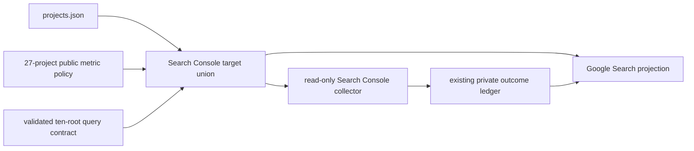

## Context

`visibilityProjects()` intentionally returns the 27 maintained public metric
projects. `root-search-queries.json` intentionally describes a different,
narrower ten-root mission and already validates every root against a catalog
project. Search Console needs the union of those two policies without turning
the root contract into another project registry.

## Design

Add one pure target-derivation helper beside the existing visibility-project
predicate. It accepts the catalog and an already validated root-query map,
preserves the catalog order of the existing public metric targets, and appends
only missing root projects in root-contract order. Supplemental targets retain
their catalog IDs and names but expose the contracted root as their measurement
domain.

The collector will validate `root-brands.json` and `root-search-queries.json`
before deriving targets. Its ledger allowlist will use the same resulting IDs.
The Console connection builder will derive the same target set, include those
catalog records in its internal project-output join, and mark Search Console
eligibility independently from generic public-metric eligibility. Only the
Google Search projection uses that eligibility flag.

## Invariants

- `projects.json` remains the only source of project identity.
- The existing public metric portfolio remains unchanged.
- Every supplemental root must resolve to a catalog project that owns the root.
- Existing public targets keep their existing primary measurement domain.
- A root that maps to an existing public target must match that target's primary
  domain; ambiguity fails closed instead of silently changing measurement
  scope.
- Historical observation IDs and project IDs are not migrated.
- Missing provider access remains an explicit unavailable result.

## Risks and mitigations

- **Contract/catalog drift:** validate both root contracts before target
  derivation and reject missing or mismatched catalog identities.
- **Accidental metric expansion:** carry a separate Search Console eligibility
  bit and leave Performance, Marketing, and AI projections on their existing
  public-project predicate.
- **Duplicate observations:** deduplicate by catalog project ID and fail closed
  if one project is assigned conflicting root measurement domains.

## Rollback

Revert the target helper and its two consumers. Existing ledger history remains
valid because no stored record is modified.
