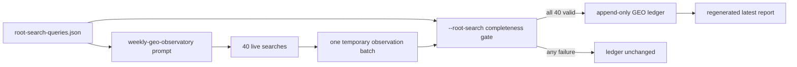

## Context

`root-search-queries.json` already validates the exact ten roots and four active intent kinds, and PR #189 proved the desired 40-observation batch shape. `geo-observatory.json` remains valuable because its append-only ledger contains older all-project observations and stable identifiers. The gap is execution: the weekly prompt and generic recorder do not distinguish the focused root mission from a broad manual observatory run.

## Goals / Non-Goals

**Goals:**

- Make every scheduled run attempt the same 40 active root queries.
- Reject an incomplete or internally inconsistent root batch before writing.
- Preserve the existing ledger, report, broad configuration, and historical query IDs.
- Let the already-installed job keep the same stable job ID and schedule.

**Non-Goals:**

- Re-measuring the other 17 maintained projects in the root-brand campaign.
- Rewriting or splitting historical ledger records.
- Automating a particular search provider or adding a paid API.
- Deploying software or changing the host's installed crontab.

## Decisions

1. Keep `root-search-queries.json` as the only scheduled query source. Creating another 40-query config would reintroduce drift.
2. Keep the stable `weekly-geo-observatory` job ID and update its checked-in prompt. This avoids a second schedule and preserves host receipts.
3. Add a `--root-search` recorder mode rather than replacing generic recording. The mode derives the expected product/query/text tuples from the validated root contract, requires exactly one entry for every tuple on one date, then delegates to the existing evidence validator and report generator.
4. Continue writing the existing ledger/report pair. The 2026-08-05 baseline is already there, the Console already consumes it, and a second ledger would split the comparable series.
5. Validate the full in-memory batch before a single ledger append. Report generation is deterministic and recoverable from the authoritative append-only ledger; no query-level partial write is permitted.

## Risks / Trade-offs

- [Risk] A query cannot be observed, so the entire weekly run fails. -> Mitigation: this is intentional; a partial run is not comparable and the cron failure receipt exposes the retry need.
- [Risk] Historical broad rows share dates with focused root rows. -> Mitigation: root completeness is checked only for the submitted batch, while report/history readers continue accepting all prior entries.
- [Risk] The installed host checkout is not on the merged revision. -> Mitigation: the stable job needs no reinstall, but it reads files from its configured checkout; handoff must state that checkout synchronization is required if it is not tracking current `main`.

## Migration Plan

Land the recorder mode and checked-in prompt under the existing job ID. Do not rewrite the ledger and do not reinstall cron. The next scheduled invocation will use the focused contract once the installed checkout contains the merged revision. Rollback is a source revert; prior observations remain valid.
