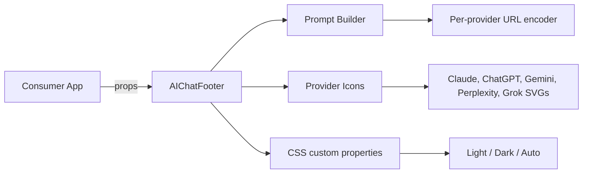

## Context

Fleet already generates agent-readable surfaces (`llms.txt`, `/api/ai`, JSON-LD, markdown mirrors) for every product. The new package adds the *human-facing* counterpart: a footer widget that lets visitors open their preferred AI assistant with a pre-filled prompt about the current product. This is purely presentational and redirect-based; it does not call any API or collect data.

The package is modeled on the existing internal `@saas-maker/feedback` package: TypeScript React component, `tsup` build, Biome lint, Node built-in tests, no runtime dependencies, and a `pnpm check` gate.

## Goals / Non-Goals

**Goals:**

- Provide a reusable, accessible, themeable React footer component.
- Ship inline SVG icons for Claude, ChatGPT, Gemini, Perplexity, and Grok.
- Encode prompts correctly for each provider's deep-link format.
- Support provider filtering, custom prompts, custom labels, and CSS overrides.
- Match the build/quality conventions of `@saas-maker/feedback`.

**Non-Goals:**

- Floating widget, chatbot, embedded iframe, or on-site AI response.
- Analytics, cookies, backend, API keys, or provider authentication.
- Automatic generation from site content (that is the agent-surface pipeline's job).
- Support for every possible AI assistant; the initial set is the five most common.

## Architecture



## Decisions

### Package lives under `foundry/packages/ai-chat-footer`

Fleet's shared UI packages belong under `foundry/packages/` (see `@saas-maker/feedback`). A new package keeps the component discoverable and versioned independently of any single product.

### React-only, no framework-agnostic core for the first version

Fleet app shells use Vite + React and marketing sites can embed React islands. A React component is the smallest useful deliverable. A framework-agnostic core can be extracted later if Astro/Vue/Svelte consumers appear.

### Inline SVG icons instead of an icon library

This avoids runtime dependencies, network requests, and license ambiguity. Each icon is a small functional component that accepts `className` and `aria-hidden` props. We keep brand colors as CSS custom properties so consumers can override them.

### Separate CSS file with CSS custom properties

The package ships `dist/index.css` alongside the JS bundle. Consumers import it once. Default styles use CSS custom properties for colors, spacing, and icon size so overrides do not require `!important` or shadow-DOM tricks.

### Prompt as a template string

The default prompt is:

```
What does {companyName} ({companyUrl}) do, and who is it best for? Keep it concise.
```

Consumers can pass `prompt` as a string with `{companyName}` and `{companyUrl}` placeholders, or as a function `(ctx) => string` for full control. The function form lets advanced consumers compute per-provider prompts if needed.

### Provider deep-link encoders live next to each icon

Each provider exports a `buildUrl(prompt)` helper. This keeps the component simple and makes the encoders independently testable. URLs are validated at build/test time; we do not encode arbitrary provider URLs at runtime.

### Auto theme uses `prefers-color-scheme`

The `theme` prop accepts `"light"`, `"dark"`, or `"auto"`. Auto applies a `data-theme="dark"` or `data-theme="light"` attribute based on `matchMedia`. The CSS uses `[data-theme="dark"]` selectors.

### Accessibility by default

Each provider link is an `<a>` with `target="_blank"`, `rel="noopener noreferrer"`, an `aria-label` like "Ask Claude about Acme", and a visually hidden text span. Icons are purely visual and have `aria-hidden="true"`.

## Risks / Trade-offs

- **Provider URL formats change** → The encoders are isolated and versioned with the package. We can release patch versions when deep-link formats drift.
- **Brand icon SVGs need care** → We use simplified official marks and include a `title` element for each. If brand guidelines change, we update the SVG components.
- **Bundle size** → Five inline SVGs are small but not zero. We allow consumers to subset providers via the `providers` prop to avoid shipping unused icons.
- **No floating mode** → First version is strictly an inline footer row. A floating action button can be a follow-up package if a product asks for it.

## Migration Plan

Create the package, implement the component, run `pnpm check`, publish a canary or patch version, and then update `PROJECT_STATUS.md` to list the new package. Consumers opt in per project; no existing code changes until a project imports it.

## Open Questions

None. The package scope is intentionally narrow.
