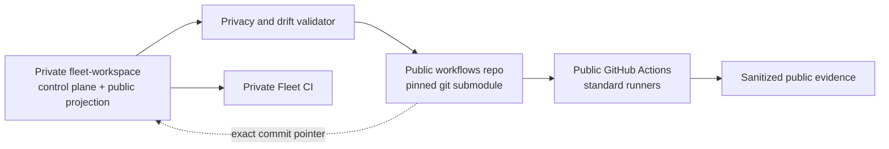

## Context

`sass-maker/fleet-workspace` currently owns twelve GitHub Actions workflows.
Most validate private monorepo source and must remain there. Two scheduled
audits primarily operate on public product URLs, but their implementations and
input registry are coupled to the private repository, so they consume the
private organization allowance.

GitHub bills a reusable workflow to its caller. Hosting YAML publicly therefore
does not make a private caller free. To use the public-repository standard-runner
allowance, a workflow must execute in a public repository and own every required
piece of code and input without checking out Fleet Workspace.

## Goals / Non-Goals

**Goals:**

- Establish `sass-maker/workflows` as a public, independently runnable
  automation repository.
- Pin it inside Fleet Workspace at `foundry/ops/workflows` as a git submodule.
- Run public-domain availability and bounded performance checks without private
  source or credentials.
- Retain Fleet Workspace as the authority for private policy, registries,
  product CI, and production operations.
- Make the six explicitly approved independent repositories public only after
  redacted history and GitHub issue/PR exposure checks.

**Non-Goals:**

- Running private Fleet tests indirectly from a public repository.
- Giving public automation a PAT or other private-repository credential.
- Moving product/package CI, mobile builds, deploys, or private provider
  inventory out of Fleet Workspace.
- Changing DNS, production deployments, databases, or cloud credentials.
- Claiming that public visibility grants an open-source license.

## Decisions

### Public repository plus pinned submodule

Create `sass-maker/workflows` and add it as a submodule at
`foundry/ops/workflows`. The public repository has its own commits, workflows,
issues, status, and checks; Fleet records the exact approved revision through
the gitlink.

This is preferred over copying files because the public implementation has one
history and one runnable source. It is preferred over a package dependency
because the module is operational source rather than a runtime library.

### Standalone runs, not billing indirection

The public repository's scheduled workflows run against its own checkout.
Reusable workflow entrypoints may also be provided for consistency, but a
private Fleet caller remains private-billed and no cost-shift claim is made.

### Allowlisted public input

The public module owns a minimal site manifest containing only stable IDs,
canonical public URLs, and declared probe paths. Fleet derives that manifest
from its existing privacy-checked public projection and validates both schema
and drift before an update is committed to the submodule.

Private repository paths, lifecycle notes, failures, deployment identifiers,
credentials, machine state, and unpublished claims are forbidden.

### Split public probes from private inventory

Public workflows may perform bounded HTTP availability checks and performance
measurement. Cloudflare account inventory, repository scans, deploy parity,
and any provider-authenticated operation remain local or in private Fleet
execution.

### Keep private-source CI in Fleet Workspace

The ten path-scoped product/package/policy workflows, Fleet Sync Guard, and
manual macOS proof continue to check out Fleet Workspace. A nested workflow in
the submodule is not treated as parent-repository CI because GitHub reads
workflow definitions only from the owning repository's root
`.github/workflows`.

### Harden public execution

Public jobs use standard GitHub-hosted runners, explicit permissions,
concurrency bounds, timeouts, and SHA-pinned third-party actions. Scheduled and
manual jobs execute only from the public repository's default branch. Pull
requests receive no secrets and no write-capable path.

## Risks / Trade-offs

- **Private data enters the public manifest** → Enforce an exact allowlist,
  reject unknown fields, scan staged public output, and require a clean
  deterministic diff.
- **Submodule and Fleet projection drift** → Add a parent-repository check that
  compares the pinned module manifest with generated public inputs.
- **A public reusable workflow is mistaken for free private CI** → Document and
  test that only standalone public runs are migrated; retain private callers
  where private source is required.
- **Untrusted pull-request code gains write access** → Keep write permissions on
  scheduled/manual default-branch jobs only; PR validation is read-only with no
  secrets.
- **Visibility change exposes repository history, issues, PRs, logs, and
  artifacts** → Run redacted full-history secret scans and metadata exposure
  checks before changing each repository; stop on any unresolved credential or
  private-data finding.
- **Third-party model/data licensing is mistaken for repository licensing** →
  Preserve third-party notices and do not add a project-wide license without a
  separate owner decision.
- **Operational source is split across repositories** → Keep authority explicit:
  Fleet owns policy and private inputs; the public module owns only its
  allowlisted implementation and evidence.

## Migration Plan

1. Record the work in Fleet Workspace's GitHub Issues and validate this
   OpenSpec change.
2. Create and initialize public `sass-maker/workflows`.
3. Implement the minimal public manifest, validators, public surface audit, and
   bounded performance workflow in the new repository.
4. Run the new repository's tests and manually dispatch each standalone
   workflow once.
5. Add the repository as `foundry/ops/workflows`, update fresh-clone and policy
   checks, and pin the verified public revision.
6. Disable the equivalent scheduled runs in Fleet Workspace only after public
   evidence succeeds. Retain local/private provider inventory commands.
7. Update durable Fleet status and the affected independent repository
   visibility statements.
8. Change the six approved repositories to public and verify visibility,
   Actions, issues, and default branches.

Rollback is a normal git revert: disable public schedules, restore the prior
Fleet workflow definitions, and revert the submodule and documentation commits.
No production runtime depends on the public module during this change.

## Open Questions

None. The first public execution surface is limited to credential-free public
URL availability and performance evidence; broader extraction requires a later
explicit proposal.
