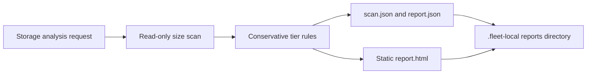

## Context

See `proposal.md` for motivation. Fleet-owned skills live under
`foundry/ops/skills/`, machine-local generated evidence must stay out of git,
and destructive commands are prohibited. The useful upstream concepts are a
read-only scan, risk tiers, and a readable HTML report; its `/tmp`, Desktop, and
mutation-server boundaries are intentionally incompatible with Fleet.

## Goals / Non-Goals

**Goals:**

- Make one command produce bounded storage evidence and a readable report.
- Enforce workspace containment in code rather than relying on instructions.
- Keep the implementation dependency-free and fixture-testable.
- Preserve conservative classifications when path evidence is ambiguous.

**Non-Goals:**

- Delete, move to Trash, uninstall, clear caches, change permissions, or alter
  system storage settings.
- Estimate APFS purgeable space or claim every byte can be attributed exactly.
- Support privileged system scans or retain reports outside Fleet Workspace.

## Decisions

### Use one standard-library Python command for scan, classification, and rendering

The skill will call a single Python entrypoint that measures configured roots,
classifies normalized findings, and writes the three artifacts. Keeping the
boundary in one process makes output containment and the no-delete surface easy
to audit and test.

Alternative considered: retain separate scan and report scripts with an
agent-authored intermediate JSON file. That creates an avoidable write boundary
and makes report shape depend on prompt interpretation.

### Enforce a fixed workspace-local artifact root

The entrypoint resolves the Fleet root, validates a conservative run identifier,
and always writes below `.fleet-local/reports/storage/`. It will not accept an
arbitrary output directory. The root ignore policy already excludes this
machine-local path while keeping it visibly inside the workspace.

Alternative considered: continue using `/tmp` for scan JSON and Desktop for
HTML. Those paths separate evidence from the owning workspace and caused the
operator's original concern.

### Generate a static report with no action API

The HTML contains collapsible findings, totals, explanations, and paths, but no
delete or Trash controls and no local HTTP server. Suggested follow-up remains
prose for human review; execution requires a separate explicit task and normal
Fleet authorization.

Alternative considered: keep the upstream loopback server with token and path
allowlists. Even guarded direct deletion conflicts with Fleet's destructive
action policy and expands the attack surface without being necessary for
diagnosis.

### Classify from explicit conservative rules

Known cache roots and reproducible developer caches can be green. Downloads,
projects, media, and general home content are yellow. Application containers,
application support, and system-owned paths are red. Unknown paths default to
yellow, and unreadable paths never contribute to estimated releasable space.

Alternative considered: ask the agent to decide every tier after scanning.
Free-form classification is useful for interpretation but too variable to be
the safety boundary.

## Risks / Trade-offs

- [Large directories make scans slow] → Scan only configured roots and their
  immediate children, expose a size floor, and report elapsed time.
- [Directory sizes change during a scan] → Treat results as timestamped
  observations, not transactional accounting.
- [A cache rule misclassifies user data] → Keep the green allowlist narrow,
  default unknown paths to yellow, and provide no execution control.
- [Absolute paths expose local information] → Keep all reports ignored and
  workspace-local; never publish them or include them in skill-run output.
- [macOS privacy controls hide directories] → Record unreadable paths and avoid
  turning missing evidence into a zero-byte finding.

## Migration Plan

1. Add the Fleet-owned skill, deterministic entrypoint, attribution, and tests.
2. Expose it through the normal Fleet skill-link installer and document the
   standalone capability in the Fleet status and standards snapshot.
3. Validate a fixture run and one bounded live workspace-local run.
4. Archive the OpenSpec change and merge through the linked Fleet Workspace PR.

Rollback removes the skill, exposure, tests, and documentation. Ignored local
reports can remain for operator review and are never deleted automatically.
