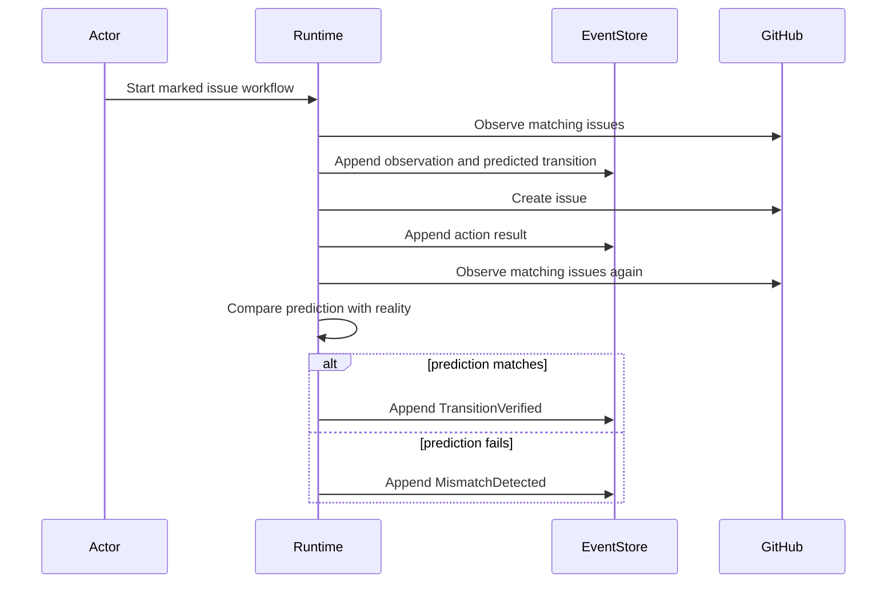

## Context

See `proposal.md` for motivation. The repository already owns internal Fleet
applications but does not yet have a runtime for explicit expected transitions.
The first experiment must use GitHub-visible state, create no deployment
surface, add no production dependencies, and preserve enough structure for
multiple actors and later skill learning without implementing those systems.

## Goals / Non-Goals

**Goals:**

- Make the predicted state durable before any external write.
- Preserve one complete causal timeline for a successful GitHub issue creation
  and an unsafe retry that creates a duplicate.
- Keep the runtime small, inspectable, deterministic under tests, and executable
  with the repository's existing Node and GitHub CLI requirements.
- Separate environment behavior, world semantics, verification, and event
  persistence behind the four minimum interfaces named in the project contract.

**Non-Goals:**

- Generic adapter discovery, queues, durable cloud storage, live collaboration,
  policies, permissions, repair generation, skill compilation, or deployment.
- Automatic deletion or mutation of experiment evidence.
- Treating the first workflow-specific implementation as proof of a platform.

## Decisions

### Keep the runtime inside the canonical repository

The component will live at `foundry/apps/internal/fleetworkspace-runtime/`.
This resolves the naming collision with the existing root without creating a
redundant nested clone, while making the new runtime boundary explicit. A new
standalone repository was rejected because today's experiment does not yet
justify an independent deploy, release cadence, or product boundary.

### Use dependency-free Node ESM

The prototype will use Node's built-in filesystem, process, UUID, child-process,
and test modules. The GitHub adapter will call the already authenticated `gh`
CLI with argument arrays rather than a shell. A framework, database, queue, or
GitHub SDK was rejected because none is required to test the core claim.

### Store canonical events as JSON Lines

`EventStore.append` will add one serialized event per line and `list` will read
the file in original order. JSONL makes append behavior visible and replayable
without introducing schema migration machinery. SQLite was rejected for day
one because the prototype needs an audit artifact, not concurrent writes.

### Make causality explicit in the event factory

All events use one envelope. `causationId` points to the event that directly
caused the new event, while `correlationId` groups the workspace run. Clock and
ID generation are injectable so tests can prove exact order and references.

### Keep GitHub semantics workflow-specific

`GithubEnvironmentAdapter` will observe open issues containing an exact marker
and execute only `create_issue`. `GithubIssueWorldProgram` will ground the
matching count, predict either creation or an intentionally idempotent retry,
and decide whether exactly one matching issue is goal evidence. There is no
generic plugin registry.

### Verify after every external write

The runner appends the proposal and prediction, executes, records the returned
result, observes GitHub again, and passes the preserved prediction plus observed
state to `TransitionVerifier`. A mismatch records the expected state, observed
state, category, and failed assumption. The runner never infers success from the
GitHub command's exit code.

### Preserve experiment evidence and clean operational noise separately

The real run's JSONL timeline will be retained as a tracked evidence fixture.
Issue `#245` is the separate implementation tracker. Both deliberately marked
experiment issues are closed only after their creation and the mismatch are
present in the timeline; closing them is operational cleanup, not a rewrite of
evidence.

## Risks / Trade-offs

- **GitHub list results can be eventually consistent** → Observe with bounded
  polling and record every attempt; do not assume immediate propagation.
- **A marker query could match unrelated issues** → Use a generated exact
  marker embedded in the issue body and filter returned bodies locally.
- **The experiment creates an intentional duplicate** → Use the private
  owning repository, name the issues as experiments, and close both experiment
  issues after evidence capture so only the real tracker remains open.
- **JSONL is not safe for concurrent writers** → Keep day-one execution
  single-process and preserve future event-store replacement behind the
  interface.
- **One hard-coded workflow can look more general than it is** → Keep names
  GitHub-specific and defer platform claims until reuse is demonstrated.

## Migration Plan

No deployment or data migration is required. Add the isolated component,
validate it locally, run the bounded GitHub experiment, and retain the timeline.
Rollback is removal of the new component and active OpenSpec change; GitHub
issues remain auditable even if the code is reverted.
