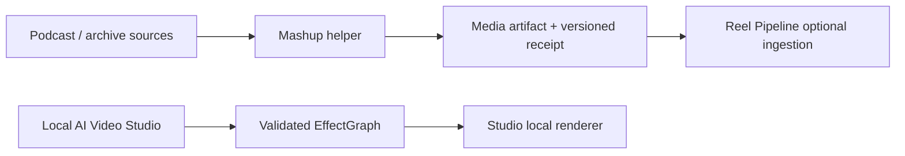

## Context

Reel Pipeline currently contains Mashup under `editorial/`, invokes it from JavaScript and package scripts, and exposes a podcast execution adapter. Mashup nevertheless has a separate domain model: archive ingestion, transcription, scoring, EDL creation, resumable SQLite state, approval, and multi-clip rendering. Local AI Video Studio is an independent Swift project with a strict `EffectGraph`, a registered effect library, and prompt planning, but only minimal direct graph editing.

The change spans three products and must preserve unrelated dirty work, avoid production dependencies, avoid video rendering during implementation, and keep each product runnable without the others. The studio UI work uses the Fleet design workflow in `preserve` mode because it adds a bounded control surface to an established visual system.

## Goals / Non-Goals

**Goals:**

- Establish one owner for podcast/archive editorial behavior and state.
- Replace source-level coupling with a narrow artifact-and-receipt boundary.
- Make the studio's supported effects understandable and directly editable.
- Keep prompt planning and manual changes reproducible through one graph schema.
- Preserve offline operation and honest readiness/degradation reporting.

**Non-Goals:**

- Combining Mashup with Local AI Video Studio.
- Adding Mashup to Reel Pipeline navigation or positioning it as a Reel effect.
- Introducing ComfyUI, plugins, cloud inference, shared databases, or shared mutable caches.
- Redesigning the studio's visual language.
- Generating or rendering validation videos before owner-led final testing.

## Decisions

### 1. Mashup becomes a focused helper product

Move the owned runtime from `foundry/marketing/reel-pipeline/editorial/` to `foundry/helpers/mashup/`. The helper owns its Python environment, CLI, persistence, schemas, tests, documentation, and renderer.

This is preferred over retaining a hidden nested runtime because directory ownership should match behavioral ownership. A shared package was rejected because Mashup is a complete workflow with state and operator entrypoints, not a consumer-neutral library.

### 2. Integration ends at immutable media plus receipt

Mashup outputs a finished media file and a versioned receipt. The receipt carries enough identity, provenance, rights, recipe, model/runtime revision, approval, and validation data for another product to verify the artifact. Consumers never inspect Mashup SQLite state or invoke its code.

A shared process API was rejected because it would retain lifecycle and availability coupling. A shared filesystem convention without a receipt was rejected because it cannot prove identity or provenance.

### 3. Preserve `fleet.podcast-edit.v1` inside Mashup

The EDL remains Mashup's editable planning contract. The new media receipt is a separate output contract for downstream consumers. Reel Pipeline no longer normalizes or renders the EDL.

This avoids forcing a planning-domain schema onto a media consumer and keeps existing resumable work representable during relocation.

### 4. Remove Reel-owned Mashup execution surfaces

Delete or replace package scripts, Python imports, subprocess paths, capability recipes, and execution-registry entries that call the nested runtime. Voice intake must use a Reel-owned transcription boundary if it remains a Reel feature; it cannot import Mashup transcription code.

The implementation must prove the invariant by running Reel checks with no runtime path into `foundry/helpers/mashup`. Compatibility shims may exist only inside Mashup for old data locations and must be time-bounded and documented.

### 5. Add a native studio capability catalog

Define catalog entries from the existing effect registry rather than maintaining a second hand-written list. Each entry exposes category, supported parameters and ranges, readiness, preview/render cost, compatibility constraints, and fallback reason. The catalog is local data and contains no executable code supplied by the planner.

Reusing Reel Pipeline's JSON recipes directly was rejected because it would couple a Swift editing product to Marketing-specific identifiers and runtime posture. The useful pattern is the contract discipline, reimplemented against the studio's native registry.

### 6. Prompt and direct controls are two graph editors

The effects panel inserts, removes, and updates typed effect nodes through the same validator used by the planner. Edits target the selected variant by default; applying to all variants is explicit. Any graph mutation changes its canonical hash and marks the prior preview stale.

The first UI increment will prioritize discoverability and safe controls over a full node editor: categorized effects, availability/cost labels, add/remove, schema-derived parameters, one/all targeting, and clear validation messages.

### 7. Preserve the studio interface

Use the existing black optical-printer workspace, compact native controls, synchronized comparison, and effect truth language. Add the effect browser as a bounded inspector/sheet that adapts to the existing wide and compact layouts. Capture before/after evidence and complete the design receipt during implementation.

## Risks / Trade-offs

- **[Path relocation breaks saved Mashup state]** → inventory persisted path semantics first; add a non-destructive compatibility lookup or documented copy migration; test existing fixtures before removing the old runtime path.
- **[Removing podcast execution reduces Reel Pipeline's apparent catalog]** → state the ownership change plainly and preserve optional consumption of verified finished output rather than pretending execution parity.
- **[Voice intake depended on Mashup transcription]** → isolate a minimal Reel-owned transcription interface or explicitly remove the unsupported path; do not duplicate the full editorial runtime.
- **[Catalog metadata drifts from renderer support]** → derive stable identifiers and parameter schemas from the native registry and add completeness tests.
- **[Direct controls make graphs invalid across variants]** → validate each target independently and report partial incompatibility before mutation.
- **[UI becomes denser]** → preserve progressive disclosure, default to the selected variant, and keep advanced graph truth secondary to the media comparison.

## Migration Plan

1. Establish independent Mashup metadata, entrypoints, and compatibility tests in the new helper location while the old nested path remains intact.
2. Move runtime ownership and add the output receipt without moving or deleting operator data.
3. Replace Reel Pipeline's direct integrations with receipt ingestion or explicit unsupported messaging; prove independent builds.
4. Remove the nested source only after parity checks pass and references are zero.
5. Add the studio catalog and graph mutation APIs with unit tests, then implement the preserve-mode effects panel.
6. Run build, graph, accessibility, adaptivity, and design-review checks without media rendering. Perform real media testing with the owner afterward.

Rollback is source-level: retain the previous nested implementation in version history and avoid destructive state migration. If the helper fails parity before removal, stop after the independent copy and keep Reel's existing path until corrected.
