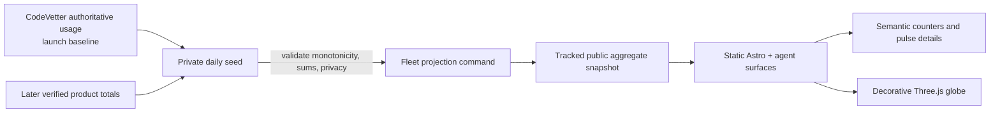

## Context

See `proposal.md` for motivation. The canonical SaaS Maker site is the static
Astro application at `foundry/apps/public/public-directory/`, deployed to the
existing `saas-maker-home` Pages project. SaaS Maker's current specification
forbids a shared runtime, private telemetry, or operational controls.

CodeVetter already holds authoritative token-usage data suitable for the launch
baseline. The owner expects to seed later cumulative values daily rather than
stream every model request. The design therefore stays entirely static: Fleet
validates a daily source snapshot, generates a privacy-safe public projection,
and the homepage animates only between verified values in that projection.

The homepage has a committed steel-framed glass-workshop identity. This change
uses the `preserve` design lane: the globe becomes one monumental black-steel
night pane inside that system, not a replacement brand. “Stripe globe” is a
reference for prominence, geographic legibility, and restrained pulse motion,
not a source for copied assets, code, gradients, or brand tokens.

## Goals / Non-Goals

**Goals:**

- Launch at the real scale of CodeVetter's cumulative usage.
- Keep daily updates simple, reviewable, deterministic, and honest.
- Preserve a static, failure-independent SaaS Maker homepage.
- Make the globe feel alive without fabricating activity between seeds.
- Bound geographic and temporal resolution before data becomes public.

**Non-Goals:**

- Live per-request ingestion or server-sent events.
- Reconstructing usage from billing, costs, text length, or tokenizers.
- Exposing per-user, per-request, model, provider, cost, prompt, or completion
  data.
- Creating a Worker, database, API, dashboard, or admin surface.
- Adding mapping, animation, component, model, or texture dependencies beyond
  the explicitly approved Three.js runtime.

## Decisions

### Use a two-layer daily snapshot

Fleet owns:

1. an ignored/private seed input containing the operator's authoritative daily
   product totals and already-coarsened geography; and
2. a tracked public projection containing only the four headline measures,
   previous/current lifetime totals, coverage wording, and privacy-cleared
   daily pulse buckets.

A repository-owned command validates the seed, compares it with the last public
projection, and writes deterministic output consumed by Astro and its generated
agent-readable surfaces. The command rejects estimates, regressions, malformed
geography, inconsistent sums, and conflicting snapshots for the same source day.

A static JSON/TypeScript fixture committed directly by hand was considered,
but a validator is necessary to protect monotonic totals, privacy, and human/AI
surface parity. A runtime API was rejected because daily owner seeding does not
need one and would reverse SaaS Maker's retirement boundary.

### Import CodeVetter as the launch baseline

The first seed is produced from CodeVetter's authoritative stored token-usage
records. Before projection, a focused adapter verifies the data source's token
semantics, avoids double-counting cache-read or cumulative fields, and emits:

- CodeVetter lifetime input plus output tokens;
- the latest source-day total available;
- available coarse country/locality aggregates, if CodeVetter actually stores
  geography safe for release;
- provenance metadata retained privately for audit.

If CodeVetter has no authoritative geographic history, its tokens still form
the lifetime baseline while the globe launches without invented historical
pulses. Later daily seeds may add real privacy-safe geography. The public copy
states that coverage begins with CodeVetter and expands as products contribute.

### Treat each seed as a cumulative ledger checkpoint

Each accepted seed carries:

- schema version and ISO snapshot date;
- cumulative lifetime token total;
- token total for that source day;
- cumulative country and contributing-project counts;
- per-product cumulative totals used for validation;
- bounded daily project/geography buckets;
- source kind and an operator-facing provenance reference.

The public projection omits private provenance and exact underlying records.
Lifetime totals must never decrease. Re-seeding the same date is idempotent when
the normalized content matches and rejected when it conflicts unless an
explicit correction workflow is used.

### Publish coarse daily activity, not request events

Daily pulse buckets contain an allowlisted project display name, country,
optional coarse locality, rounded token total, and snapshot day. Small buckets are
withheld or promoted to country level before projection. The globe replays those
buckets with visual staggering; the stagger is choreography, not a claim about
the exact request time.

The label says “latest verified activity,” not “live requests.” A disclosure
can still read `CodeVetter · Tokyo · 42K tokens`, but only when Tokyo is a
privacy-cleared aggregate in the seed.

### Animate only within verified bounds

The public projection contains the previous and current verified lifetime
totals for validation, while the page renders the exact current value from its
first paint. Enhancement never rewinds the visible value, increments past the
seed, or estimates an inter-day rate.

The supporting measures show today's seeded tokens, countries served, and
projects contributing. The “today” label includes the snapshot date when the
current calendar day has not yet been seeded.

### Render the globe with Three.js and semantic HTML

A bounded Three.js scene renders a dark, slowly rotating orthographic globe
from procedural point geometry, layered atmosphere, steel meridians, and
privacy-cleared pulse markers. It uses no external model or texture asset. The
globe sits slightly high in its reserved stage so it visually connects to the
heading. Semantic HTML outside WebGL owns the title, counters, snapshot and
last-updated status, and pulse-detail controls. Canvas is decorative and
excluded from the accessibility tree.

The globe effect contract is:

| Field | Decision |
|---|---|
| Purpose | Make cumulative global reach spatial and emotionally legible |
| Trigger | Enter viewport; verified daily buckets replay as restrained pulses |
| Completion | Counter stops at the seeded total; globe rests in slow rotation; pulses decay; offscreen and hidden states pause |
| Rendering | One Three.js WebGL scene for spatial point geometry, atmosphere, lighting, and pulse depth; no post-processing pass or external asset |
| Input | DOM pulse list supports keyboard, pointer, touch, coarse pointer, and missing hover |
| Fallback | CSS-rendered dormant globe and complete HTML metrics for reduced motion, missing WebGL, context loss, data saving, or disabled script |
| Budget | Pinned runtime with zero transitive dependencies; one canvas, one renderer, no textures/models/post-processing, capped DPR/geometry/pulses, paused offscreen, and zero layout shift |

At reduced motion the globe renders one static frame, pulses become persistent
markers, and the counter renders its final verified total immediately. All
content remains readable when scripts or WebGL fail. Context loss switches back
to the reserved CSS globe rather than collapsing the chapter.

### Preserve the site hierarchy

Insert the chapter after the opening studio hero and before the maintained
catalog. It becomes the emotional bridge from “one accountable maker” to the
individual products. The existing hero, navigation, anchors, catalog, package,
commission, footer, and legal routes remain unchanged.

The enormous lifetime number is the only hero-scale element in the chapter.
The other three measures sit on one restrained specimen rail. Selecting a pulse
reveals one concise privacy-cleared disclosure.

### Keep human and agent surfaces consistent

The homepage's generated Markdown and agent-readable output describe the same
metric definition, coverage start, snapshot date, and four measures. They do
not reproduce animation, and they never serialize private seed provenance.

### Data flow

## Risks / Trade-offs

- **CodeVetter's total is large but geographic history may be absent** → use
  the real lifetime baseline and launch with only geography that actually
  exists; never manufacture historical locations.
- **Manual daily seeding can be forgotten** → display the exact snapshot date
  and make the command concise, deterministic, and safe to rerun.
- **A correction could appear to reduce the lifetime total** → reject normal
  regressions and require an explicit audited correction path.
- **A coarse city plus project could reveal sparse activity** → enforce a
  public aggregation floor and promote sparse buckets to broader geography.
- **The animation could imply real-time traffic** → label activity as latest
  verified daily data and stop the counter at the seeded total.
- **Continuous WebGL work can waste battery** → use one lean scene, pause
  offscreen/hidden, cap DPR and geometry, honor data saving, and use a static
  reduced-motion/low-capability state.
- **A daily seed can look live or stale without context** → display both the
  source snapshot day and an explicit source-derived `Last updated` timestamp.

## Migration Plan

1. Approve this proposal and preserve-lane section direction.
2. Inspect CodeVetter's token store and document the exact authoritative fields
   and double-counting exclusions.
3. Add the private seed schema, public projection schema, validator/generator,
   and regression tests.
4. Produce and verify the CodeVetter launch baseline without publishing it.
5. Build the SaaS Maker chapter against awaiting, baseline-only,
   multi-project, and reduced-motion fixtures; complete design-review evidence.
6. Generate the real public projection, run Fleet/public checks, and prepare the
   static deployment. Deployment remains a separate explicit action.
7. Seed subsequent cumulative snapshots daily through the same command.

## Open Questions

- The exact public aggregation floor can be tuned during privacy testing
  without changing the contract, provided sparse buckets are never published.
- CodeVetter's available geographic history will determine whether launch day
  includes historical pulses or only the real cumulative counter.
