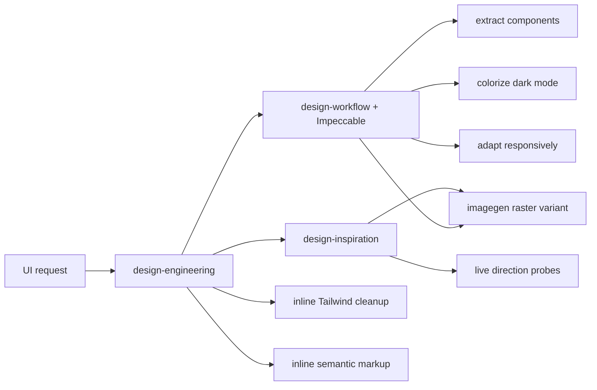

## Context

See `proposal.md` for motivation and `specs/ui-workbench/spec.md` for the
behavior contract. Fleet already exposes `design-engineering` as a parent,
`design-workflow` as the visual completion authority, `design-inspiration` for
references and probes, Impeccable for craft and review, and `imagegen` for
raster generation and editing. The existing parent already routes focused work
without loading every child, while Impeccable's `shape`, `extract`, `colorize`,
`adapt`, and `live` commands cover most of the public task boundaries.

The ui.sh website documents nine task names and outcomes, but its actual skill
payload is available only through authenticated API endpoints. The
implementation therefore uses only the public task boundaries as inspiration
and authors every Fleet instruction from first principles.

## Goals / Non-Goals

**Goals:**

- Make all nine jobs discoverable through the existing parent with minimal
  always-loaded metadata.
- Reuse authoritative Fleet workflows where their contracts already cover the
  job and add only two compact inline recipes where no existing route fits.
- Give structural refactors, class cleanup, theme work, responsive work, image
  edits, and semantic reconstruction explicit invariants and checks.
- Keep the skill payload concise, testable, and free of new dependencies.

**Non-Goals:**

- Reproduce, infer, scrape, or bypass access controls around ui.sh's private
  prompts, files, installer token, or API.
- Create any new skill, standalone catalog entry, competing design approval
  system, UI component library, Tailwind formatter, or image model.
- Modify product UI, add production dependencies, or deploy any Fleet surface
  as part of installing these workflows.

## Decisions

### Map every job onto existing skills and commands

Map the nine jobs as follows:

| Public task boundary | Fleet route |
|---|---|
| General UI design | existing `design-workflow` plus Impeccable |
| Multiple design directions | existing `design-inspiration` plus Impeccable `live` where browser comparison is required |
| Brand direction | `design-inspiration` plus imagegen for an explicitly requested visual board |
| Component extraction | Impeccable `extract` under `design-workflow` |
| Tailwind canonicalization | bounded inline recipe in `design-engineering` |
| Dark-mode UI adaptation | `design-workflow` plus Impeccable `colorize` |
| Dark-mode raster adaptation | imagegen handoff from `design-workflow` |
| Responsive adaptation | `design-workflow` plus Impeccable `adapt` |
| Semantic markup reconstruction | bounded inline recipe in `design-engineering` |

This keeps trigger vocabulary compact and gives users the useful execution
boundaries without creating aliases that overlap with mature Fleet behavior.

### Improve three existing Fleet skills

- Add the task map plus short Tailwind and markup recipes to
  `design-engineering`. The recipes stay inline because each is bounded and
  does not justify another child or reference.
- Add explicit Impeccable and imagegen handoffs to `design-workflow`; its
  preserve/overhaul classification and completion receipt remain authoritative.
- Add idea comparison and brand-board output rules to `design-inspiration` and
  its existing research contract. Static evidence remains the default; use
  `live` or imagegen only when the requested artifact needs them.

Do not edit the external Impeccable or system imagegen payloads. Fleet-owned
skills describe how to route to those installed capabilities.

### Preserve source-of-truth boundaries by job

- Brand direction may generate a project-native board, but an overhaul still
  stops for owner approval before implementation.
- Impeccable `extract` changes ownership and file boundaries, not rendered
  behavior or public APIs; validate every migrated caller.
- Tailwind canonicalization runs only when Tailwind is declared, uses existing
  project ordering or merge tooling, and treats arbitrary values, variants,
  responsive precedence, and conflicts conservatively.
- Dark-mode work uses semantic roles and the project's theme mechanism, covers
  interaction states and assets, and delegates raster editing to imagegen.
- Impeccable `adapt` derives responsive transformations from content and
  behavior instead of imposing generic breakpoints; Fleet's 390/768/1440
  evidence remains the meaningful-work completion floor.
- Markup reconstruction produces semantic, unstyled HTML or JSX only. It does
  not trace styling or prematurely extract reusable components.

### Route raster changes through imagegen without copying assets silently

The design workflow requires an attached or locally available source image
before invoking imagegen's edit mechanism. It retains the source, creates a
distinct variant, asks the model to preserve composition and purpose, and
reviews the output in its intended dark context. If the source is missing, the
workflow pauses for the asset instead of hallucinating it.

### Extend the focused design-engineering contract test

Update `foundry/ops/test/design-engineering-skills.test.mjs` to assert the nine
routes, Tailwind and markup boundaries, brand-board constraints, Impeccable and
imagegen handoffs, and continuing design-workflow authority. Use
skill-creator's `quick_validate.py` on the changed Fleet skills, the focused
Node test, capability-catalog validation, strict OpenSpec validation, and
`git diff --check` as the proof set.

## Risks / Trade-offs

- **The parent becomes too broad** → Keep the task map compact and only retain
  bounded inline steps for jobs with no existing owner.
- **Routing overlaps with Impeccable** → Name the exact existing command and
  keep Fleet's design-workflow as the completion authority.
- **Tailwind cleanup changes rendered output** → Require framework presence,
  project-native tooling, conservative conflict resolution, diff inspection,
  and the narrowest visual or build check.
- **Theme or responsive work expands into redesign** → Classify preserve versus
  overhaul before editing and keep protected routes, labels, fields, analytics,
  wordmarks, and legal copy unchanged.
- **Generated brand or raster output drifts from the source** → Use explicit
  preservation constraints, compare in context, retain originals, and require
  owner selection for brand direction.
- **Clean-room wording accidentally tracks proprietary material** → Base
  implementation only on Fleet standards and publicly stated outcomes; do not
  query authenticated endpoints or reconstruct hidden text.

## Migration Plan

1. Create a GitHub issue for the approved independently shippable change.
2. Update the three existing Fleet skills, their relevant metadata or
   reference, and the focused routing-contract tests.
3. Run quick validation for every changed Fleet skill, focused Node tests, capability
   validation, strict OpenSpec validation, and whitespace checks.
4. Update Fleet skill inventory and shipped status only after implementation
   passes and the change is ready to archive.
5. Commit and push the isolated branch and open a pull request with
   `Closes #<issue>`; do not deploy.

Rollback reverts the three Fleet skill edits and their test assertions.
External Impeccable and imagegen payloads remain unchanged throughout.
