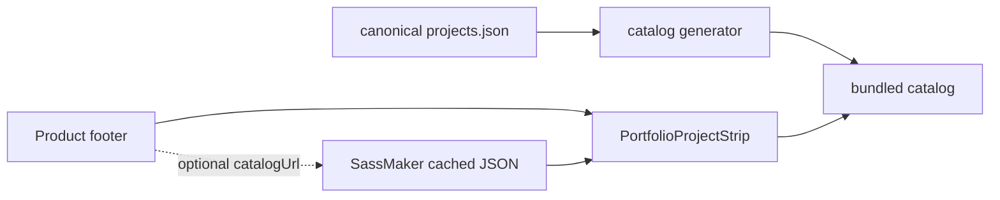

# Design

## Package boundary

The package is backend-free and owns only rendering, catalog validation, and
optional revalidation. SassMaker owns one generated static JSON endpoint; it
does not become a dynamic application API.

## Loading strategy

The canonical source for both internal and external project truth is
`foundry/ops/config/projects.json`. The existing
`foundry/ops/public/products.json` remains a generated public projection for
other consumers, not a second source of truth. The initial catalog is imported as a static TypeScript array, so SSR and first
paint never wait on the network. The default `catalogUrl` is
`https://sassmaker.com/projects.json`, generated from the same registry and
served by Pages with browser and edge caching. The component performs one
cache-friendly GET after mount with an 800ms timeout. A valid result replaces
the initial list; any failure is silent and preserves the last valid list.
Consumers can override or disable revalidation and can pass `projects` to
control the initial data.

## Motion and layout

The strip is a clipped horizontal track with duplicated items for a seamless,
slow marquee. CSS animation is paused on `:hover`, `:focus-within`, and reduced
motion. When there are too few items for a meaningful loop, the track is static.
Each destination remains a real anchor; the duplicate set is `aria-hidden` to
avoid duplicate screen-reader links.

## Visual direction

Preserve lane: the component is intentionally neutral and token-driven so it
can inherit each product's identity. It uses a hairline border, compact label,
small dot separators, restrained contrast, and a soft edge fade. No logos or
new visual dependencies are introduced.
