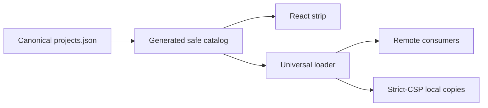

## Context

See `proposal.md` for motivation. The strip has two maintained renderers: the
React package and a generated dependency-free browser loader served by SaaS
Maker. Most products load the remote browser asset, while strict-CSP products
host a generated byte-identical copy. Both renderers consume the same generated
safe catalog projection.

## Goals / Non-Goals

**Goals:**

- Keep one compact inherited rail with no visible metadata/control column.
- Add deterministic, source-project referral query parameters at render time.
- Preserve canonical catalog URLs, existing URL state, accessible naming,
  interaction pausing, reduced-motion behavior, and first-paint data.
- Keep remote and strict-CSP loader copies identical.

**Non-Goals:**

- Add an analytics SDK, cookie, storage, redirect service, or server endpoint.
- Publish private registry fields or change public-project eligibility.
- Restyle individual host products or change their content security policies.

## Decisions

### Derive referral URLs only while rendering

Each renderer resolves the current project first, then uses the platform URL
parser to set `ref` on a temporary destination URL. The source catalog remains
canonical and reusable in internal and public contexts. Invalid or non-absolute
consumer-supplied URLs fail closed to their original value.

Alternative considered: generate source-specific catalogs. Rejected because it
would duplicate canonical data and multiply cache variants.

### Remove the visible metadata group, not the accessible region identity

The heading and Pause/Resume button are removed. The containing region retains
an accessible label, animation still pauses whenever a pointer or keyboard
focus enters the rail, and reduced-motion users receive a static layout.

Alternative considered: replace Pause with an icon-only control. Rejected
because it retains an unexplained secondary action and does not satisfy the
owner's request to remove the control.

### Keep one generated browser artifact

SaaS Maker serves the canonical universal loader. Strict-CSP products receive
the same generated artifact during this rollout rather than weakening CSP or
forking component behavior.

## Risks / Trade-offs

- **Removing the explicit motion control reduces direct user control** → retain
  pointer/focus pausing and a fully static reduced-motion presentation.
- **Host projects may parse referral parameters differently** → use one stable
  lowercase project identifier and preserve every unrelated query parameter.
- **A strict-CSP copy can drift from the remote asset** → compare hashes before
  consumer commits and smoke-test each local asset after deployment.

## Migration Plan

1. Update and verify the React package and universal loader generator.
2. Generate the canonical catalog and assert complete public eligibility.
3. Merge and deploy SaaS Maker so remote consumers update from one source.
4. Copy the generated loader into strict-CSP repositories, run native checks,
   merge, and deploy without database migrations.
5. Smoke-test all maintained public domains and referral links. Rollback uses
   the prior SaaS Maker deployment and prior consumer commits.
