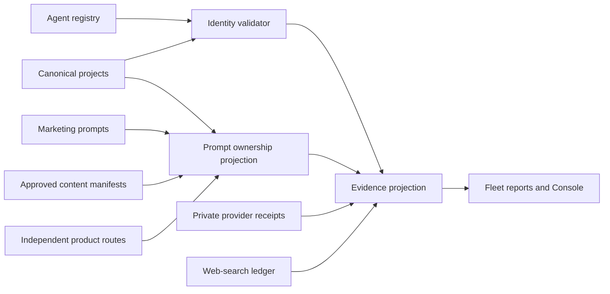

## Context

The canonical project catalog already owns lifecycle and public-listing truth,
while agent metadata, marketing prompts, Search/GEO evidence, and independent
repositories are separate validated overlays. Technical agent-readiness is
complete, content publishing already has an exact manifest-hash gate, and
provider observations already have a strict private ingestion boundary.

## Goals / Non-Goals

**Goals:**

- Make identity and external-link drift fail before public projection.
- Show the exact boundary between crawlability, owned prompt content, deployment,
  web-search discovery, and provider answer visibility.
- Reuse existing catalogs, validators, and private evidence stores.
- Produce actionable, reviewable content manifests without bypassing approval.

**Non-Goals:**

- Automatically deploying any product.
- Loading provider credentials or scraping consumer AI interfaces.
- Generating unsupported comparisons, testimonials, or backlinks.
- Moving independently owned product source into Fleet Workspace.

## Decisions

### Extend the canonical project catalog instead of adding a GEO registry

Identity and applicability fields belong on the existing project record because
it already owns product membership and public projection. Agent and marketing
registries remain overlays keyed by project id. A new standalone GEO registry
was rejected because it would recreate the drift this change is meant to stop.

### Validate declared links in a bounded explicit command

The validator will check only declared public destinations, use bounded
timeouts/concurrency, and emit a deterministic machine-readable summary. It
will distinguish private/internal source posture and not require an App Store
URL when the channel is not applicable. Folding arbitrary web crawling into
catalog validation was rejected because network state would make every local
schema check non-deterministic.

### Project prompt ownership; do not publish from the projection

Prompt ownership joins the canonical prompts to approved public routes and
content-coverage manifests. The projection is diagnostic and never writes to a
product repository. Existing campaign-manifest preview/gate/receipt behavior
continues to own publication approval.

### Keep evidence modes orthogonal

The Console/reporting layer will surface independent states for agent access,
homepage identity, content ownership, deployment parity, web-search class, and
provider observations. No weighted aggregate will hide a missing evidence
family.

## Risks / Trade-offs

- **Network validation can be flaky** → separate deterministic schema checks
  from the explicit live-link command and preserve exact failure evidence.
- **Canonical naming may remove useful aliases** → retain deliberate bounded
  aliases while rejecting undeclared public names.
- **Twenty-three provider gaps remain after code changes** → report them
  honestly; collection requires approved external captures, not synthetic data.
- **Prompt pages can become repetitive** → coverage review checks intent overlap
  and cannibalization before manifest approval.
- **Independent repositories can drift after validation** → CI consumes the
  same catalog contract and weekly measurement records later live divergence.

## Migration Plan

1. Add optional identity/link/applicability fields and validator tests without
   changing public output.
2. Populate all 27 maintained records and make schema validation strict.
3. Update agent/public projections and correct existing naming/link drift.
4. Add prompt-ownership output and provider-coverage disclosure.
5. Run focused tests, strict OpenSpec validation, and live read-only checks.
6. Land independent product fixes in their own repositories and PRs.
7. Deploy only after separate approval; then rerun live audits and outcome
   measurement. Rollback is a source revert because no data migration exists.
