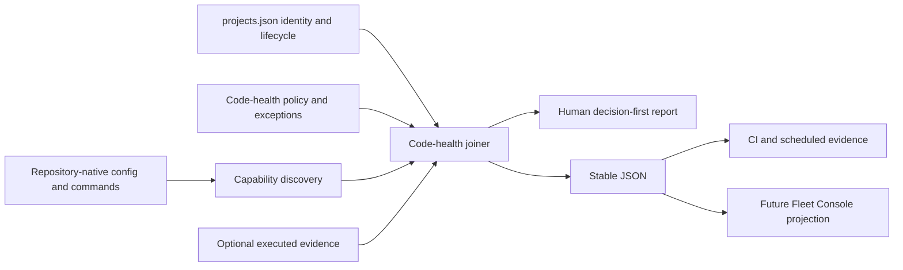

## Context

See `proposal.md` for motivation. The existing cleanup runner executes a safe
subset of repository-native commands for one checkout, the dependency guard
can scan selected git roots, and lint parity classifies shared-preset adoption.
Their scope and schemas differ, they do not express a complete quality
capability contract, and absence is often non-blocking. Fleet contains web,
server, native, research, mixed-language, and content-only repositories, so the
design must standardize evidence without standardizing every tool.

The canonical project registry remains the identity and lifecycle source of
truth. Repository-local manifests, configurations, scripts, and native build
systems remain the evidence source. Fleet may own a policy overlay, but it must
not duplicate product identity or infer that a configured command has passed.

## Goals / Non-Goals

**Goals:**

- Represent a stable capability contract and thresholds independently of
  ecosystem-specific commands.
- Make complete coverage, missing coverage, exceptions, and exclusions
  deterministic and machine-readable.
- Reuse current cleanup and lint discovery where it is reliable.
- Provide a fast inventory suitable for Fleet checks plus an execution path
  that can consume repository-native evidence without mutation.
- Let existing projects adopt strict enforcement through explicit baselines
  and no-regression ratchets.

**Non-Goals:**

- A universal maintainability score or AI-authorship detector.
- Automatic deletion, formatting, dependency installation, or mass rewrites.
- Replacing CodeVetter, repository CI, or language-native tools.
- Treating configured checks as proof that source currently passes them.
- Making every trend metric a blocking PR gate.

## Decisions

### Separate policy, coverage, and execution evidence

The report will model three layers:

1. policy says whether a capability is required, advisory, or not applicable;
2. coverage says whether a native evidence path is configured;
3. execution says whether current evidence passed, failed, warned, or is stale.

This prevents a discovered `test` script from being reported as a passing test
suite. The first implementation will make coverage deterministic and reuse
existing native execution for accepted checks; later analyzers can add metric
evidence without changing the contract.

An alternative was to make the cleanup runner's current pass/fail list the
entire standard. That cannot express duplication, cycles, baselines,
ecosystem applicability, or evidence freshness.

### Keep a Fleet policy overlay keyed by canonical project id

`foundry/ops/config/code-health.json` will define schema version, thresholds,
profile capability contracts, explicit project profiles where automatic
classification would be ambiguous, and time-bounded exceptions. It will not
repeat names, repositories, lifecycle, domains, or priority. Validation will
reject unknown project ids, missing maintained-project profiles, invalid
capabilities, and malformed exceptions.

Automatic profile inference was considered, but mixed repositories and nested
application roots make silent misclassification too likely. Explicit profiles
also make applicability reviewable when a project changes stack.

### Discover capabilities rather than mandate command names

The auditor will recognize current package scripts and configuration plus
language-native manifests and commands. A JavaScript project can expose
`check`, `lint`, `typecheck`, `test`, `test:coverage`, and Knip; Rust, Go,
Python, and Swift profiles can satisfy the same capability ids with their
native boundaries. Approved equivalents live in policy evidence, not hidden
branches in the reporter.

Mandating a `package.json` in every repository was rejected because it would
add wrapper code without improving native quality.

### Use hard targets for new work and ratchets for legacy debt

The policy stores universal target values, while accepted existing violations
are explicit exceptions with an issue and review date. The reporter validates
exception shape and expiry; it never silently refreshes a baseline. This lets
the standard become active immediately without either breaking every legacy
repository or weakening targets to the worst current project.

### Keep the fast Fleet command read-only and deterministic

The default command will inspect configuration and emit coverage readiness. It
will not execute arbitrary repository scripts. An explicit execution mode may
run only already-approved native stages through the cleanup boundary and must
continue after failures. Observation time belongs outside deterministic report
content unless the caller explicitly requests an evidence envelope.

Running every test suite by default was rejected because native and browser
projects have materially different cost, hardware, and credential boundaries.

### Report a matrix, not a score

The human summary will show non-green maintained projects first, then passing
projects and excluded identities. JSON preserves each capability result and
summary counts. Numeric observations keep units, direction, scope, and tool
provenance. No weighted average will disguise a missing required check.

### Establish centrally, then improve one project at a time

The Fleet worktree lands the policy, inventory, and evidence contract first.
Its first real inventory becomes the ordered adoption ledger: focus projects,
then active, then secondary, preserving catalog order within a tier unless the
owner directs otherwise. Only one independent repository is mutated at a time.

For each selected project, Fleet records the before inventory, checks its git
state, creates a separate worktree when the primary checkout is dirty or has
active work, applies the smallest coherent cleanup, runs native validation,
and classifies every remaining finding before selecting the next project.

Parallel repository mutation was rejected because it makes owner review,
conflicting active work, and attribution of quality improvements harder. Fleet
may collect read-only evidence across all projects up front, but write work is
strictly sequential.

## Risks / Trade-offs

- **Explicit project profiles can drift when the catalog changes** → validate
  exact maintained-project coverage in the root Fleet check.
- **Static discovery can overestimate actual quality** → label it as coverage
  evidence and never as executed proof.
- **Universal thresholds can be noisy in generated, fixture, or vendored
  source** → profiles define source scope and exceptions remain explicit and
  review-dated.
- **Executing every native check can be expensive or require unavailable
  hardware** → keep default inventory fast and execution explicit; report
  unavailable evidence truthfully.
- **Existing projects may start non-green** → use no-regression baselines and
  repository-owned issues instead of broad automatic rewrites.
- **The project catalog is currently being revised elsewhere** → implement in
  an isolated worktree and rebase before integration, resolving profile
  coverage against the then-current catalog.

## Migration Plan

1. Land the standard, policy schema, profile coverage, deterministic inventory,
   and tests in Fleet Workspace.
2. Add the inventory to the root Fleet check in non-mutating strict-coverage
   mode; existing measured debt is represented by explicit baselines rather
   than hidden skips.
3. Run the read-only inventory against every maintained checkout and derive the
   focus → active → secondary adoption sequence.
4. Complete one project pass at a time: preserve active work, isolate changes
   in a clean worktree when needed, verify native checks, and classify or track
   every residual finding before advancing.
5. Add scheduled metric collectors incrementally while keeping missing
   evidence visible.

Rollback removes the root check integration and policy consumer while leaving
the standard document and repository-native checks intact. No production data
or deployment migration is involved.

## Open Questions

None. Tool-specific adoption can evolve behind the stable capability and
evidence schema without changing the standard.
