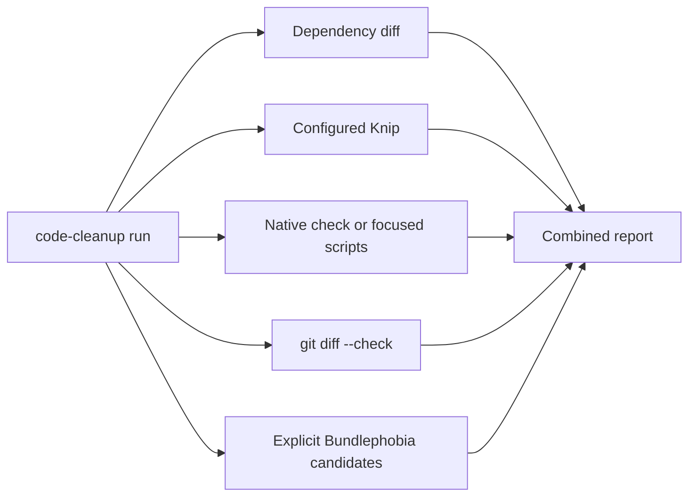

## Context

Fleet already has a read-only dependency guard, a shared Knip convention, and
project-native lint, format-check, typecheck, test, and aggregate check scripts.
Those capabilities are fragmented: an operator must know which tools exist in a
repository and invoke each one separately. The new `$code-cleanup` surface
should orchestrate them without introducing a package, installing missing
tools, or mutating the inspected repository.

The runner must work across heterogeneous repositories and package managers.
It also needs to preserve the dependency guard's exact comparison behavior and
privacy boundary around Bundlephobia.

## Goals / Non-Goals

**Goals:**

- Provide one read-only command for dependency review, unused-code/dependency
  analysis, native quality checks, whitespace validation, and optional
  Bundlephobia evidence.
- Prefer each repository's declared package manager and existing scripts.
- Continue after a failed check so the final report shows all discovered
  cleanup signals.
- Make missing tooling visible instead of treating absent coverage as a pass.
- Preserve stable human and JSON output and useful exit codes.

**Non-Goals:**

- Installing Knip, formatters, linters, or any other package.
- Deleting unused files, exports, dependencies, or code automatically.
- Running write-mode formatters or changing manifests and lockfiles.
- Replacing project-specific checks with a new Fleet analyzer.
- Sending inferred, private, workspace, or non-browser package names to a
  remote service.

## Decisions

### Rename the existing skill instead of adding a second overlapping skill

`guard-dependencies` becomes `code-cleanup`, and its CLI keeps the existing
`check`, `fleet`, and `lookup` commands while adding `run`. This leaves one
discoverable entrypoint for both dependency decisions and cleanup evidence.

An alternative was to keep both skills and have `code-cleanup` call the guard.
That would preserve compatibility but duplicate guidance and make it unclear
which surface owns unused-package cleanup.

### Discover native scripts and execute a bounded plan

The runner reads tracked and untracked `package.json` files without installing
anything. It selects the repository-root package manifest when available,
detects the declared package manager, runs `knip:strict` or another configured
Knip path separately, then runs `check` and the available non-writing
`format:check`, `lint`, `typecheck`, and `test` scripts.

Script names alone do not prove coverage: several Fleet `check` scripts only
run Biome. The runner therefore executes every distinct safe command, skipping
a focused script only when its command is identical to an already-selected
command or the aggregate script explicitly invokes it. Knip remains separate
because current Fleet check scripts do not consistently include it. The
alternative—blindly running every package script—could trigger builds, deploy
helpers, or write-mode formatting.

### Keep orchestration read-only and failure-tolerant

Every child command runs with the repository as its working directory, a
bounded timeout, captured output, and no shell interpolation. The runner
continues after failures and reports each check as `passed`, `failed`,
`unavailable`, or `skipped`. It never invokes an installer or a write-mode
formatter.

### Require explicit Bundlephobia candidates

The combined command accepts repeatable exact public npm specifiers through
`--bundlephobia`. It does not infer candidates from a manifest because package
privacy, browser delivery, and exact resolved versions cannot be established
safely from every repository shape. A failed lookup is reported but does not
alter dependency-diff findings.

Automatic lookup of every changed dependency was rejected because it could
send private package names remotely and would produce irrelevant evidence for
server-only or build-only packages.

### Use one report schema for the combined run

The `run` report contains the preserved dependency report, discovered coverage,
ordered check results, Bundlephobia results, and a summary. A cleanup run exits
non-zero when dependency review is required, a local check fails, or a requested
remote lookup fails. Missing optional coverage is explicit but does not by
itself fail the command.

## Risks / Trade-offs

- **Aggregate scripts can be slow or broader than their names imply** →
  use a per-command timeout, show the selected command before execution, and
  avoid scripts with deploy/release semantics.
- **A project may hide Knip behind a custom command** → detect standard scripts,
  dependencies, and configuration files; report `unavailable` when no safe
  native path is discoverable.
- **A passing run can still miss project-specific cleanup tools** → report the
  exact coverage discovered and keep repository-local instructions
  authoritative.
- **Skill rename can leave stale profile links** → update the canonical exposed
  skill list; the existing installer removes links no longer present there.
- **Bundlephobia availability is external and unstable** → keep it advisory,
  explicit, and separately identified in the combined report.

## Migration Plan

1. Add the delta specs and focused tests for the combined behavior.
2. Rename the skill directory and CLI, retaining the existing subcommands.
3. Add `run` discovery, orchestration, reporting, and CLI options.
4. Update Fleet exposure, policy, and discovery documentation to
   `$code-cleanup`.
5. Reinstall Fleet skill links and verify that the old exposed link is removed.
6. Validate OpenSpec, unit tests, CLI help, and a representative read-only run.

Rollback is a source-level rename reversal: restore the previous skill name and
exposure entries while leaving the dependency guard implementation intact.

## Open Questions

None. Projects can add or refine their own safe scripts independently; the
shared runner intentionally consumes rather than standardizes those commands.
