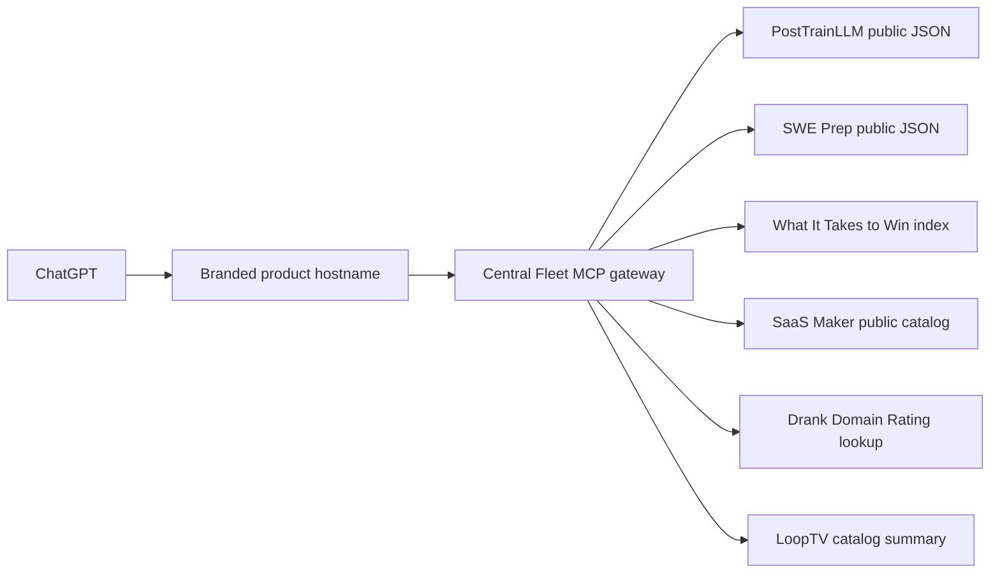

## Context

The existing Fleet MCP Worker serves seven independently branded ChatGPT
connections through one stateless gateway. Public routes use fixed anonymous
GET adapters; private routes use product-scoped Auth0 resources. The gateway
already enforces request and response bounds, explicit tool schemas, mutation
absence, hostname isolation, redaction, and daily production monitoring.

Six additional maintained non-iOS products already publish useful structured
JSON on their live hosts:

- PostTrainLLM: `/data/leaderboard.json` and `/gallery/manifest.json`.
- SWE Interview Prep: `/curriculum/catalog.json` and
  `/system-design/catalog.json`.
- What It Takes to Win: `/data/search-index.json`.
- SaaS Maker: `/api/ai`, backed by its privacy-checked public projection.
- Drank: `/api/dr?target=<domain>`, a fixed product-owned public lookup that
  keeps its provider credential server-side.
- LoopTV: `/catalog-summary.json`, a bounded 834-byte aggregate over its
  otherwise oversized public catalog.

The source payloads range from roughly 6 KB to 14 MB. The existing generic
read client caps an upstream response at 1 MB, so the 14 MB people dataset is
not suitable; the 782 KB search index is the approved boundary.

## Goals / Non-Goals

**Goals:**

- Reuse the existing centralized gateway and adapter model.
- Expose useful recognizable retrieval goals with small exact catalogs.
- Keep source reads live and stateless without copying product data.
- Make the inventory auditable so later additions have an objective gate.
- Preserve all existing route behavior and deployment controls.

**Non-Goals:**

- New product APIs, sync systems, databases, credentials, or account linking.
- Personal Email Manager, RolePatch, SWE progress, App Health, Knowledge Base,
  Karte, or another session/service-key surface.
- Free AI generation, India Standards estimates, job application actions, or
  any write/generation operation.
- Exposing full private Fleet configuration through SaaS Maker.
- Deploying or submitting the six plugins during this implementation change.

## Decisions

### 1. Extend one gateway, not one Worker per plugin

Each route has its own hostname, server identity, tool catalog, listing, and
monitor cases, but reuses the gateway's protocol and safety code. Separate
Workers would add six release units without improving data or auth isolation;
internal Service Binding splits remain available if a future adapter needs an
independent runtime.

### 2. Add public adapter definitions, not product-owned MCP implementations

All six sources are public product-owned JSON and need no caller credential.
The gateway will add six `AppDefinition` entries and six public
hosted routes. It will continue to use only fixed `GET` operations with no
caller-controlled origin, path, method, headers, or body.

Alternatives rejected:

- Creating MCP servers in all six repositories would duplicate protocol and
  safety logic and require six product releases.
- Copying JSON into Worker assets would violate daily real-time source access
  and introduce synchronization drift.

### 3. Normalize heterogeneous public contracts in the shared runtime

The existing normalizer expects an array or known collection field. Each tool
will name its exact collection keys and use local bounded filtering where the
source exposes a whole public catalog. Detail tools select by stable identifier
from the approved source collection. No adapter forwards a raw payload.

PostTrainLLM uses `entries` for leaderboard evidence and `models` for gallery
detail. SWE Prep exposes `tracks`, `concepts`, `roadmaps`, and
`systemDesignCases`; the system-design detail source exposes `cases`. What It
Takes to Win uses the public search-index array, not its 14 MB full dataset.
SaaS Maker uses `products`, `surfaces`, and `learnings` from `/api/ai`.

### 4. Keep exact small tool catalogs

- PostTrainLLM: `search_published_models`, `get_published_model`,
  `list_model_benchmarks`.
- SWE Interview Prep: `search_curriculum`, `get_curriculum_item`,
  `list_learning_roadmaps`, `search_system_design_cases`,
  `get_system_design_case`.
- What It Takes to Win: `search_people_and_milestones`,
  `get_person_research_record`, `list_research_categories`.
- SaaS Maker: `search_public_products`, `get_public_product`,
  `list_public_surfaces`, `list_public_learnings`.
- Drank: `get_domain_rating`.
- LoopTV: `get_catalog_summary`.

The catalogs map to recognizable user goals rather than reproducing every JSON
field as a tool.

### 5. Treat the inventory as a release input

A versioned document will list every maintained non-iOS catalog product with
its storage/auth boundary, useful structured contract, decision, and evidence.
Eligibility is not inferred from the presence of `/api/ai`: a marketing-only
agent catalog is not itself enough unless the underlying product data is useful
for repeated queries.

Private or service-key systems remain deferred until a separate change defines
real per-user federation. Static-only products remain discoverable through web
and agent-index surfaces rather than receiving empty MCP wrappers.

## Risks / Trade-offs

- **Large whole-catalog reads increase latency** → Use the smallest approved
  source, retain the 1 MB upstream cap, bound result pages, and exercise payload
  size in tests and live readiness probes.
- **Static exports can drift in shape** → Validate expected collections and
  return stable invalid-upstream errors; daily monitoring catches live drift.
- **Local filtering can scan hundreds of records** → The approved payloads
  are bounded public artifacts and output remains capped; no database or remote
  fan-out is introduced.
- **More plugins increase publication overhead** → Generate complete,
  independently verifiable listing packages but keep submission separate from
  implementation and payment-dependent OpenAI review.
- **SaaS Maker could leak Fleet-private truth** → Read only its deployed
  privacy-checked `/api/ai` projection and add forbidden-field tests.

## Migration Plan

1. Retain the full eligibility inventory and add fixture-backed app contracts.
2. Add six anonymous hosted routes, branded host mappings, listing assets, and
   challenge-secret names without values.
3. Extend exact-catalog, isolation, monitor, and public submission evaluations.
4. Run the helper check, strict OpenSpec validation, dry-run Worker bundle, and
   credential-free live source probes.
5. Commit and open a reviewed PR with `Closes #333`; do not deploy.
6. In a later explicitly approved release, deploy the reviewed SHA, add custom
   domains and challenge values, verify production, and create ChatGPT drafts.

Rollback before deployment is a normal code revert. After a later deployment,
remove or disable only the affected hosted route/listing and roll the gateway
back through its existing SHA-tagged release path; source products are
untouched.
