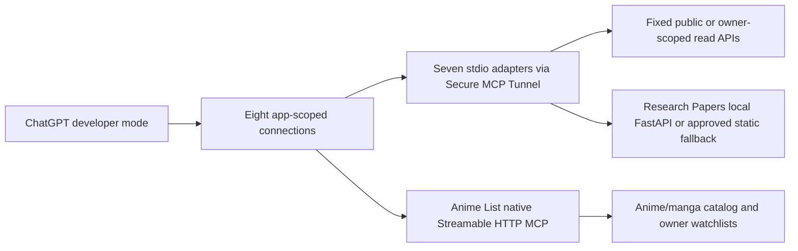

## Context

The selected Fleet applications have different useful read boundaries:

- Reader has owner-scoped reads through revocable `rdr_*` keys.
- Starboard and High Signal expose public discovery and evidence routes.
- Calorie exposes useful owner data only behind a Better Auth session; its broad dashboard also includes medication data that must not enter this connection.
- Anime List already implements `POST /api/mcp`, six public catalog tools, four authenticated watchlist tools, and hashed `anime_list_*` personal access tokens. Its current MCP adapter still needs explicit annotations, typed outputs, stricter inputs, bounded responses, timeouts, redaction, and deterministic errors.
- Significant Hobbies has a rich public hobby/experience corpus and opt-in public timelines, while Daily, journal, Trajectory, bucket lists, and account records are private or device-local.
- Research Papers has an operator-local FastAPI/ClickHouse corpus and a public static Pages build. ClickHouse must not become a production dependency, and the paid-answer POST path must not be invoked by this read connection.
- Setline exposes one authenticated whole-state endpoint behind a Better Auth session. A robust connection needs narrower owner-scoped reads and must preserve authored order, recorded/calculated provenance, and the product's no-coaching boundary.

OpenAI supports Streamable HTTP and stdio MCP servers and private connections through Secure MCP Tunnel. Public plugin distribution would require a separate public HTTPS, privacy, packaging, and OAuth review. This change is limited to personal developer-mode connections.

## Goals / Non-Goals

**Goals:**

- Give ChatGPT eight separately enableable read-only connections with application-specific identities and focused tool catalogs.
- Reuse Anime List's native MCP implementation and share protocol, validation, HTTP, normalization, error, redaction, and test utilities across the other adapters.
- Use least-privilege owner credentials only where private reads are essential; keep all other connections public-only or local-only.
- Normalize results into bounded, stable schemas with identifiers, canonical links, provenance, freshness, and continuation state.
- Make mutation technically unavailable through registered tools and fixed upstream operation allowlists.
- Verify locally, with MCP Inspector, and with retained tool-selection evaluations before ChatGPT developer-mode setup.

**Non-Goals:**

- Write tools, arbitrary HTTP/SQL/database tools, browser-session reuse, admin tools, ingest/refresh jobs, paid-answer calls, custom MCP UI, public plugin packaging, public submission, deployment, migration execution, or automatic tunnel lifecycle management.
- Exposing Calorie medication data; Significant Hobbies private data; Research Papers operator controls; or Setline workout execution, recommendations as coaching, account controls, import, or sync writes.
- Replacing existing application auth or API contracts beyond the smallest app-owned read-token and bounded-read additions required for least privilege.

## Decisions

### 1. Eight connections, two implementation shapes

Create a shared Fleet-owned package at `foundry/helpers/chatgpt-connections/` for Reader, Starboard, High Signal, Calorie, Significant Hobbies, Research Papers, and Setline. Each app gets its own server identity, tool registry, configuration, and tunnel profile. Shared code is limited to protocol-safe mechanics and does not collapse application schemas into a generic query tool.

Anime List retains its existing app-owned Streamable HTTP MCP endpoint. The change hardens that implementation in place and connects it through its own profile. Duplicating its ten tools in the shared helper would create two contracts and invite drift.

Alternative considered: one “Fleet apps” server. Rejected because a mixed multi-domain catalog harms tool selection, couples credentials, and prevents independent enablement or revocation.

### 2. Secure MCP Tunnel is the personal transport boundary

The seven shared entrypoints use stdio. Secure MCP Tunnel carries their MCP traffic outbound to ChatGPT. Anime List's profile relays its native Streamable HTTP endpoint and supplies the existing PAT only within the local/tunnel credential boundary when owner watchlist access is enabled.

No private server accepts new public ingress. Stopping one profile disables only that connection. Public distribution is a separate change.

### 3. Tool catalogs are task-shaped

| Connection | Initial tools | Data boundary |
| --- | --- | --- |
| Reader | `search_saved_reading`, `get_saved_item`, `list_reader_collections` | Owner-only via `rdr_*` |
| Starboard | `search_repositories`, `get_repository`, `preview_project`, `inspect_tool_adoption` | Public catalog only |
| High Signal | `search_signals`, `get_signal`, `get_daily_brief`, `get_track_record` | Published public data only |
| Calorie | `get_daily_nutrition`, `get_nutrition_history`, `search_saved_foods`, `list_goal_cycles` | Owner nutrition/water/food data via new read-only token; no medication or weight fields |
| Anime List | Existing `search_anime`, `search_manga`, anime/manga detail, stats/random, and four watchlist tools | Public catalog; owner watchlists via existing PAT |
| Significant Hobbies | `search_hobbies`, `search_experiences`, `get_experience`, `search_public_timelines`, `get_public_timeline` | Public corpus and explicitly PUBLIC timelines only |
| Research Papers | `search_research_papers`, `get_research_paper`, `find_similar_papers`, `list_hot_papers`, `list_sleepers`, `get_reading_path` | Local corpus with explicit public-static fallback; no RAG spend or jobs |
| Setline | `get_training_programme`, `list_workout_templates`, `list_workout_history`, `get_workout_session`, `get_progress_summary` | Owner state via new read-only token; bundled plan may be public |

Names describe user goals rather than routes. Search/list tools use typed filters, small defaults, hard maximums, and explicit continuation state. Detail tools accept stable identifiers returned by list/search tools. No generic `query_app`, URL fetcher, GraphQL, SQL, or mode-heavy admin tool is exposed.

### 4. Read-only is enforced by capability, operation, and auth

1. No mutation tool is registered.
2. Every adapter selects from a compile-time method/path tuple allowlist. The shared adapters use GET only. Anime List may retain its existing POST catalog-search operations because they are read-semantic, but only those exact routes and validated bodies are allowed; no caller controls origin, path, headers, or method.
3. Every tool advertises `readOnlyHint: true` and `destructiveHint: false`, with an accurate `openWorldHint`.
4. Contract tests fail if a registered operation targets a known mutation route, accepts arbitrary transport fields, or omits read-only annotations.

Read-only means no application or provider state changes, not merely use of the HTTP GET verb.

### 5. Private credentials are least-privilege and app-owned

- Reader reuses a dedicated revocable `rdr_*` key.
- Anime List reuses a dedicated revocable `anime_list_*` PAT and never accepts its browser cookie for MCP.
- Calorie and Setline gain separate hashed, shown-once, revocable read-only tokens that resolve exactly one owner. Their MCP adapters cannot use Better Auth session cookies because those sessions also authorize writes.
- Starboard, High Signal, and Significant Hobbies use anonymous public contracts only.
- Research Papers authenticates no public data; its full-corpus source remains reachable only from the operator-local process through the private tunnel.

Calorie and Setline token schemas/routes, if approved during apply, are additive and app-owned. Migration generation, remote application, token issuance, and production deployment are explicit later gates. Tokens never appear as tool inputs, outputs, logs, snapshots, or retained receipts.

### 6. Privacy projections are narrower than existing broad endpoints

The MCP boundary does not blindly forward application response bodies:

- Calorie projects daily/history data to nutrition, water, food, and goal-cycle fields. Medication routines/check-ins and weight records are excluded at the source boundary. Weight is disabled for the initial connection; adding it later requires a separate privacy decision.
- Significant Hobbies queries only corpus data and records whose visibility is exactly `PUBLIC`; it never treats signed-out local storage as public.
- Research Papers returns metadata, abstracts where already permitted, citations, scores, and source links; it never returns PDFs, credentials, operator logs, or raw ClickHouse access.
- Setline retains authored/adjusted/recorded/calculated provenance and order, but omits auth/account records and active write intents.
- Reader returns only the requested owner record and bounded organization context.

### 7. Normalize bounded model-readable results

Every adapter validates upstream data into a versioned internal result before creating MCP output. Handlers return `structuredContent` matching an explicit output schema plus a short `content` summary. Common collection fields are `items`, `nextCursor` or `nextOffset`, `hasMore`, `freshness`, `retrievalMode`, and `truncated`. Common records carry stable app identifiers, canonical URLs, concise summaries, timestamps, and evidence/provenance where applicable.

Default collection size is 10 and maximum is 50 unless the source has a lower safe bound. Text fields and aggregate payload size are bounded before MCP output. Truncation preserves identifiers and canonical URLs for follow-up.

Research Papers reports `retrievalMode: "local-corpus"` or the exact static fallback mode. Static fallback supports only the tools backed by approved exports; full-corpus or similar-paper requests fail explicitly when the local service is unavailable.

### 8. Timeouts, retries, failures, and degraded modes are deterministic

All upstream calls use a bounded timeout, defaulting to 10 seconds. At most one retry is allowed for safe read operations on network failures, 429 responses with usable retry guidance, or 5xx responses. Invalid input, authentication failures, not-found responses, and unsupported fallback operations are not retried.

Stable failure categories are:

- `invalid_input`
- `unauthorized`
- `not_found`
- `rate_limited`
- `timeout`
- `upstream_unavailable`
- `unsupported_in_current_mode`
- `invalid_upstream_response`

Known degraded behavior is labeled, never inferred. Empty results are successful empty collections. No tool fabricates freshness, evidence, recommendations, or private data when an upstream is unavailable.

### 9. Official SDK and dependency discipline

Use `@modelcontextprotocol/sdk` and its required schema dependency for the shared runtime. Anime List already uses this SDK. Before editing the helper manifest or root lockfile, run the Fleet `code-cleanup` dependency inspection workflow, explain the dependency, and obtain the approval required by Fleet policy.

### 10. Verification is layered and application-specific

1. Input/output schema tests, including invalid and oversized values.
2. Adapter tests for fixed operations, ownership, public visibility, privacy projection, normalization, pagination, timeouts, retries, redaction, and error mapping.
3. MCP contract tests for identity, tools, annotations, structured outputs, and mutation absence.
4. Retained evaluations for direct, indirect, follow-up, empty, unauthorized, degraded, unsupported, cross-app, and mutation prompts.
5. Native app checks for every changed route or credential boundary.
6. MCP Inspector for all eight connections.
7. ChatGPT developer-mode evaluation only after Inspector passes.

Tests use fixtures and no production credentials. Manual owner-data smoke tests use separately issued tokens without retaining their values.

## Risks / Trade-offs

- **Eight connections increase operational setup.** One profile and doctor command per app keeps failures and enablement independent; the runbook includes a concise set-up matrix.
- **Calorie and Setline need new credential boundaries.** Hashed read-only PATs are more work than cookie reuse but avoid granting write authority or depending on expiring browser sessions.
- **Anime List's existing MCP is functional but permissive.** Hardening it in place preserves one contract while adding annotations, schemas, bounds, timeouts, structured output, and safe errors.
- **Research Papers local corpus may be offline.** Supported static exports provide a labeled partial fallback; unsupported full-corpus requests fail honestly.
- **Significant Hobbies contains sensitive private features.** Phase one exposes only public corpus data and explicitly PUBLIC timelines.
- **Private Reader, Calorie, Anime List, and Setline data reaches ChatGPT when requested.** Each connection is separately enableable, returns bounded requested records only, and can be revoked independently.

## Migration Plan

1. Create the owning GitHub issue and approve the MCP SDK dependency work.
2. Build the shared helper, schemas, fixtures, and public adapters without changing product routes.
3. Harden Anime List's native MCP contract and run its existing MCP/PAT tests.
4. Add only the proven bounded public-read route changes in Starboard, High Signal, Significant Hobbies, and Research Papers.
5. Add and locally validate Calorie and Setline read-token models and narrow read projections. Do not apply remote migrations or deploy.
6. Run native checks and MCP Inspector for all eight connections.
7. After explicit operator approval, apply any required migrations, deploy affected app changes, issue dedicated tokens, configure eight tunnel profiles, and add connections one at a time in ChatGPT developer mode.

Rollback is per connection: stop/remove its tunnel profile and revoke its dedicated token where applicable. Any app route deployment follows that app's normal rollback. No connection depends on deleting user data or rolling back a destructive migration.

## Resolved During Apply

- High Signal uses `https://highsignal.app`; Reader and Starboard route shapes were verified against their owning repositories.
- Significant Hobbies private Daily/Living data remains intentionally excluded.
- Calorie weight records are disabled for the initial connection, alongside the medication exclusion.
