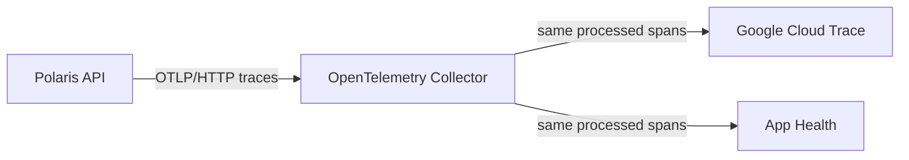

## Context

Polaris currently reports errors through the Sentry Go SDK and metrics through
the existing Prometheus path. Draft PR #295 additionally creates HTTP server
spans, but exports them directly to App Health with an App Health credential in
application code. App Health already accepts standard OTLP/HTTP traces, and
Google Cloud Trace accepts the same OpenTelemetry stream.

The desired topology is one application-owned OTel stream with infrastructure
fan-out:

Polaris runs on GKE through the Vault Wealth ArgoCD/Helm repository. App Health
accepts only privacy-bounded HTTP server span fields for endpoint health, so
Polaris route instrumentation must continue to use framework route templates
rather than concrete URLs.

## Goals / Non-Goals

**Goals:**

- Give Polaris one vendor-neutral OTLP destination.
- Fan out one post-processor trace stream to GCP and App Health.
- Keep sampling, environment attribution, batching, retry, and exporter health
  in the Collector rather than duplicating them in application code.
- Preserve existing Sentry error capture without adding Sentry to the trace
  pipeline.
- Keep vendor credentials out of Polaris and source them from Secret Manager.
- Verify real Polaris routes locally and canary staging before production.

**Non-Goals:**

- Replacing Prometheus metrics, application logs, or Sentry error capture.
- Sending logs or metrics through this initial Collector pipeline.
- Storing raw spans in App Health or expanding its privacy contract.
- Provisioning or printing secret values in source control.
- Automatically enabling production environments as part of merging a PR.

## Decisions

### Polaris exports once to an internal Collector

Polaris SHALL use the standard OTLP/HTTP exporter and resource attributes
including `service.name=polaris` and `deployment.environment.name`. Its only
runtime destination is the Collector endpoint supplied through standard OTel
configuration.

This replaces the direct App Health exporter. Vendor-specific exporters inside
Polaris were rejected because they multiply credentials, retries, and failure
modes in the request-serving process.

### A dedicated Collector deployment owns fan-out

The Collector SHALL run as a separate workload and service, independently of
the Polaris API and Temporal worker. It SHALL use one traces pipeline with a
common processor chain followed by both configured exporters.

A sidecar was rejected because every Polaris replica would duplicate queues and
credentials. Embedding the Collector as a Polaris workload was rejected because
the shared Polaris chart exposes unrelated application secrets to all
workloads. A separate deployment gives the Collector least-privilege secrets,
independent health checks, and a stable internal endpoint.

### Use maintained protocol exporters and platform identity

- Google Cloud Trace SHALL use the Collector's Google Cloud exporter and GKE
  Workload Identity with only the Cloud Trace agent role.
- App Health SHALL use its existing `https://ingest.sassmaker.com/v1/traces`
  OTLP/HTTP endpoint with the Polaris product key injected as a bearer-token
  secret.

Sentry was discussed as an example of a future subscriber but is explicitly
not configured in this rollout. Adding another consumer later requires its own
approval, exporter configuration, credential review, and proof.

### Process once, export independently

The traces pipeline SHALL apply memory limiting, resource normalization, and
batching before the exporter list. Both configured consumers therefore receive the
same accepted, sampled span stream. Exporter queues/retries SHALL be isolated so
a failing consumer does not block the other consumers or Polaris.

`deployment.environment.name` SHALL originate in Polaris from `APP_ENV`; the
Collector SHALL preserve it. This allows one App Health product key to route
local, staging, and production data without separate application code paths.

### Keep instrumentation privacy-bounded

The Polaris Echo middleware SHALL emit HTTP method, normalized route template,
status code, duration, span kind, service, and environment. It SHALL NOT attach
request or response bodies, query values, headers, cookies, identities, or
concrete route parameter values. Unmatched routes SHALL use a bounded fallback
rather than the concrete request path.

### Keep existing Sentry capture separate

The existing Sentry SDK remains responsible for errors exactly as before. The
Collector SHALL NOT export traces to Sentry, and Polaris SHALL NOT add a new
Sentry OpenTelemetry integration as part of this change.

## Risks / Trade-offs

- [A Collector outage could lose spans] → Polaris uses bounded asynchronous
  export and fails open; Collector health, queues, and drop counters are
  observable.
- [One slow exporter could pressure the common pipeline] → use per-exporter
  queues/retries and bounded memory; verify failure isolation locally.
- [Consumers can apply different downstream retention or sampling] → define
  equality at the Collector export boundary and sample once before fan-out;
  downstream vendor behavior is disclosed rather than treated as identical
  storage.
- [100% staging sampling adds cost] → use 100% only for the bounded proof, then
  choose the production sampling ratio explicitly before rollout.
- [Production secrets or IAM may be absent when code merges] → Collector
  deployment is staged and fail-closed on required exporter configuration;
  Polaris itself remains healthy if its Collector endpoint is unavailable.

## Migration Plan

1. Revise Polaris PR #295 to remove the App Health endpoint/key and export
   generic OTLP to a configured Collector.
2. Add the dedicated Collector chart/config, workload identity, Cloud Trace API
   enablement, and secret references to the infrastructure repository.
3. Run a credential-free local Collector proof using real Polaris routes and
   two recording OTLP sinks; compare trace IDs and normalized attributes at
   all sinks and simulate one failed sink.
4. Populate staging-only secret values out of band, reconcile the Collector,
   and point staging Polaris at its internal service.
5. Confirm the same trace IDs/routes in Cloud Trace and App Health and
   verify no concrete identifiers or payload data.
6. Roll back by removing the Polaris Collector endpoint. This disables new
   trace export without changing request handling, Sentry error capture, or
   Prometheus metrics.
7. Production rollout remains a separate approval after staging evidence.

## Open Questions

- The App Health product key value must be populated by an authorized operator;
  source code contains only its Secret Manager reference.
- The production sampling ratio and whether KSA and UAE production share or
  separate App Health products require an explicit rollout decision.
