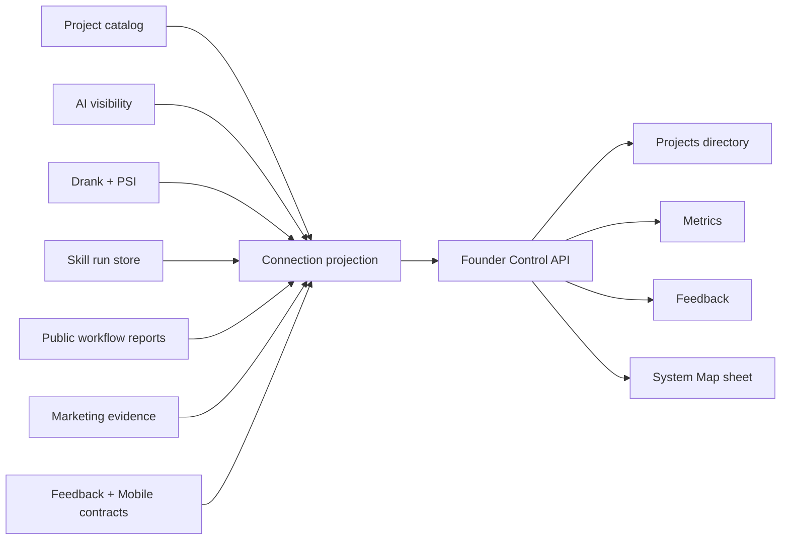

## Context

Fleet Console currently has an owner-first mission API and a Marketing
projection. Separate Fleet sources already retain project identity, AI
visibility, Drank, PSI Swarm, skill executions, public workflow audits, and
Marketing evidence. The first integrated implementation normalized which
connections work, but owner review found that topology does not explain what
those connections produced. Feedback and the Console-to-Mobile relationship
have contracts or intent without an implemented end-to-end consumer.

The work crosses the private Founder Control server, machine-local evidence,
checked-in reports, and an established responsive Astro interface. It must not
expose retained skill output, private feedback content, credentials, or raw
provider state.

## Goals / Non-Goals

**Goals:**

- Make the six Foundry buckets and every intended cross-bucket connection
  inspectable in Fleet Console.
- Give recorded execution, measurements, project state, marketing, and Feedback
  evidence separate focused destinations rather than one overloaded ledger.
- Mirror the six repository buckets in a collapsible Console sidebar.
- Carry one project scope across filterable pages through the URL.
- Graph comparable numeric histories and state exact improvement from the first
  to newest observation.
- Read real local evidence for existing integrations and represent absent
  contracts honestly.
- Give Home a small integration-health summary without displacing its five
  owner questions.
- Preserve provider authority and link to the owning component.
- Keep all readers fail-soft so one absent database or stale report does not
  take down Founder Control.
- Produce a dense, calm, accessible surface at phone, tablet, and desktop
  widths.

**Non-Goals:**

- Fabricate Feedback submissions, Marketing outcomes, skill metrics, or mobile
  consumers.
- Collapse incompatible output units into a synthetic productivity score.
- Copy private retained output into a checked-in or public artifact.
- Replace Drank, PSI Swarm, Marketing, or the skill-run store with Console-owned
  domain logic.
- Activate schedules, deploy, migrate data, or change authentication.
- Redesign the established Foundry visual language.

## Decisions

### Extend one normalized read-only connection projection

Founder Control will expose `GET /v1/connections` with a versioned projection:

```text
output summary -> recent runs -> projects -> history -> improvements
connection summary -> buckets -> components -> connections -> evidence
```

Each component has bucket ownership, current status, headline, freshness, and
an owner path. Each connection identifies provider, consumer, transport,
status, detail, freshness, and safe evidence metadata. A single projection is
preferred over client-side calls to every provider because it keeps private
paths and failure handling on the authenticated machine.



### Derive status from transport evidence, not source presence

`connected` requires a readable producer artifact and a consumer contract.
`partial` identifies a useful implemented portion that does not fulfill the
intended loop. `missing` identifies an absent transport or consumer. `stale`
and `unavailable` are evidence health overlays, not substitutes for connection
completeness.

This prevents a package directory or aspirational document from being
presented as a working product connection.

### Use bounded provider readers

The adapter will read:

- canonical project count from `ops/config/projects.json`;
- AI visibility evidence through the existing Founder projection summary;
- Drank domain histories and PSI machine-local SQLite project histories;
- skill-run status, captured artifact metadata, project rollups, and daily
  histories through `SkillRunStore`;
- sanitized per-project availability/performance results from the public
  workflows submodule;
- current Marketing projection counts;
- package/runtime contracts for Feedback and Mobile Cockpit.

Readers return unavailable evidence rather than throwing. The bulk API never
returns skill output bodies, feedback bodies, database paths, credentials, or
private provider identifiers. One explicit run-detail request may return that
run's already-sanitized, size-bounded streams without filesystem paths.

### Mirror repository buckets in a focused Operate shell

The established near-black Foundry visual system becomes a desktop sidebar
shell. The sidebar is collapsible, keeps icon and accessible-label navigation
when narrow, and becomes a modal drawer on phone widths. It collapses repository
taxonomy into five operator destinations:

```text
Projects       -> canonical directory
Metrics        -> visibility outcomes, site-health readiness, and design review
Marketing      -> recommendations and published outcomes
Feedback       -> owner inbox
```

The pages answer separate operator questions:

- Projects is the default directory and links each canonical record to its
  available website, changelog, and source.
- Metrics answers whether each Fleet project is becoming more visible through
  one dense 27-project matrix. Each row shows the canonical project and domain,
  with D-Rank, AI Agent Readiness, PSI, and LCP as current comparable signals.
  Search and AI Visibility remain in project detail until provider-backed
  outcomes exist. Design review also remains in project detail because it is a
  minimum quality gate, not a useful portfolio ranking. The project name opens its
  canonical project page and each metric cell deep-links to the matching
  project section. The project page owns the full graphs, evidence, missing
  states, and run controls: SEO contains D-Rank, Search Visibility, and Content
  Coverage; GEO contains AI Crawlability, AI Agent Readiness, and AI
  Visibility; Performance contains PSI Swarm; and Design contains Design
  Critique. Historical identities remain retained in their owner datasets but
  do not inflate active coverage. Generic skill executions remain operational
  run evidence rather than a separate longitudinal product view.
- Marketing keeps campaign recommendations, creative production, distribution,
  and publishing outcomes together without absorbing visibility measurement or
  explaining pipeline architecture.
- Feedback is an owner inbox. With no submissions it says so plainly instead
  of filling the page with package or ingestion documentation.

The shell adds one project selector below the page heading. Its query parameter
is carried across sidebar destinations. Each view applies it to its own
evidence; the System Map remains portfolio-wide because transports are system
relationships. Feedback keeps the selected project even before submissions
exist so the future inbox contract is project-native from day one.

### Project comparable history without blending units

The connection projection adds bounded dated series to every numeric signal
that has retained observations. Skill runs also expose per-project daily
periods so project filtering does not misleadingly filter only the latest ten
rows. PSI history is capped to the newest bounded observations per URL; D-Rank
uses the checked-in domain history; AI Visibility uses its normalized event
history; Search Visibility uses GEO observations; readiness families use their
retained audit observations; skill metrics use their normalized observation
records.

Search Visibility is agent-mediated because its observation workflow requires
evidence gathering rather than a local deterministic command. The Console
labels that boundary instead of presenting a fake run button. AI Agent
Readiness, AI Crawlability, Content Coverage, PSI Swarm, D-Rank, the AI
Visibility fixture canary, and Design Critique may expose existing allowlisted
local runners when the selected project has the inputs each runner requires.
AI Agent Readiness and AI Crawlability share one live site audit, but retain
separate histories: readiness scores all required agent surfaces, while
crawlability scores only robots, critical AI-bot access, and sitemap checks.

Agent Readiness resolves the public sitemap into page URLs and checks each page
for Markdown negotiation or a same-route Markdown alternate on small sites. For
large corpora it uses a deterministic, evenly distributed sample while
retaining the full bounded sitemap count and checked-route count, so the
percentage is never presented without its denominator. It also checks that
every advertised `/api/ai` surface has a readable Markdown target. Coverage is
retained as both a percentage and native counts so a small complete site is not
ranked below a large incomplete corpus. The dated audit observation is the
freshness boundary; the first implementation does not claim semantic parity
between HTML and Markdown or infer freshness from weak HTTP headers. Route
probing is same-origin, bounded, and concurrency-limited so a malformed or huge
sitemap cannot turn one owner-triggered audit into an unbounded crawl.

The client renders dependency-free inline SVG charts. Every chart states current
value, starting value, absolute change, percentage change when mathematically
valid, observation count, and date range. Higher-is-better and lower-is-better
directions affect improvement language, not the data. A single observation is
shown as a baseline rather than a line. Scores, milliseconds, layout shift,
ratings, ranks, ratios, and counts remain separate series.

Skill implementations never receive D1 credentials. Today the central Fleet
skill runner writes immutable `fleet.skill-run.v1` envelopes and retained
outputs locally for debugging and auditability. Only the observability families
project comparable longitudinal histories into Metrics. Raw output remains with
its owner and generic skill history is not a Console destination.

Home receives only the highest-priority attention and newest produced results.
The evidence panorama, gaps, ledger, and provider summaries remain in a modal
left-side System Map sheet opened as secondary diagnostics. Legacy Outputs,
Projects, Decisions, and Activity paths redirect to their nearest focused view.
On phone widths the sidebar becomes a full-height drawer and all ledgers stack.

### Keep implementation injectable and testable

### Keep outcome, readiness, and fixture semantics separate

The Metrics projection gives every headline measurement an explicit semantic
kind: `outcome`, `readiness`, `domain`, or `fixture`. A fixture canary proves
that the AI Visibility runner and normalization path work; it does not measure
whether a project appears in real model answers. The matrix therefore excludes
fixture values from AI Visibility outcomes and sorting, and reports the outcome
as `not measured` until a provider-backed observation exists.

GEO Observatory search classes remain query-level web-search observations, not
Google Search Console performance. They stay available in the project evidence
view, while the matrix omits the direct Search Console outcome until that
provider is connected. Technical GEO audits remain useful
as AI Agent Readiness and AI Crawlability and are labeled as readiness rather
than visibility.

D-Rank is a domain-level observation. The projection carries the measured
domain, source, observation time, and whether the project inherits a shared
root-domain value. The Console displays that scope so duplicated values across
subdomains are not mistaken for independent measurements. Generated-at time is
never used as measurement freshness; each visible value uses the provider's
own observation time.

The projection builder accepts a Fleet root, home path, current time, and
optional already-built Marketing data. Tests use temporary fixtures and injected
readers instead of the operator's real machine state.

## Risks / Trade-offs

- **Machine-local stores are absent on a fresh clone** → Return `unavailable`
  with a recovery boundary; keep the rest of the projection usable.
- **A checked-in report becomes stale** → Preserve its observation time and
  show stale state instead of reporting the last pass as current.
- **The page becomes an infrastructure cockpit** → Lead with recorded output,
  project impact, and improvement actions; keep topology, paths, and raw
  evidence in the System Map sheet.
- **Different output units imply a fake total** → Present parallel factual
  measures and never add runs, sites, ratings, and performance observations
  into one score.
- **A chart implies improvement from too little evidence** → Require two dated
  numeric observations; otherwise show baseline-only.
- **Project filtering silently leaves portfolio totals behind** → Every
  filterable section derives its rows, periods, actions, and chart series from
  the selected project or labels an unavoidable portfolio-wide boundary.
- **A project has no comparable history** → Label baseline-only or no history;
  never draw a trend from one observation.
- **Connection status drifts from implementation** → Centralize definitions in
  the tested projection rather than maintaining UI copy and README tables
  independently.
- **Private evidence leaks** → Emit counts, bounded labels, timestamps, and
  safe owner links only; test forbidden fields.

## Migration Plan

1. Add and test the normalized projection.
2. Add the authenticated API route.
3. Build the output-first route, left-side System Map sheet, and Home summary
   in the existing visual system.
4. Capture responsive evidence and run critique/audit/build gates.
5. Update durable status and archive the OpenSpec change.

Rollback is a normal Git revert. No provider or stored data is mutated.

## Open Questions

None block this version. Feedback product rollout and a first-class Mobile
Cockpit consumer remain honest partial/missing states until their own bounded
implementation changes land.
